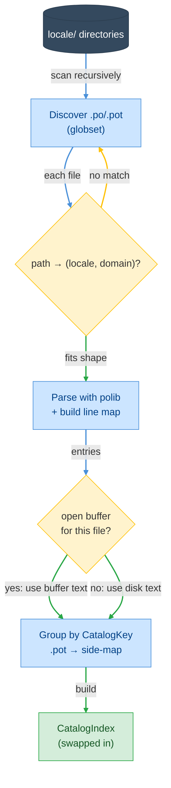

# F01 — Catalog Index

> **Status:** Draft
>
> **Version:** 0.3   ·   **Last updated:** 2026-06-15
>
> **Purpose:** How the server finds, parses, and indexes your `.po`/`.pot` catalogs into the in-memory map every other feature reads — and how it keeps that index current as catalogs change on disk. This is the backbone of the whole server.
>
> **Depends on:** [E07-data-model](../foundations/E07-data-model.md), [E01-architecture](../foundations/E01-architecture.md)   ·   **Related:** [E15-app-config](../foundations/E15-app-config.md), [F03-diagnostics](F03-diagnostics.md)

> Requirement tag: **CAT**

---

## 1. Purpose & Scope

This spec teaches the server what your translations *are* by reading every catalog on disk into one queryable index.

It owns the catalog half of the two-pass pipeline: discovery, loading, and indexing. Every feature that answers a question about a msgid — completion, hover, navigation, diagnostics — reads the index this spec builds. None of them touch a `.po` file directly.

This spec covers:

- Discovering every `.po`/`.pot` file under the configured or auto-discovered locale directories.
- The path-to-`(locale, domain)` rule that names each catalog.
- Loading entries with `polib` and building a line map for fast goto.
- Indexing pass 2: grouping entries by [CatalogKey](../foundations/E07-data-model.md) across locales and domains.
- The unsaved-buffer overlay and the debounced wholesale rebuild.
- Detecting external (out-of-editor) catalog writes — by a translator, `pybabel`, or `git` — and re-indexing them, with the open buffer taking precedence over disk.

## 2. Non-Goals / Out of Scope

- The shapes themselves — [CatalogIndex](../foundations/E07-data-model.md), [CatalogEntry](../foundations/E07-data-model.md), [CatalogKey](../foundations/E07-data-model.md) — are defined in [E07](../foundations/E07-data-model.md). This spec fills them; it never redefines them.
- Where `locale_dirs` and `domains` come from, and how discovery merges with config — owned by [E15](../foundations/E15-app-config.md).
- The pipeline timing and the pass-1/pass-2 race guard — owned by [E01](../foundations/E01-architecture.md).
- Extracting translation calls from Python and Jinja source — owned by [F02](F02-message-extraction.md).
- Judging entries wrong (missing, fuzzy, placeholder mismatch) — owned by [F03](F03-diagnostics.md).

## 3. Background & Rationale

A source call like `_("Checkout")` means nothing on its own. Its meaning lives in the catalogs — `messages.pot` says the msgid exists, `de/LC_MESSAGES/messages.po` says it is `"Kasse"`, `fr/LC_MESSAGES/messages.po` says it is still untranslated. Per constitution P5, the catalog is the source of truth. This spec is where that truth is read in and made queryable, so that one `lookup` answers "everything known about this msgid" in memory, never by re-reading the world (P6).

## 4. Concepts & Definitions

Catalog, catalog entry, catalog index, catalog key, locale, domain, and POT template are all canonical in the [glossary](../glossary.md). This spec links to them rather than redefining them.

## 5. Detailed Specification

### 5.1 Discovery

Discovery walks the locale directories and collects every catalog file, tagging each with the locale and domain its path encodes.

**REQ-CAT-01 — Find every `.po` and `.pot` under the locale dirs.**

You give the server a set of locale directories — explicit `locale_dirs`, the auto-discovered set, or both merged ([E15 REQ-CFG-02](../foundations/E15-app-config.md)). For each directory the server collects every file whose extension is `.po` or `.pot`, recursively, using a globset. In the shopfront, scanning `locale/` finds three files — `locale/messages.pot`, `locale/de/LC_MESSAGES/messages.po`, and `locale/fr/LC_MESSAGES/messages.po`. A non-existent or unreadable directory is skipped silently, not an error (P3).

**REQ-CAT-02 — A catalog's path encodes its locale and domain.**

The server derives the [locale](../glossary.md) and [domain](../glossary.md) from each file's path, never from its contents. The rule is exact. The domain is the file's base name without extension. For a `.po` file, the locale is the directory name two levels up, above an `LC_MESSAGES` directory. For a `.pot` template, the locale is the empty string, since a template has no language.

The shopfront paths map like this:

| Path | Locale | Domain |
|---|---|---|
| `locale/de/LC_MESSAGES/messages.po` | `de` | `messages` |
| `locale/fr/LC_MESSAGES/messages.po` | `fr` | `messages` |
| `locale/messages.pot` | `""` | `messages` |

The function that owns this mapping rejects any path that doesn't fit the shape, returning nothing rather than guessing:

```rust
// src/catalog/loader.rs
pub fn locale_domain_from_po_path(path: &Path) -> Option<(String, String)> {
    // .pot → locale ""; .po → <locale>/LC_MESSAGES/<domain>.po → (locale, domain)
}
```

A `.po` not sitting under an `LC_MESSAGES` directory yields `None` and is skipped, so a stray file never pollutes the index with a bogus locale.

### 5.2 Loading

Loading parses each catalog with `polib` and turns its messages into [CatalogEntry](../foundations/E07-data-model.md) rows, plus a line map for navigation.

**REQ-CAT-03 — Parse each catalog with `polib` into entries.**

The server reads each file and parses it with `polib` (constitution: one parser per format, no regex). Each non-empty message becomes one [CatalogEntry](../foundations/E07-data-model.md), carrying its locale, domain, msgid, optional msgctxt and plural, its `msgstr` slots, and its `fuzzy`/`obsolete` flags. The empty-msgid header entry is dropped. A parse failure is logged and that file is skipped; the rest of the index still builds (P3). Loading the shopfront's German catalog yields one entry for `"Checkout"` with `msgstr` `"Kasse"`, and one for `"Save"` flagged `fuzzy`.

```rust
// src/catalog/loader.rs
pub fn load_po_file(path: &Path, locale: &str, domain: &str)
    -> Result<Vec<CatalogEntry>, String>;
```

**REQ-CAT-04 — Build a line map so goto lands on the right line.**

`polib` gives you each message but not its source line, and goto-definition needs the line. So the server scans the raw text once and records, per [CatalogKey](../foundations/E07-data-model.md), the line where its `msgid` appears. The scan tracks the preceding `msgctxt` so a context-qualified key maps to its own line, and it flags obsolete (`#~`) entries. Each entry's `line` field comes from this map.

```rust
// src/catalog/loader.rs
pub struct PoLineMap { /* CatalogKey → 1-based line; plus obsolete keys */ }
impl PoLineMap {
    pub fn build(content: &str) -> Self;
    pub fn get_line(&self, key: &CatalogKey) -> Option<u32>;
}
```

The line map is the one place this spec reads catalog text by hand rather than through `polib` — it exists solely to recover positions `polib` discards.

### 5.3 Indexing (pass 2)

Pass 2 groups every loaded entry under its [CatalogKey](../foundations/E07-data-model.md), so one key fans out to its translations across every locale and domain.

**REQ-CAT-05 — Group entries by `(msgid, msgctxt)` across locales and domains.**

The server collects entries from every catalog into one flat list, then builds the [CatalogIndex](../foundations/E07-data-model.md) by grouping them under their [CatalogKey](../foundations/E07-data-model.md). The shopfront's `"Checkout"` key gathers the German `"Kasse"` and the empty French entry under one lookup. As it groups, the index records every locale and every domain it has seen, so features can ask "which locales exist?" without a rescan.

```rust
// src/catalog/index.rs
let index = CatalogIndex::build(all_entries);
```

**REQ-CAT-06 — `.pot` template entries go in a separate map.**

"Does this msgid exist in the template?" is a different question from "is it translated in locale X?", so the index keeps them apart ([E07 REQ-IDX-03](../foundations/E07-data-model.md)). An entry whose file ends in `.pot` is also recorded in the index's `pot_entries` side-map, keyed by its [CatalogKey](../foundations/E07-data-model.md). The shopfront's `"Checkout"` lives in `pot_entries` because `messages.pot` defines it; an unknown `_("Chekout")` resolves in neither map, which is what separates "unknown msgid" from "known but untranslated" for [F03](F03-diagnostics.md).

### 5.4 The unsaved overlay

An open `.po` buffer shadows its on-disk copy, so the index reflects what you are typing, not what was last saved.

**REQ-CAT-07 — Open catalog buffers overlay the disk during rebuild.**

When pass 2 runs, the server first loads every catalog from disk. Then, for each open `.po`/`.pot` document, it re-derives the file's `(locale, domain)`, parses the *buffer* text, drops the disk entries for that path, and substitutes the buffer entries. So when you type a French translation for `"Checkout"` into the open `fr` catalog, the source-side hint updates live, before you save. This is [E07 REQ-IDX-07](../foundations/E07-data-model.md); the overlay is keyed by URI against the documents map. If the buffer fails to parse mid-edit, the server keeps the on-disk entries for that file rather than dropping it (P3).

### 5.5 Reload

A catalog change rebuilds the whole index, debounced, never incrementally.

**REQ-CAT-08 — A catalog change triggers a debounced wholesale rebuild.**

When a `.po`/`.pot` file changes — on disk or in an open buffer — the server schedules a relink, debounced so a burst of keystrokes coalesces into one rebuild ([E01 REQ-ARCH-04](../foundations/E01-architecture.md), [REQ-ARCH-12](../foundations/E01-architecture.md)). The rebuild discards the old [CatalogIndex](../foundations/E07-data-model.md) and constructs a fresh one from scratch; there is no per-entry patching. The new index is swapped into `WorkspaceState` behind its `RwLock` in one assignment, so readers always see a complete, consistent index ([E07 REQ-IDX-01](../foundations/E07-data-model.md)). A wholesale rebuild is simpler than incremental patching and, per P6, fast enough at catalog scale that the simplicity wins.

### 5.6 Detecting external changes

Translators, `pybabel`, and `git` all edit catalogs behind the editor's back. The index has to notice those writes, or it silently goes stale.

**REQ-CAT-09 — External `.po`/`.pot` writes are watched and re-indexed.**

The server watches every catalog so a change made outside the editor reaches the index. It registers `workspace/didChangeWatchedFiles` for `**/*.po` and `**/*.pot` under each configured or discovered locale directory when the client supports dynamic registration, and falls back to a native `notify` watcher over the same globs when it doesn't ([E01 REQ-ARCH-12](../foundations/E01-architecture.md)). Each event maps to an index action, and the result is one debounced rebuild (REQ-CAT-08):

- **Created** — a new catalog, or a whole new locale directory, is discovered, parsed, and indexed (REQ-CAT-01…03). Its locale joins `all_locales` and its domain `all_domains`.
- **Changed** — the file is re-read from disk and re-parsed — *unless it is open in the editor* (REQ-CAT-10).
- **Deleted** — the file's entries are dropped. A locale whose last catalog is gone leaves `all_locales`, and any source msgid it alone translated flips to a missing-translation finding in [F03](F03-diagnostics.md).
- **Renamed** — handled as a delete then a create; the `(locale, domain)` is re-derived from the new path (REQ-CAT-01).

A tool that rewrites many catalogs at once — `pybabel update` touching every locale, a `git checkout` swapping a branch's translations — fires a burst of events. The debounce collapses them into a single rebuild, so the index is built once against the *final* on-disk state, never once per file. When the server itself writes catalogs (the [F13](F13-catalog-commands.md) commands), it reloads them directly on completion rather than waiting for the watcher, so the result is immediate.

**REQ-CAT-10 — An open buffer outranks its disk file.**

When a watched file is open in the editor, its unsaved buffer is the truth (REQ-CAT-07), so the server ignores watcher events for that URI. A translator's save — or any external write — to a file you are *also* editing must not clobber your in-progress edits with disk text. The `documents` map is the open-set check ([E07 REQ-IDX-01](../foundations/E07-data-model.md)); the editor's own `didChange`/`didSave` already keeps that file's overlay current. The disk copy is re-read only once the buffer closes: a `didClose` reverts the file to its on-disk state and triggers a rebuild. This is the catalog-side reading of [E01 REQ-ARCH-12](../foundations/E01-architecture.md)'s open-buffer precedence rule.

### 5.7 Readers of the index

This spec builds the index; the features that read it live elsewhere.

The [CatalogIndex](../foundations/E07-data-model.md) read API ([E07 REQ-IDX-04](../foundations/E07-data-model.md)) is the only door in. Completion ([F04](F04-completion.md)) walks `all_msgids`; hover ([F05](F05-hover.md)) and navigation ([F06](F06-navigation.md)) call `lookup` and read each entry's `line`; diagnostics ([F03](F03-diagnostics.md)) use `is_in_pot` and `missing_locales`. None of them re-parse a catalog — they all read this one index.

## 7. Visualizations

The three passes turn a directory tree into one queryable index.



## 9. Examples & Use Cases

You open the shopfront fresh. The server discovers `locale/`, finds the three catalogs, and tags each one: `messages.pot` as `("", "messages")`, the German file as `("de", "messages")`, the French file as `("fr", "messages")` (REQ-CAT-02). It parses all three with `polib` and groups their entries (REQ-CAT-05).

Now `lookup` on the `"Checkout"` key returns two entries — German `"Kasse"` and the empty French one — and `is_in_pot` is true because the template defines it. You ctrl-click `_("Checkout")` in `views.py`: navigation reads the German entry's `line` from the line map and jumps straight to it (REQ-CAT-04).

You start translating. You open `fr/LC_MESSAGES/messages.po` and type `msgstr "Paiement"` under `"Checkout"`. The buffer overlay shadows the on-disk copy (REQ-CAT-07), a debounced rebuild runs (REQ-CAT-08), and the missing-French warning on your source call clears — before you save the file.

## 10. Edge Cases & Failure Modes

- A locale directory that doesn't exist or can't be read → skipped silently; other directories still index (P3).
- A `.po` outside any `LC_MESSAGES` directory → `locale_domain_from_po_path` returns `None`; the file is skipped, no bogus locale.
- A catalog that `polib` can't parse → logged and skipped; the rest of the index builds.
- An open buffer that fails to parse mid-edit → the on-disk entries for that file are kept, not dropped.
- The same `(msgid, msgctxt)` defined twice in one catalog → both entries are kept under the key; the duplicate is a diagnostic ([F03](F03-diagnostics.md)), not a load failure.
- An empty-msgid header entry → dropped, never indexed.
- No locale directory found at all → the index is empty and the server stays silent; opening a `.po` still works ([E15](../foundations/E15-app-config.md)).
- A translator (or `pybabel`) saves a `.po` you have open with unsaved edits → your buffer wins; the watcher event is ignored for that file, and the disk copy is re-read only on `didClose` (REQ-CAT-10).
- A `git checkout` rewrites every locale at once → the burst of watcher events debounces into a single rebuild against the final state (REQ-CAT-09), not one rebuild per file.
- A new locale directory appears on disk → its catalogs are discovered and indexed, and the locale joins `all_locales` without a server restart (REQ-CAT-09).
- A catalog is half-written when the watcher fires (a non-atomic save) → `polib` parses what it can (P3); the save's completing event triggers another rebuild that corrects it.

## 11. Testing

This feature is tested by unit tests over its pure rules — the path mapping, the line map, the index grouping — and by integration tests that wire discovery, `polib` loading, the overlay, and the debounced rebuild against real shopfront catalogs.

### 11.1 Scope & coverage

Target: **100% of this feature's behavior is covered.** Every `REQ-CAT-NN` below maps to at least one test, and every edge case (§10) has a test. See the policy in [E17 §2](../foundations/E17-testing.md#2-coverage-policy).

### 11.2 Test plan

Each row is a behavior under test. Shared fixtures link to the [E17 registry](../foundations/E17-testing.md#5-fixtures-registry); each row names the requirement it verifies.

| Behavior / scenario | Type | Fixtures | Verifies |
|---|---|---|---|
| Discovery finds every `.po`/`.pot` under the locale dirs; a missing dir is skipped | integration | [clean-shopfront](../foundations/E17-testing.md#clean-shopfront) | REQ-CAT-01 |
| The path-to-`(locale, domain)` rule maps `de`/`fr`/`.pot` paths; a non-`LC_MESSAGES` `.po` yields `None` | unit | [clean-shopfront](../foundations/E17-testing.md#clean-shopfront) | REQ-CAT-02 |
| `polib` parses a catalog into entries; the header is dropped, fuzzy is flagged; a malformed file is skipped | integration | [clean-shopfront](../foundations/E17-testing.md#clean-shopfront) | REQ-CAT-03 |
| The line map lands `msgid`/`msgctxt`/obsolete keys on their source lines | unit | [non-ascii-catalog](../foundations/E17-testing.md#non-ascii-catalog) | REQ-CAT-04 |
| Pass 2 groups entries by `CatalogKey` across locales/domains; `all_locales`/`all_domains` are recorded | integration | [clean-shopfront](../foundations/E17-testing.md#clean-shopfront) | REQ-CAT-05 |
| `.pot` entries land in the `pot_entries` side-map; an unknown msgid resolves in neither map | integration | [unknown-msgid](../foundations/E17-testing.md#unknown-msgid) | REQ-CAT-06 |
| An open buffer overlays its disk copy during rebuild; a mid-edit parse failure keeps disk entries | integration | [clean-shopfront](../foundations/E17-testing.md#clean-shopfront) | REQ-CAT-07 |
| A catalog change triggers one debounced wholesale rebuild swapped in atomically | integration | [clean-shopfront](../foundations/E17-testing.md#clean-shopfront) | REQ-CAT-08 |
| An external write fires create/change/delete/rename actions; a burst debounces to one rebuild | integration | [clean-shopfront](../foundations/E17-testing.md#clean-shopfront), [large-workspace](../foundations/E17-testing.md#large-workspace) | REQ-CAT-09 |
| A watched file open in the editor ignores its watcher event; `didClose` reverts to disk | integration | [clean-shopfront](../foundations/E17-testing.md#clean-shopfront) | REQ-CAT-10 |

### 11.3 Fixtures

Reusable fixtures live in the [E17 fixtures registry](../foundations/E17-testing.md#5-fixtures-registry) — [clean-shopfront](../foundations/E17-testing.md#clean-shopfront) is the baseline, [unknown-msgid](../foundations/E17-testing.md#unknown-msgid) exercises the empty-resolution path, [non-ascii-catalog](../foundations/E17-testing.md#non-ascii-catalog) pins the line-map positions, and [large-workspace](../foundations/E17-testing.md#large-workspace) drives the burst-debounce. This feature needs no local fixture of its own.

### 11.4 Requirement coverage

Every load-bearing requirement maps to a test — this table is the proof.

| Requirement | Covered by |
|---|---|
| REQ-CAT-01 | `req_cat_01_discovers_po_under_locale_dir` |
| REQ-CAT-02 | `req_cat_02_path_maps_to_locale_domain` |
| REQ-CAT-03 | `req_cat_03_polib_parses_into_entries` |
| REQ-CAT-04 | `req_cat_04_line_map_lands_on_msgid_line` |
| REQ-CAT-05 | `req_cat_05_groups_entries_by_catalog_key` |
| REQ-CAT-06 | `req_cat_06_pot_entries_in_side_map` |
| REQ-CAT-07 | `req_cat_07_open_buffer_overlays_disk` |
| REQ-CAT-08 | `req_cat_08_change_triggers_debounced_rebuild` |
| REQ-CAT-09 | `req_cat_09_external_writes_reindexed` |
| REQ-CAT-10 | `req_cat_10_open_buffer_outranks_disk` |

## 12. End-to-End Test Plan

F01 has no surface of its own, but every feature reads the index it builds, so its journeys are tested end to end through the running server: a real client opens a workspace, probes a resolved msgid, and writes a catalog on disk to watch the re-index.

### 12.1 Coverage target

**100% of the feature's user-visible scope, end to end** — the index loading on open, the external-write re-index, and the malformed-catalog degrade path. See the policy in [E29 §2](../foundations/E29-e2e-testing.md#2-coverage-policy).

### 12.2 Scenarios

Each row is a journey a real editor drives over stdio. The watcher re-index journey is the shared protocol-conformance journey from [E29 REQ-E2E-03](../foundations/E29-e2e-testing.md#5-patterns).

| # | Journey | Path | Expected outcome |
|---|---|---|---|
| E2E-01 | Open [clean-shopfront](../foundations/E17-testing.md#clean-shopfront); probe `Checkout` | happy | The index loads; a probe resolves `Checkout` as de-translated (`Kasse`) and fr-missing, and `is_in_pot` is true |
| E2E-02 | An external `.po` write lands via the watcher | happy | The watcher event re-indexes and the affected diagnostics update (shared [E29 REQ-E2E-03](../foundations/E29-e2e-testing.md#5-patterns) journey) |
| E2E-03 | Open a workspace with a malformed catalog | error | The bad file is skipped with a log; the readable entries in every other catalog stay indexed and queryable |

### 12.3 Acceptance criteria & Definition of Done

The §12.2 scenarios, written Given/When/Then, are this feature's acceptance criteria:

| # | Given | When | Then |
|---|---|---|---|
| AC-01 | a fresh clean-shopfront | the client opens the workspace and probes `Checkout` | the index loads and resolves `Checkout` to `Kasse` (de) and missing (fr), with `is_in_pot` true |
| AC-02 | an indexed workspace | a translator writes a `.po` outside the editor | the watcher re-indexes and the affected diagnostics update without a restart |
| AC-03 | a workspace with one malformed catalog | the client opens it | the bad file is skipped and every other catalog's entries remain queryable |

**Definition of Done:** every `REQ-CAT-NN` has a passing test (§11.4), every acceptance scenario above passes, and the §13 security concern is verified.

## 13. Non-Functional Requirements

### 13.1 Security & Privacy

- **Static analysis only** — per P1, the server never imports, executes, or introspects your code; it only reads `.po`/`.pot` and source text. It makes no network calls and has no auth, accounts, or PII.
- **File-read trust boundary** — the only resource this feature touches is the local filesystem, and it reads only within the configured or discovered workspace and locale directories. A path that doesn't fit the catalog shape is skipped, never followed elsewhere.
- **Untrusted input degrades, never crashes** — catalog text is untrusted and often half-written; per P3 a malformed entry or unparsable file is logged and skipped, and the rest of the index still builds. Bad input never panics the server.
- **No write surface** — F01 only reads catalogs into memory; it never writes them. Catalog writes are owned by the [F13](F13-catalog-commands.md) commands.

## 16. Cross-References

- **Depends on:** [E07-data-model](../foundations/E07-data-model.md) — `CatalogIndex`, `CatalogEntry`, `CatalogKey` (REQ-IDX-03/05/07); [E01-architecture](../foundations/E01-architecture.md) — the debounced relink and the index swap.
- **Related:** [E15-app-config](../foundations/E15-app-config.md) — supplies `locale_dirs`/`domains` and the discovery merge; [F03-diagnostics](F03-diagnostics.md) — reads `is_in_pot`/`missing_locales`; [F04-completion](F04-completion.md), [F05-hover](F05-hover.md), [F06-navigation](F06-navigation.md) — readers of this index.
- **Testing:** [E17-testing](../foundations/E17-testing.md#2-coverage-policy) — the coverage policy and the [fixtures registry](../foundations/E17-testing.md#5-fixtures-registry) this feature's §11 reuses; [E29-e2e-testing](../foundations/E29-e2e-testing.md#2-coverage-policy) — the E2E policy and the shared watcher conformance journey ([REQ-E2E-03](../foundations/E29-e2e-testing.md#5-patterns)).

## 17. Changelog

- **2026-06-15** — v0.3: restructured to the updated spec-writer template — added §11 Testing (scope, the per-`REQ-CAT` test plan, fixtures, and the requirement-coverage table), §12 End-to-End Test Plan (index-load, watcher re-index, and malformed-degrade journeys, with §12.3 Given/When/Then acceptance criteria and a Definition of Done), and §13.1 Security & Privacy (static-analysis-only, the file-read trust boundary, and degrade-never-crash). Renumbered the existing sections to the canonical order (Visualizations §7, Examples §9, Edge Cases §10, Cross-References §16, Changelog §17). No behavioral content changed.
- **2026-06-15** — v0.2: defined external-change detection — REQ-CAT-09 watches `**/*.po`/`**/*.pot` via `didChangeWatchedFiles` (or a native `notify` fallback) and maps create/change/delete/rename to index actions with burst-debouncing, and REQ-CAT-10 gives an open buffer precedence over its disk file so external saves never clobber in-editor edits. Added the translator-save, `git checkout`, new-locale, and half-written-file edge cases.
- **2026-06-15** — Initial draft: discovery via globset with the exact path-to-`(locale, domain)` rule (REQ-CAT-01/02); `polib` loading plus the `PoLineMap` for goto positions (REQ-CAT-03/04); pass-2 grouping by `CatalogKey` with the separate `.pot` side-map (REQ-CAT-05/06); the unsaved-buffer overlay (REQ-CAT-07); the debounced wholesale rebuild (REQ-CAT-08). Translated from the legacy `catalog/loader.rs`, `catalog/index.rs`, and `state.rs` `reload_catalogs` logic.
