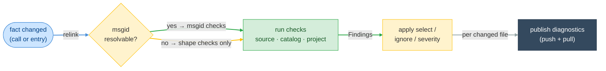

# F03 — Diagnostics

> **Status:** Draft
>
> **Version:** 0.4   ·   **Last updated:** 2026-06-15
>
> **Purpose:** The i18n checks the server publishes — unknown msgids, gettext misuse, and catalog quality — each with a stable code and severity.
>
> **Depends on:** [F01-catalog-index](F01-catalog-index.md), [F02-message-extraction](F02-message-extraction.md), [constitution](../constitution.md)   ·   **Related:** [F07-code-actions](F07-code-actions.md), [E15-app-config](../foundations/E15-app-config.md), [F15-cli](F15-cli.md)

> Requirement tag: **DIAG**

---

## 1. Purpose & Scope

These are the i18n bugs that hide in string literals and across catalog files — the mistakes a Python type checker and a `.po` editor both walk right past. A typo'd msgid no catalog knows. A German translation that dropped a placeholder. A second `msgid "Checkout"` in one file. Each is *positively provable* from the index, so each gets a stable code and a squiggle.

You get one catalog of checks here, split three ways: source-side (Python and Jinja calls), catalog-side (`.po`/`.pot` entries), and project-level (cross-file consistency). Constitution P4 — only diagnose what is positively wrong — is the gate every check passes.

This spec covers:

- the publishing rules — when findings appear, how they clear, and how they're configured;
- the full diagnostic catalog with codes, severities, and firing conditions;
- the subtle checks in detail, each justified under P4;
- the `Finding` and `DiagCode` shapes the CLI and the LSP layer share.

## 2. Non-Goals / Out of Scope

- **Style opinions.** We diagnose *wrong*, not *unidiomatic*. Catalog header date formats, comment style, msgid casing — none of these prove a defect, so none fire.
- **Machine translation or quality scoring.** The server never judges whether a translation is *good*, only whether it's structurally consistent with its msgid (P5 — the catalog is the source of truth).
- **Quick fixes.** The code actions that repair these findings — add the missing msgid, sync the placeholder, drop the obsolete entry — live in [F07-code-actions](F07-code-actions.md).
- **Hardcoded-string *detection*.** The `msg/hardcoded-string` code is registered in the catalog below, but *when it fires* — the heuristics that decide a literal is user-facing — and its extract fix are owned by [F11](F11-hardcoded-strings.md). It is opt-in, gated behind `detect_hardcoded_strings` ([E15](../foundations/E15-app-config.md)).

## 3. Background & Rationale

A message's correctness is split across files. `_("Checkout")` in `app/views.py` is half the fact; the other half is whether `locale/de/LC_MESSAGES/messages.po` translates it and whether the placeholders survived. The catalog index ([E07](../foundations/E07-data-model.md)) joins the two, so the checks here read one resolved snapshot rather than re-deriving anything.

The legacy server shipped a handful of these — unknown msgid, missing translation, fuzzy, duplicate, format mismatch, plural count, header. This spec keeps all of them (marked *parity*) and adds the string-level catalog checks that pofilter, dennis, and Weblate taught the localization world to expect (marked *NEW*). The new checks are cheap, so they ship first; the heavy ones (XML tags, cross-locale) follow.

## 4. Concepts & Definitions

Catalog, catalog key, fuzzy, obsolete, placeholder, Plural-Forms, and unresolved msgid are canonical in the [glossary](../glossary.md). One term is local to this spec:

- **Finding** — the server's internal diagnostic value before it becomes an `lsp_types::Diagnostic`. It carries a URI, range, code, severity, message, related locations, and an optional `data` payload. It is also the unit the `check` CLI emits ([F15](F15-cli.md)).

## 5. Detailed Specification

### 5.1 Publishing rules

The server decides *when* a finding appears, *where* it clears, and *whether* you've turned it off — before it ever computes the finding itself. These four rules govern all of that.

**REQ-DIAG-01 — Diagnostics are workspace-scoped; both push and pull.**

Catalog-side and project-level checks can implicate a file you aren't editing — a duplicate in `de/messages.po`, an obsolete entry against the `.pot`. So the scope is the workspace, not the open document set.

After each relink the server re-publishes diagnostics for every file whose finding set changed (`textDocument/publishDiagnostics`), and it advertises the pull model (`textDocument/diagnostic`) for clients that prefer it (per [E01 REQ-ARCH-10](../foundations/E01-architecture.md)). Closing a file clears nothing; a finding vanishes only when a relink removes it or the file is deleted, and that disappearance is an explicit empty publish. A newly opened file always receives a (possibly empty) publish — the e2e harness's "the server looked at this file" signal. Each finding carries `source: "babel-lsp"` and its stable `code` from §5.2.

**REQ-DIAG-02 — Unresolved means silent.**

A translation call whose msgid can't be read statically — a variable, an f-string, a `.format()` expression — has `msgid: None` ([E07 REQ-IDX-06](../foundations/E07-data-model.md)). It participates in no msgid lookup, so `msg/unknown-id` and `msg/missing-in-locale` never fire on it.

That silence is deliberate, not a gap. We can't prove an absent msgid is wrong when we never read it — silence over a guess (P4). The *shape* of the unreadable call, however, can still be provably wrong: an f-string is wrong because gettext looks up the interpolated string, not the template. Those shape checks (`msg/fstring-in-call`, `msg/format-before-call`, `msg/non-constant-id`) fire on the unresolved call precisely *because* they don't need the msgid value.

**REQ-DIAG-03 — Every code is select/ignore/severity-configurable.**

Each row in §5.2 has a stable `area/short-name` code, and any of them can be toggled or re-leveled from config without touching the server. Resolution runs `diagnostics.select` (default `["all"]`), subtracts `diagnostics.ignore`, then applies `diagnostics.severity` overrides — the ruff-style model owned by [E15 REQ-CFG-05](../foundations/E15-app-config.md). The shopfront silences `po/fuzzy` and lifts `po/missing-translation` to a warning this way. The `check` CLI exposes the same filter as `--select`/`--ignore` over the same resolved config ([F15](F15-cli.md)).

**REQ-DIAG-04 — Paired findings carry relatedInformation.**

Whenever a check names a second location, the finding's `relatedInformation` points there with a one-line label: the first occurrence for `po/duplicate-id`, the `.pot` entry that an obsolete entry outlived, the source call a `proj/unused-id` found *no* match for, the other locale that disagrees in `proj/inconsistent-translation`. The `data` field carries the machine-readable payload its paired quick fix needs ([F07](F07-code-actions.md)); when the client lacks `publishDiagnostics.dataSupport`, the action handler recomputes the same inputs from the snapshot. `data` is an optimization, never a dependency.

### 5.2 The catalog

Every check the server can publish, grouped by where it fires. Severities follow gettext-tooling convention: a broken placeholder is a Warning you should fix, an untranslated string is Information you should know. `[parity]` marks a legacy check carried forward; `[NEW]` marks one this suite adds. The **From** column names the upstream tool whose rule each check mirrors — GNU `msgfmt`, translate-toolkit's `pofilter`, Mozilla `dennis`, Weblate, ruff's `INT` rules / `flake8-i18n`, and `i18n-ally` — so a rule's exact semantics can be checked against its origin.

**Source-side** — Python and Jinja translation calls.

| Code | Severity | Fires when | From |
|---|---|---|---|
| `msg/unknown-id` | Warning | The call's msgid is in **no** `.po` **and** not in the `.pot` template — a typo or an un-extracted string. `[parity]` | i18n-ally `key-missing` |
| `msg/missing-in-locale` | Information | The msgid is known (in a catalog or the `.pot`) but its `msgstr` is empty or absent in one or more locales. `[parity]` | i18n-ally `missing-translation` |
| `msg/fstring-in-call` | Warning | The gettext argument is an f-string (`JoinedStr`); gettext looks up the *interpolated* text, never the template. `[NEW]` | ruff `INT001`, flake8-i18n `I001` |
| `msg/format-before-call` | Warning | The argument is a `str.format(...)` call or a `%` formatting expression — formatting runs *before* the lookup. `[NEW]` | ruff `INT002`/`INT003`, flake8-i18n `I002`/`I003` |
| `msg/non-constant-id` | Information | The first argument is not a string literal (a name, attribute, or call), so `pybabel extract` can't read it. `[NEW]` | pybabel (extraction) |
| `msg/implicit-concat` | Hint | Two or more adjacent string literals are implicitly concatenated as the argument. `[NEW]` | babel-lsp (cf. ruff `ISC001`) |
| `msg/empty-id` | Warning | The msgid literal is `""` — gettext reserves the empty id for the header, so it never resolves to a translation. `[NEW]` | gettext convention |
| `msg/hardcoded-string` | Information | A user-facing literal is not wrapped in a translation call — off by default (`detect_hardcoded_strings`); firing detail in [F11](F11-hardcoded-strings.md). `[NEW, opt-in]` | i18n-ally, pylint-i18n |

**Catalog-side** — `.po` and `.pot` entries. Most compare a `msgstr` against its `msgid`.

| Code | Severity | Fires when | From |
|---|---|---|---|
| `po/missing-translation` | Information | A non-header entry has an empty `msgstr`. `[parity]` | pofilter `untranslated` |
| `po/fuzzy` | Information | The entry carries the `#, fuzzy` flag. `[parity]` | pofilter `isfuzzy` |
| `po/duplicate-id` | Error | The same `(msgid, msgctxt)` key appears more than once in one file — `msgfmt` errors on this. `[parity]` | gettext `msgfmt` |
| `po/obsolete` | Hint | A `#~`-marked entry whose key is absent from the `.pot` (REQ-DIAG-09). `[parity]` | gettext (`#~`) |
| `po/format-mismatch` | Warning | On a `c-format`/`python-format`/`python-brace-format` entry, the `msgstr` drops a printf (`%(n)s`, `%s`, `%1$s`) or brace (`{name}`, `{0}`) specifier present in the `msgid` (REQ-DIAG-07). `[parity]` | `msgfmt --check-format`, pofilter `printf`/`pythonbraceformat`, dennis `E102`–`E104` |
| `po/plural-count` | Warning | The number of `msgstr[i]` ≠ the `nplurals` declared in `Plural-Forms` (REQ-DIAG-08). `[parity]` | `msgfmt`, pofilter `nplurals` |
| `po/header-missing` | Warning | The header entry lacks a valid `Content-Type` charset, or — for a plural catalog — a `Plural-Forms` line. `[parity]` | `msgfmt --check-header` |
| `po/accelerator-mismatch` | Information | The `msgid` holds exactly one accelerator marker (`&` by default, or `_`) and the `msgstr` holds a different count (REQ-DIAG-13). `[NEW]` | `msgfmt --check-accelerators`, pofilter `accelerators` |
| `po/escape-mismatch` | Warning | The multiset of backslash escapes other than `\n` (`\t`, `\r`, `\\`, `\uNNNN`) differs between `msgid` and `msgstr`. `[NEW]` | pofilter `escapes` |
| `po/newline-count` | Warning | The count of `\n` differs between `msgid` and `msgstr`. `[NEW]` | pofilter `newlines`, Weblate "Mismatched \n" |
| `po/whitespace-edges` | Information | Leading or trailing whitespace differs between `msgid` and `msgstr`. `[NEW]` | pofilter `startwhitespace`/`endwhitespace`, Weblate |
| `po/end-punctuation` | Information | The trailing punctuation (`. ! ? : ;` and locale forms like `。`/`？`) differs between `msgid` and `msgstr`. `[NEW]` | pofilter `endpunc`, Weblate |
| `po/xml-tag-mismatch` | Warning | The multiset of XML/HTML tags (name + count) differs between `msgid` and `msgstr`. `[NEW]` | pofilter `xmltags`, dennis `W303`, Weblate "XML markup" |
| `po/unchanged` | Hint | The `msgstr` is non-empty and identical to the `msgid` (REQ-DIAG-10 exclusions apply). `[NEW]` | pofilter `unchanged`, dennis `W302`, Weblate |
| `po/blank` | Warning | The `msgstr` is non-empty but whitespace-only. `[NEW]` | pofilter `blank`, dennis `W301` |
| `po/bracket-count` | Hint | The count of `()`, `[]`, or `{}` differs between `msgid` and `msgstr`. `[NEW]` | pofilter `brackets` |
| `po/double-space` | Hint | The `msgstr` contains a double space absent from the `msgid`. `[NEW]` | pofilter `doublespacing`, Weblate |
| `po/repeated-word` | Hint | The `msgstr` repeats a word consecutively (`the the`). `[NEW]` | pofilter `doublewords`, Weblate |
| `po/url-changed` | Information | A URL in the `msgid` is dropped from the `msgstr` or has its path altered; a TLD/locale-only domain swap is allowed (OQ-DIAG-2). `[NEW]` | pofilter `urls` |
| `po/number-mismatch` | Information | The set of numeric literals differs between `msgid` and `msgstr`. `[NEW]` | pofilter `numbers` |
| `po/same-plurals` | Hint | Every `msgstr[i]` is identical when `nplurals > 1` — the forms were never differentiated. `[NEW]` | Weblate "Same plurals" |
| `po/extra-variable` | Warning | The `msgstr` contains a placeholder/variable absent from the `msgid` — a runtime `KeyError` (REQ-DIAG-07). `[NEW]` | dennis `E201`, pofilter `variables` |

**Project-level** — cross-file consistency across the workspace.

| Code | Severity | Fires when | From |
|---|---|---|---|
| `proj/inconsistent-translation` | Information | One `(msgid, msgctxt)` key has divergent non-empty `msgstr` values **within a single locale**, across its catalog files (REQ-DIAG-11). `[NEW]` | Weblate "Inconsistent" (scoped per-locale) |
| `proj/unused-id` | Hint | A catalog or `.pot` msgid that **no** source translation call references (REQ-DIAG-12). `[NEW]` | i18n-ally "unused key" |
| `proj/missing-locale-file` | Information | A configured locale has no `.po` for a domain the project otherwise uses. `[NEW]` | babel-lsp (coverage) |

### 5.3 The checks in detail

Most rows above are self-evident from their firing condition. These few carry a subtlety worth pinning — usually a P4 gate that keeps them from firing on something merely unusual.

**REQ-DIAG-05 — `msg/unknown-id` needs the `.pot` to vote.**

The squiggle covers the msgid string literal alone (`msgid_range`, [E07 REQ-IDX-06](../foundations/E07-data-model.md)), with message `msgid 'Chekout' is in no catalog or template`. The check fires only when the key is in *no* `.po` and *not* in the `.pot` — `is_in_pot` is the second vote ([E07 REQ-IDX-04](../foundations/E07-data-model.md)). A msgid that lives in the template but lacks translations is *not* unknown; that's `msg/missing-in-locale`, a milder Information. Separating the two keeps a freshly-extracted-but-not-yet-translated string from screaming when it's merely young.

**REQ-DIAG-06 — The "before lookup" trio fires on shape, not value.**

`msg/fstring-in-call`, `msg/format-before-call`, and `msg/non-constant-id` all describe an unresolved call (`msgid: None`), and all three are provable from the call's *syntax* without reading any msgid. An f-string node, a `.format()`/`%` applied to the first argument, a bare `Name` or other non-literal — each is structurally certain. They are the named explanation for why a call is unresolved (REQ-DIAG-02): rather than silently skipping the call, the server points at *why* gettext won't find anything. Only one of the three fires per call — the most specific that matches.

**REQ-DIAG-07 — `po/format-mismatch` compares specifier *sets*, both styles.**

The check extracts printf specifiers (`%(num)d`, `%s`) and brace specifiers (`{name}`, `{0}`) from both `msgid` and `msgstr`, then reports each that's missing from the translation and each that's extra (the `util/format_string` set logic carried from legacy). For a plural entry, `msgstr[i>0]` is compared against `msgid_plural`, not `msgid`. `%%` is an escape and never counts. The message names the offender: `placeholder '%(num)d' is missing from the translation`. A `msgstr` placeholder with no `msgid` counterpart is the more dangerous case — it's broken out as `po/extra-variable` at Warning, because it raises a `KeyError` at runtime, while a *dropped* placeholder merely renders wrong.

Following `msgfmt --check-format`, the check honors the entry's **format flag**: it runs when the entry is flagged `c-format`, `python-format`, or `python-brace-format`, and — absent any flag — only when the `msgid` actually contains a specifier. An entry with no flag and no specifier is plain prose, so a stray `%` or `{` in it is left alone (P4). Positional printf specifiers (`%1$s`, `%2$d`) are compared by their index, not their order of appearance, so a translation that legitimately reorders arguments doesn't false-positive.

**REQ-DIAG-08 — `po/plural-count` reads the header, and stays quiet when it can't.**

The check parses `nplurals` from the catalog's `Plural-Forms` header (`util/plural`) and compares it to the entry's `msgstr` count. It fires only when the header parses *and* the entry has at least one non-empty `msgstr` — a wholly untranslated plural is `po/missing-translation`, not a count error. No parseable `Plural-Forms` means no expected count, so the check stays silent rather than guessing (P4); the missing header is `po/header-missing` instead.

**REQ-DIAG-09 — `po/obsolete` requires the template's word.**

An entry is obsolete only when it's flagged `#~` *and* its key is absent from the `.pot` (`is_in_pot` returns false). With no `.pot` in the workspace, "gone from the template" is unprovable, so the check stays silent — exactly the legacy behavior, kept under P4. The finding's `relatedInformation` is empty here; there's nothing to point at, which is the point.

**REQ-DIAG-10 — `po/unchanged` excludes the legitimately-equal.**

A `msgstr` identical to its `msgid` is *usually* an untranslated copy — but proper nouns, code, and short symbols (`OK`, `HTTP`, `2026`) translate to themselves. So this is a Hint, never louder, and it suppresses when the msgid is a single token with no letters that change case across languages, matches the locale's own language tag, or appears in the project's `unchanged.ignore` list ([E15 REQ-CFG-04](../foundations/E15-app-config.md)). It's a nudge to look, not a claim of error.

**REQ-DIAG-11 — `proj/inconsistent-translation` is within one locale.**

The check groups all entries for a key *within a single locale* (a locale can span several catalog files across packages and domains) and fires when two non-empty `msgstr` values disagree. It never compares *across* locales — German and French differing is the whole point of translation. Each finding's `relatedInformation` links the divergent siblings so a translator can reconcile them. Information severity: divergence is suspicious, not provably wrong, since context can justify it.

**REQ-DIAG-12 — `proj/unused-id` needs a complete source scan.**

A catalog msgid that no source call references is dead weight — but only if the scan saw every call. The check fires after a full workspace scan, and suppresses for any msgid whose key could be produced by an *unresolved* call: when the workspace holds calls we couldn't read (`msgid: None`), an apparently-unused id might be exactly one of them, so absence isn't proven (P4). Hint severity, anchored on the catalog `msgid` line.

**REQ-DIAG-13 — `po/accelerator-mismatch` follows msgfmt's "exactly one" rule.**

An accelerator is the keyboard shortcut marked by a single prefix character in a UI label — `&File`, `_Open`. The naive "the marker count differs" reading would fire on every literal `&` in prose (`Health & Safety`), so the check follows `msgfmt --check-accelerators` and pofilter's `accelerators` exactly: it fires **only** when the `msgid` contains exactly one marker and the `msgstr` contains a number of markers other than one. Zero markers in the source means there's no accelerator to preserve, so the check stays silent. The marker defaults to `&`; `_` (GTK-style) is recognized, and the set is configurable. Information severity — a missing accelerator is a usability slip, not a crash.

## 6. UI Mockups

F03 doesn't draw its own widgets — the editor renders every finding. But the *content* it publishes is the contract: where the squiggle lands, what the hover box reads, what the related-information line points at. These two mockups sketch the surfaces a user actually sees, one per finding family, and they track the worked examples in §9.

### 6.1 Source-side squiggle — a typo no catalog knows

When the user types `_("Chekout")` in `app/views.py`, the server underlines the msgid literal and the editor shows the message on hover. This is `msg/unknown-id` (REQ-DIAG-05), the squiggle covering the literal alone.

```
app/views.py
  17 │  title = _("Chekout")
     │            ~~~~~~~~
     │            ╭─────────────────────────────────────────────────────╮
     │            │ ⚠ warning · babel-lsp · msg/unknown-id              │
     │            │ msgid 'Chekout' is in no catalog or template         │
     │            │ (did you mean 'Checkout'?)                           │
     │            ╰─────────────────────────────────────────────────────╯
```

States: warning (`msg/unknown-id`) · the same surface renders f-string and format-before-call findings (§9), differing only in message text and severity word.

### 6.2 Catalog-side squiggle with related information — a dropped placeholder

When the German `msgstr` reads `%(naam)d` where the msgid said `%(num)d`, the server underlines the offending `msgstr` and attaches a related-information line pointing back at the `msgid`. This is `po/format-mismatch` (REQ-DIAG-07), at Warning.

```
locale/de/LC_MESSAGES/messages.po
  41 │  msgid "%(num)d items in your cart"   ◀ related: msgid declared here
  42 │  msgstr "%(naam)d Artikel in Ihrem Warenkorb"
     │          ~~~~~~~~
     │          ╭───────────────────────────────────────────────────────╮
     │          │ ⚠ warning · babel-lsp · po/format-mismatch            │
     │          │ placeholder '%(num)d' is missing from the translation; │
     │          │ '%(naam)d' is extra                                    │
     │          │ ── related ───────────────────────────────────────────│
     │          │ messages.po:41  msgid declared here                    │
     │          ╰───────────────────────────────────────────────────────╯
```

States: warning (`po/format-mismatch`, `po/extra-variable`) · error (`po/duplicate-id`, related → first occurrence) · the related line is absent for unpaired catalog findings (REQ-DIAG-09).

## 7. Visualizations

A finding's life: a fact changes, the relevant checks run, and the publish either adds or clears a squiggle.



## 8. Data Shapes

Every check is a pure function over the workspace snapshot, emitting `Finding`s. One code enum keeps the catalog, the config filter, and the CLI's `--select`/`--ignore` in lockstep — a code is spelled one way, parsed one way.

```rust
// src/features/diagnostics.rs
pub enum DiagCode {
    // source-side
    MsgUnknownId, MsgMissingInLocale, MsgFstringInCall, MsgFormatBeforeCall,
    MsgNonConstantId, MsgImplicitConcat, MsgEmptyId, MsgHardcodedString,
    // catalog-side
    PoMissingTranslation, PoFuzzy, PoDuplicateId, PoObsolete, PoFormatMismatch,
    PoPluralCount, PoHeaderMissing, PoAcceleratorMismatch, PoEscapeMismatch,
    PoNewlineCount, PoWhitespaceEdges, PoEndPunctuation, PoXmlTagMismatch,
    PoUnchanged, PoBlank, PoBracketCount, PoDoubleSpace, PoRepeatedWord,
    PoUrlChanged, PoNumberMismatch, PoSamePlurals, PoExtraVariable,
    // project-level
    ProjInconsistentTranslation, ProjUnusedId, ProjMissingLocaleFile,
}

impl DiagCode {
    pub fn as_str(&self) -> &'static str;          // "po/format-mismatch"
    pub fn parse(s: &str) -> Option<Self>;          // used by config + CLI
    pub fn default_severity(&self) -> Severity;
}
```

A `Finding` is the unit every check returns and the LSP layer maps to `lsp_types::Diagnostic`. It is also the `check` subcommand's output unit ([F15](F15-cli.md)).

```rust
// src/features/diagnostics.rs
pub struct Finding {
    pub uri: Uri,
    pub range: Range,                       // the msgid literal, or the msgstr line
    pub code: DiagCode,
    pub severity: Severity,                 // after config override
    pub message: String,
    pub related: Vec<(Location, String)>,   // → relatedInformation
    pub data: Option<serde_json::Value>,    // payload for the paired F07 fix
}

pub fn run_checks(state: &WorkspaceState, filter: &CodeFilter) -> Vec<Finding>;
```

Files: `features/diagnostics.rs` owns dispatch and the `Finding → Diagnostic` mapping; one private module per family — `checks/source.rs`, `checks/catalog.rs`, `checks/project.rs` — with the shared string logic in `util/format_string.rs` and `util/plural.rs`.

## 9. Examples & Use Cases

Six representative findings against the broken shopfront. The `~~~` marker shows where the squiggle lands; the comment is the message.

```python
# msg/unknown-id — a typo no catalog or .pot knows (app/views.py)
title = _("Chekout")
#         ~~~~~~~~  msgid 'Chekout' is in no catalog or template (did you mean 'Checkout'?)

# msg/fstring-in-call — interpolated before lookup, so extraction sees nothing
greeting = _(f"Hello {user}")
#            ~~~~~~~~~~~~~~~  f-string is interpolated before _(); the catalog never sees this template

# msg/format-before-call — .format()/% applied to the literal before the call
status = _("Hi %s" % name)
#          ~~~~~~~~~~~~~~  the string is formatted before _(); pass placeholders through gettext instead
```

```po
# po/format-mismatch — German dropped the placeholder name (locale/de/LC_MESSAGES/messages.po)
msgid "%(num)d items in your cart"
msgstr "%(naam)d Artikel in Ihrem Warenkorb"
#       ~~~~~~~~  placeholder '%(num)d' is missing from the translation; '%(naam)d' is extra

# po/duplicate-id — the same key twice in one file (Error, relatedInformation → first)
msgid "Checkout"
msgstr "Kasse"
# ... later in the same file ...
msgid "Checkout"
# ~~~~~~~~~~~~~~  duplicate msgid 'Checkout' — first defined at messages.po:14

# po/plural-count — French gave one form where the locale declares two
msgid "%(num)d item"
msgid_plural "%(num)d items"
msgstr[0] "%(num)d article"
#         ~~~~~~~~~~~~~~~~~  expected 2 plural forms for fr (nplurals=2), found 1
```

## 10. Edge Cases & Failure Modes

- A call with `msgid: None` → all msgid checks skip it; only the shape trio (REQ-DIAG-06) may fire. Silence over a guess (P4).
- No `.pot` in the workspace → `msg/unknown-id` and `po/obsolete` lose their second vote and stay silent; `msg/missing-in-locale` still works from the `.po` set.
- A wholly-empty plural entry → `po/missing-translation`, not `po/plural-count`; the count check needs at least one non-empty form.
- Same msgid, different msgctxt → two keys, never merged; a duplicate across contexts is not `po/duplicate-id`.
- An open, unsaved `.po` buffer → checks read the buffer overlay, not the disk ([E07 REQ-IDX-07](../foundations/E07-data-model.md)); a translation typed live clears `msg/missing-in-locale` on the next relink.
- A malformed catalog → `polib` returns the readable entries; checks run over those, and the unreadable region simply carries no findings (P3).
- `%%` in a format string → an escape, ignored by `po/format-mismatch`; a literal percent is not a placeholder.

## 11. Testing

Diagnostics is the spec where the suite's "every code has a triggering fixture" rule lives: each diagnostic code is proven by a fixture that fires it at a known range, the publishing rules are proven by relink and clear scenarios, and the per-rule config filter is proven end to end. The categories, tools, and shared fixtures are [E17-testing](../foundations/E17-testing.md)'s — this section maps them onto F03's checks.

### 11.1 Scope & coverage

Target: **100% of this feature's behavior is covered.** Every `REQ-DIAG-NN` below maps to at least one test; every diagnostic code in §5.2 has a triggering fixture; every UI surface state (§6) and edge case (§10) has a test. See the policy in [E17 §2](../foundations/E17-testing.md#2-coverage-policy).

### 11.2 Test plan

Each row is a behavior under test. Per-code rows assert that the named code fires at the expected range over its fixture; the publishing and config rows assert the surrounding machinery.

| Behavior / scenario | Type | Fixtures | Verifies |
|---|---|---|---|
| `msg/unknown-id` fires on the typo'd literal, squiggle on `msgid_range`, message names the msgid | unit | [unknown-msgid](../foundations/E17-testing.md#unknown-msgid) | REQ-DIAG-05 |
| `msg/fstring-in-call` fires on the f-string call; no msgid check fires on the same call | unit | [fstring-call](../foundations/E17-testing.md#fstring-call) | REQ-DIAG-02, REQ-DIAG-06 |
| `po/format-mismatch` reports the dropped specifier and the extra one, both printf and brace styles | unit | [placeholder-mismatch](../foundations/E17-testing.md#placeholder-mismatch) | REQ-DIAG-07 |
| `po/duplicate-id` fires at Error with `relatedInformation` → first occurrence | unit | [duplicate-id](../foundations/E17-testing.md#duplicate-id) | REQ-DIAG-04 |
| Every remaining §5.2 code fires once over a minimal triggering catalog/source at the right range | unit | per-code fixtures (extend [clean-shopfront](../foundations/E17-testing.md#clean-shopfront)) | REQ-DIAG-04, REQ-DIAG-08..13 |
| A relink that adds a finding re-publishes; a relink that removes one sends an empty publish (push) | integration | [unknown-msgid](../foundations/E17-testing.md#unknown-msgid) | REQ-DIAG-01 |
| A `textDocument/diagnostic` pull returns the same finding set as the push | integration | [placeholder-mismatch](../foundations/E17-testing.md#placeholder-mismatch) | REQ-DIAG-01 |
| An unresolved call stays silent for msgid checks; only the shape trio may fire | unit | [fstring-call](../foundations/E17-testing.md#fstring-call) | REQ-DIAG-02 |
| `diagnostics.select`/`ignore`/`severity` toggle and re-level a code; the CLI `--select`/`--ignore` resolve the same | unit | [clean-shopfront](../foundations/E17-testing.md#clean-shopfront) | REQ-DIAG-03 |
| No `.pot` → `msg/unknown-id` and `po/obsolete` stay silent; `msg/missing-in-locale` still fires | unit | [clean-shopfront](../foundations/E17-testing.md#clean-shopfront) (no `.pot`) | REQ-DIAG-05, REQ-DIAG-09 |
| A malformed catalog yields findings only for readable entries (P3) | unit | [clean-shopfront](../foundations/E17-testing.md#clean-shopfront) (corrupted) | §10 |

### 11.3 Fixtures

The four named fixtures above live in the [E17 registry](../foundations/E17-testing.md#5-fixtures-registry) — reuse them, don't restate them. F03 also owns the minimal per-code fixtures:

- **per-code triggering catalogs** — one tiny `.po`/`.pot` or source snippet per §5.2 code that has no dedicated registry fixture (e.g. `po/escape-mismatch`, `po/repeated-word`, `proj/unused-id`), each firing exactly its one code at a documented range. These are the concrete form of the "every code has a triggering fixture" rule.

### 11.4 Requirement coverage

Every load-bearing requirement maps to a test — this table is the proof.

| Requirement | Covered by |
|---|---|
| REQ-DIAG-01 | `req_diag_01_push_and_pull_republish_on_relink`, `req_diag_01_empty_publish_clears` |
| REQ-DIAG-02 | `req_diag_02_unresolved_msgid_checks_silent` |
| REQ-DIAG-03 | `req_diag_03_select_ignore_severity_and_cli_parity` |
| REQ-DIAG-04 | `req_diag_04_paired_findings_carry_related_information` |
| REQ-DIAG-05 | `req_diag_05_unknown_id_needs_pot_vote` |
| REQ-DIAG-06 | `req_diag_06_shape_trio_fires_on_syntax` |
| REQ-DIAG-07 | `req_diag_07_format_mismatch_both_styles` |
| REQ-DIAG-08 | `req_diag_08_plural_count_reads_header_else_silent` |
| REQ-DIAG-09 | `req_diag_09_obsolete_requires_pot` |
| REQ-DIAG-10 | `req_diag_10_unchanged_excludes_legitimate` |
| REQ-DIAG-11 | `req_diag_11_inconsistent_within_one_locale` |
| REQ-DIAG-12 | `req_diag_12_unused_id_needs_complete_scan` |
| REQ-DIAG-13 | `req_diag_13_accelerator_exactly_one_marker` |

## 12. End-to-End Test Plan

The journeys that prove a diagnostic survives the whole protocol round-trip: the user opens a broken file, the server publishes the exact squiggle, the user fixes the catalog, and the watcher clears it. These drive the real binary over stdio per [E29](../foundations/E29-e2e-testing.md).

### 12.1 Coverage target

**100% of the feature's scope, end to end** — the happy path plus all reasonably possible error paths (unknown msgid, malformed catalog, unresolved call, a silenced code). See the policy in [E29 §2](../foundations/E29-e2e-testing.md#2-coverage-policy).

### 12.2 Scenarios

Each scenario synchronizes on a publish (the "pass 2 ran" signal), then asserts the exact range and code — never just the code.

| # | Journey | Path | Expected outcome |
|---|---|---|---|
| E2E-01 | Open the unknown-msgid fixture | happy | A publish arrives for `views.py` carrying `msg/unknown-id` at the exact `msgid_range` of `"Chekout"`, `source: "babel-lsp"`. |
| E2E-02 | Fix the catalog so the finding no longer holds, save | happy | The watcher re-indexes and the next publish for the file is **empty**, clearing the squiggle (cites [REQ-E2E-03](../foundations/E29-e2e-testing.md), [F01 REQ-CAT-09](F01-catalog-index.md)). |
| E2E-03 | Open the placeholder-mismatch fixture | error | A publish carries `po/format-mismatch` at the `de` `msgstr` range with `relatedInformation` → the `msgid` line. |
| E2E-04 | Set `diagnostics.ignore` to silence a code, reload | config | The previously-published code is absent from the next publish; the others remain. |
| E2E-05 | Open a fixture whose only finding is a Hint-severity check | error | A Hint-severity diagnostic is published (range + code asserted) and still counts toward the `check` CLI's non-zero exit — a hint gates the gate. |
| E2E-06 | Open a malformed catalog | error | The server stays up; readable entries get findings, the unreadable region gets none (P3). |

### 12.3 Acceptance criteria & Definition of Done

The §12.2 scenarios, written Given/When/Then, are this feature's acceptance criteria:

| # | Given | When | Then |
|---|---|---|---|
| AC-01 | The unknown-msgid workspace is open | the client opens `views.py` | a `msg/unknown-id` diagnostic is published at the `"Chekout"` literal's range. |
| AC-02 | That diagnostic is showing | the user adds the missing msgid to the catalog and saves | the watcher relinks and an empty publish clears the squiggle. |
| AC-03 | The placeholder-mismatch workspace is open | the client opens the `de` catalog | a `po/format-mismatch` Warning is published with related information pointing at the msgid. |
| AC-04 | A code is listed in `diagnostics.ignore` | the workspace re-indexes | that code is published for no file, while unignored codes still publish. |

**Definition of Done:** every `REQ-DIAG-NN` has a passing test (§11.4), every acceptance scenario above passes, and every enabled non-functional concern (§13) is verified.

## 13. Non-Functional Requirements

### 13.1 Security & Privacy

- **Access & authorization** — none crossed. The checks are static analysis only (P1): they read local `.po`/`.pot` and source files already in the workspace and import or execute nothing. No network call, no subprocess, no `pybabel` shell-out lives here (the catalog *commands* that do are [F13](F13-catalog-commands.md)'s).
- **Input & validation** — catalog and source text is untrusted-but-local. It is parsed by `polib`/tree-sitter, never evaluated; a malformed catalog degrades to readable-entries-only rather than failing (P3, §10).
- **Data sensitivity** — no PII, secrets, or regulated data. A finding carries only a code, a severity, a range, and a message naming the offending msgid or placeholder. Diagnostics never embed file contents beyond the range they point at, so nothing leaks into the published payload that wasn't already on the user's screen.
- **Baseline** — a read-only local analyzer with no external trust boundary; the notable threat is a hostile catalog crashing the parser, mitigated by the partial-parse guarantee (P3).

## 15. Open Questions & Decisions

- **Decision (resolves OQ-DIAG-1)** — `po/unchanged` ships with an `unchanged.ignore` config key ([E15 REQ-CFG-04](../foundations/E15-app-config.md)): a list of exact msgids treated as legitimately identical across languages (brand names, taglines). It composes with the single-token heuristic — a string is exempt if the heuristic clears it *or* it appears in `unchanged.ignore`. This keeps the check on for a project while silencing its known false positives, rather than disabling it wholesale.
- **Decision (resolves OQ-DIAG-2)** — `po/url-changed` tolerates locale-specific domain swaps. Two URLs count as the same when their path, query, and fragment are identical and their hosts differ only in the TLD or a locale segment (`example.com` ↔ `example.de`, `example.com` ↔ `de.example.com`). The check fires only when a msgid URL is dropped entirely or has its *path* altered — the cases that actually break a link — so a translator localizing a domain isn't nagged.
- **Decision** — Findings are configured by code, not by family. A `po/*` glob in `select`/`ignore` is a possible later convenience, but v1 spells each code out for clarity, matching [E15 REQ-CFG-05](../foundations/E15-app-config.md).
- **Decision (rollout)** — The low-cost string-level checks ship first in M3: every `po/*` comparison, the source shape trio, and the parity set. The heavier checks — `po/xml-tag-mismatch` and the project-level cross-locale walks (`proj/inconsistent-translation`, `proj/unused-id`) — follow once the index supports the wider queries cheaply.

## 16. Cross-References

- **Depends on:** [F01-catalog-index](F01-catalog-index.md) — the index and `is_in_pot`/`missing_locales` queries every check reads; [F02-message-extraction](F02-message-extraction.md) — the calls and their unresolved state; [constitution](../constitution.md) — P4 the gate, P5 catalog-as-truth.
- **Related:** [F07-code-actions](F07-code-actions.md) — the quick fixes paired to these codes via `data`; [E15-app-config](../foundations/E15-app-config.md) — `select`/`ignore`/`severity` resolution; [F15-cli](F15-cli.md) — the `check` subcommand emitting `Finding`s with the same filter; [E07-data-model](../foundations/E07-data-model.md) — `CatalogIndex`, `CatalogEntry`, `TranslationCall`.
- **Testing:** [E17-testing](../foundations/E17-testing.md#2-coverage-policy) — the coverage policy and the [fixtures registry](../foundations/E17-testing.md#5-fixtures-registry) §11 reuses (every code has a triggering fixture); [E29-e2e-testing](../foundations/E29-e2e-testing.md#2-coverage-policy) — the journey harness §12 drives.

## 17. Changelog

- **2026-06-15** — v0.4: restructured to the updated spec-writer template — added §6 UI Mockups (the source-side squiggle and the catalog-side finding with related information, tracking the §9 worked examples), §11 Testing (the per-code triggering-fixture plan, publishing and config coverage, and the REQ-DIAG-01..13 coverage table), §12 End-to-End Test Plan (open→publish→watcher-clear journeys with Given/When/Then acceptance and a DoD), and §13 Non-Functional (13.1 Security & Privacy — static-analysis-only, no leak beyond ranges; 13.2 Accessibility — content-level, severity in words not color). Renumbered the existing sections to the canonical order; all prior content (the 33-code catalog, REQ-DIAG-01..13, the `DiagCode`/`Finding` shapes, the worked examples) is preserved unchanged.
- **2026-06-15** — v0.3: resolved the diagnostic open questions — `po/unchanged` gains the `unchanged.ignore` allowlist (OQ-DIAG-1, [E15](../foundations/E15-app-config.md)); `po/url-changed` tolerates TLD/locale-only domain swaps, firing only on dropped or path-altered URLs (OQ-DIAG-2).
- **2026-06-15** — v0.2: each catalog row gains a **From** column citing the upstream tool whose rule it mirrors (msgfmt, pofilter, dennis, Weblate, ruff `INT`/flake8-i18n, i18n-ally), and every firing rule was tightened to that tool's canonical semantics — notably `po/format-mismatch` now honors the `c-format`/`python-format` flag and normalizes positional specifiers (REQ-DIAG-07), and `po/accelerator-mismatch` follows msgfmt's "exactly one marker in the source" rule (new REQ-DIAG-13); `po/escape-mismatch` excludes `\n` (owned by `po/newline-count`) to stop double-firing. Corrected the ruff provenance: `msg/format-before-call` maps to ruff `INT002` (`.format()`) and `INT003` (printf `%`); `msg/implicit-concat` is babel-lsp-specific (ruff's `INT` set has no implicit-concat rule — only `ISC001` flags it generally), not `INT002`.
- **2026-06-15** — Initial draft: publishing rules (workspace-scoped, push+pull, unresolved-silent, per-rule config, relatedInformation); the three-part catalog of 33 codes (8 source, 22 catalog, 3 project) marked parity vs new — including the opt-in `msg/hardcoded-string` whose firing detail [F11](F11-hardcoded-strings.md) owns; detailed P4 gates for the subtle checks; the `DiagCode`/`Finding` shapes shared with the CLI; six worked shopfront examples; and the M3-first rollout ordering.
