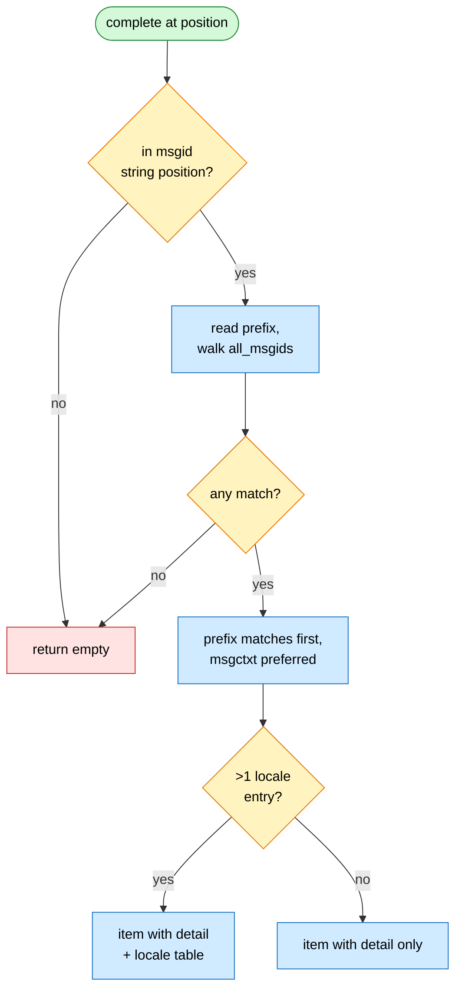

# F04 — Completion

> **Status:** Draft
>
> **Version:** 0.2   ·   **Last updated:** 2026-06-15
>
> **Purpose:** msgid autocompletion inside translation calls, with a multi-locale preview of each candidate.
>
> **Depends on:** [F01-catalog-index](F01-catalog-index.md), [F02-message-extraction](F02-message-extraction.md)   ·   **Related:** [F05-hover](F05-hover.md), [E07-data-model](../foundations/E07-data-model.md)

> Requirement tag: **CPL**

---

## 1. Purpose & Scope

When you start typing a msgid inside a translation call, this feature offers every msgid your catalogs already know, and previews how each one is translated across your locales.

You type `_("Che` in `views.py`. The server offers `Checkout`, and the completion shows `[de] Kasse` beside it — so you pick the real msgid without leaving the editor or guessing at its exact spelling.

This spec covers:

- The trigger: typing a quote inside a recognized translation call's msgid position.
- The candidates: every msgid in the [catalog index](F01-catalog-index.md), prefix-matched first.
- What each completion item shows — its detail line, its multi-locale table, and its precise text edit.
- Context-awareness: a `pgettext` call prefers msgids that carry its context.

## 2. Non-Goals / Out of Scope

- Building the index of msgids — owned by [F01](F01-catalog-index.md); this feature only reads `all_msgids`.
- Detecting which call the cursor sits in — the call shapes and ranges come from [F02](F02-message-extraction.md).
- Completing anything that isn't a msgid (kwargs, plurals, domain names) — Python's own LSP owns those.
- The hover surface that renders the same translations on a finished call — owned by [F05](F05-hover.md).

## 3. Background & Rationale

A msgid lives in two places at once: the source call that uses it and the catalogs that translate it. When you write a new call you have to spell the msgid exactly as the catalogs spell it, or the link breaks. This feature closes that gap — it reads the msgids the catalogs already carry and offers them as you type, so the call you write always matches a key the index knows.

It is a pure reader. It never edits a catalog and never runs code (P1); it walks the in-memory index [F01](F01-catalog-index.md) already built and renders what it finds.

## 4. Concepts & Definitions

- **msgid** — the source string that identifies a message; the thing this feature completes. (Canonical definition in [glossary](../glossary.md).)
- **prefix** — the partial msgid already typed between the opening quote and the cursor; what candidates are matched against.
- **catalog key** — a `(msgid, msgctxt)` pair; a context-qualified key and a plain key are distinct. (Canonical definition in [glossary](../glossary.md).)

## 5. Detailed Specification

The provider runs in three steps: decide whether the cursor is in a msgid position, gather matching msgids, then render each as a completion item. None of this touches a catalog file — it reads the in-memory index.

```rust
// src/features/completion.rs
pub fn complete(state: &WorkspaceState, uri: &Uri, pos: Position) -> Vec<CompletionItem>;
```

### 5.1 Trigger and gating

You only want completions where a msgid belongs, not everywhere you type a quote.

**REQ-CPL-01 — Complete only inside a msgid string position.**

The server uses [F02](F02-message-extraction.md)'s call detection to find the call enclosing the cursor. The cursor must sit inside the call's msgid string literal — the first string argument. If it sits anywhere else, or in no recognized call at all, the result is empty.

**REQ-CPL-02 — Advertise the quote trigger characters.**

A string literal contains no identifier character, so editors never auto-fire completion inside one on their own. The server therefore advertises `triggerCharacters: ["\"", "'"]` in its completion capabilities, so typing either quote opens the msgid surface as the call is written.

### 5.2 Gathering candidates

You want the msgids that match what you have typed so far, with the most likely ones first.

**REQ-CPL-03 — Prefix matches first, then contains matches.**

The server reads the partial msgid typed between the opening quote and the cursor — the prefix. It walks `all_msgids` from the [catalog index](../foundations/E07-data-model.md) ([E07 REQ-IDX-04](../foundations/E07-data-model.md)) and keeps every key whose msgid contains the prefix. Keys whose msgid *starts with* the prefix sort ahead of keys that merely contain it. An empty prefix keeps every msgid.

**REQ-CPL-04 — Respect msgctxt inside a `pgettext` call.**

When the enclosing call carries a context — a `pgettext("button", …)` or its `npgettext` cousin ([E07 REQ-IDX-06](../foundations/E07-data-model.md)) — the server prefers keys whose `msgctxt` equals that context, sorting them ahead of context-free matches. A context-qualified key and a plain key are different keys ([glossary: catalog key](../glossary.md)), so both can appear; the matching-context one wins the ordering.

### 5.3 Rendering an item

Each candidate must read its msgid back into the call, and preview how it translates.

**REQ-CPL-05 — Each item carries a label, a detail, and a precise text edit.**

For each surviving key the server builds a `CompletionItem`:

- `label` is the msgid itself.
- `kind` is `TEXT` — a msgid is a plain string, not a symbol.
- `detail` previews the default locale (the first entry from `lookup`): `[de] Kasse` when translated, or `[fr] (untranslated)` when the `msgstr` is empty.
- `text_edit` replaces the partial-string range exactly — from just after the opening quote to the cursor — so picking a candidate against `"Che` yields `"Checkout"`, never a doubled `"CheCheckout"`.

```rust
// src/features/completion.rs
CompletionItem {
    label: key.msgid.clone(),
    kind: Some(CompletionItemKind::TEXT),
    detail: Some(detail_for(entries.first())),       // "[de] Kasse" | "[fr] (untranslated)"
    documentation: locale_table(&entries),           // REQ-CPL-06; None for a single locale
    text_edit: Some(CompletionTextEdit::Edit(TextEdit { range: prefix_range, new_text: key.msgid.clone() })),
    ..Default::default()
}
```

The explicit `text_edit` matters because `/`, `.`, and spaces inside a msgid break the editor's default word boundary; without it a multi-word msgid like `Bad Request` is filtered out or mis-inserted.

**REQ-CPL-06 — Show a multi-locale table when several entries exist.**

When `lookup` returns more than one entry for the key, the server renders a markdown table into `documentation`, one row per locale, so you see the whole translation picture before committing. Each row marks status — translated, untranslated, or fuzzy — alongside its `msgstr`:

```markdown
<!-- documentation value for the "Checkout" candidate -->
| Locale | Translation |
|--------|-------------|
| de     | Kasse       |
| fr     | _(untranslated)_ |
```

A key with a single entry gets no table — the `detail` line already says everything.

## 6. UI Mockups

This feature has one editor surface: the completion menu the editor pops up as you type the msgid. babel-lsp owns the content — each item's label, its `[locale] translation` detail, and the multi-locale documentation table — while the editor owns the menu frame, its position, and keyboard navigation (P2).

### 6.1 Completion menu — the msgid popup

Appears under the cursor as you type a msgid inside a translation call (REQ-CPL-01/02). The menu lists matching msgids; the selected item shows its detail beside the label, and a documentation panel to the side previews every locale. Dismissed by `Esc` or by accepting an item.

```
  _("Che
       │  ← cursor
  ╭─ completions ──────────────────╮ ╭─ documentation ────────────╮
  │ «Checkout»          [de] Kasse │ │ Checkout                   │
  │  Cheese             [de] Käse  │ │                            │
  │  Check order        [de] —     │ │ | Locale | Translation |   │
  ╰────────────────────────────────╯ │ |--------|-------------|   │
   ▲ selected item, detail at right   │ | de     | Kasse       |   │
                                      │ | fr     | (untranslated) |
                                      ╰────────────────────────────╯
```

States:

- **matches** — one row per candidate, prefix matches first (shown above).
- **no-match** — prefix matches nothing; the editor shows no menu at all.

```
  No-match (prefix "Zzz"):          No-catalogs (empty index):
  _("Zzz                            _("Che
       │  no menu                        │  no menu
  (empty result — editor             (all_msgids empty — empty
   renders nothing)                   result, never an error)
```

- **no-catalogs** — no catalogs indexed yet, so `all_msgids` is empty; the result is empty and the editor renders nothing (P3).

## 7. Visualizations

The provider's three gates — is the cursor in a msgid position, does anything match, does the key have several entries — decide what each candidate becomes.



## 8. Data Shapes

A completion item crosses the LSP boundary to the editor. For the `Checkout` candidate against the prefix `Che`, the server returns this `CompletionItem` (the `documentation` value is the markdown table from REQ-CPL-06):

```json
{
  "label": "Checkout",
  "kind": 1,
  "detail": "[de] Kasse",
  "documentation": {
    "kind": "markdown",
    "value": "| Locale | Translation |\n|--------|-------------|\n| de | Kasse |\n| fr | _(untranslated)_ |"
  },
  "textEdit": {
    "range": { "start": { "line": 4, "character": 7 }, "end": { "line": 4, "character": 10 } },
    "newText": "Checkout"
  }
}
```

The `range` covers `Che` — from just after the opening quote to the cursor — so accepting the item replaces exactly that span (REQ-CPL-05).

## 9. Examples & Use Cases

You are adding a button label in the shopfront's `app/views.py`. You type `_("Che` and the editor fires completion on the opening quote (REQ-CPL-02). The server finds the enclosing `_(…)` call, reads `Che` as the prefix, and walks the index (REQ-CPL-03).

`Checkout` is the only msgid with that prefix. The item's `label` is `Checkout`; its `detail` reads `[de] Kasse` from the German entry (REQ-CPL-05). Because `lookup` also returns the empty French entry, the `documentation` table shows both locales — `de: Kasse`, `fr: (untranslated)` (REQ-CPL-06). You accept it, the `text_edit` swaps `Che` for `Checkout`, and the literal reads `_("Checkout")`.

Later you type `pgettext("button", "Sa`. The call carries the context `button`, so the `Save` key tagged with that context sorts ahead of any plain `Save` (REQ-CPL-04).

## 10. Edge Cases & Failure Modes

- Empty prefix (cursor right after the opening quote) → every msgid in the index is offered.
- No catalogs indexed yet, or none on disk → `all_msgids` is empty → an empty result, never an error (P3).
- Cursor in a non-literal msgid position — `_(f"Hi {name}")` or `_(name)` → no msgid string to complete, so no completion ([E07](../foundations/E07-data-model.md) unresolved call).
- Cursor inside the call but outside the msgid argument (a later kwarg) → empty; only the msgid position triggers (REQ-CPL-01).
- A prefix that matches nothing → empty result; the editor shows no menu.

## 11. Testing

Completion is tested as a pure function: seed a fixture workspace, place a cursor, and assert the returned `CompletionItem` list — its order, each item's detail, and its `textEdit` range.

### 11.1 Scope & coverage

Target: **100% of this feature's behavior is covered.** Every `REQ-CPL-NN` below maps to at least one test; every menu state (§6) and edge case (§10) has a test. See the policy in [E17 §2](../foundations/E17-testing.md#2-coverage-policy).

### 11.2 Test plan

Each row is a behavior under test, read off [clean-shopfront](../foundations/E17-testing.md#clean-shopfront) unless noted.

| Behavior / scenario | Type | Fixtures | Verifies |
|---|---|---|---|
| Quote inside `_(…)` triggers; cursor outside the msgid arg returns empty | unit | [clean-shopfront](../foundations/E17-testing.md#clean-shopfront) | REQ-CPL-01 |
| Completion capability advertises `triggerCharacters` `"` and `'` | unit | [clean-shopfront](../foundations/E17-testing.md#clean-shopfront) | REQ-CPL-02 |
| Prefix matches sort ahead of contains matches; empty prefix keeps all | unit | [clean-shopfront](../foundations/E17-testing.md#clean-shopfront) | REQ-CPL-03 |
| `pgettext("button", …)` prefers the context-tagged `Save` key | unit | [clean-shopfront](../foundations/E17-testing.md#clean-shopfront) | REQ-CPL-04 |
| Item carries label, `[de] Kasse` detail, and a `textEdit` over the prefix span only | unit | [clean-shopfront](../foundations/E17-testing.md#clean-shopfront) | REQ-CPL-05 |
| Multi-locale key renders a markdown documentation table; single-locale key renders none | unit | [clean-shopfront](../foundations/E17-testing.md#clean-shopfront) | REQ-CPL-06 |
| Empty index → empty result, no error (no-catalogs state) | unit | empty workspace | REQ-CPL-03, §10 |
| Non-literal msgid `_(f"Hi {name}")` → no completion | unit | [fstring-call](../foundations/E17-testing.md#fstring-call) | REQ-CPL-01, §10 |
| Prefix matching nothing → empty result (no-match state) | unit | [clean-shopfront](../foundations/E17-testing.md#clean-shopfront) | REQ-CPL-03, §6 |

### 11.3 Fixtures

Shared fixtures live in the [E17 fixtures registry](../foundations/E17-testing.md#5-fixtures-registry) — this feature reuses [clean-shopfront](../foundations/E17-testing.md#clean-shopfront) (the baseline with `Checkout` translated in `de`, missing in `fr`, and a fuzzy `Save`) and [fstring-call](../foundations/E17-testing.md#fstring-call) (the unresolved-msgid case). The empty-index state uses a bare temp workspace with no catalogs; no feature-local fixture is needed.

### 11.4 Requirement coverage

Every load-bearing requirement maps to a test — this table is the proof.

| Requirement | Covered by |
|---|---|
| REQ-CPL-01 | `req_cpl_01_completes_only_in_msgid_position` |
| REQ-CPL-02 | `req_cpl_02_advertises_quote_trigger_characters` |
| REQ-CPL-03 | `req_cpl_03_prefix_before_contains` |
| REQ-CPL-04 | `req_cpl_04_prefers_msgctxt_in_pgettext` |
| REQ-CPL-05 | `req_cpl_05_item_label_detail_and_text_edit` |
| REQ-CPL-06 | `req_cpl_06_multi_locale_documentation_table` |

## 12. End-to-End Test Plan

A real client opens a shopfront file, sends `textDocument/completion` at a cursor, and asserts the items the running server returns — the same path an editor takes.

### 12.1 Coverage target

**100% of the feature's scope, end to end** — the happy path plus all reasonably possible error paths (empty prefix, no catalogs, an unresolved call). See the policy in [E29 §2](../foundations/E29-e2e-testing.md#2-coverage-policy).

### 12.2 Scenarios

Each scenario seeds a fixture from the [E17 registry](../foundations/E17-testing.md#5-fixtures-registry), waits on the post-open publish (never a sleep), then drives `textDocument/completion`.

| # | Journey | Path | Expected outcome |
|---|---|---|---|
| E2E-01 | Type `_("Che`, request completion | happy | Items include `Checkout` with detail `[de] Kasse`; its `textEdit` replaces only `Che` so the buffer reads `_("Checkout")` |
| E2E-02 | Empty prefix `_("`, request completion | happy | Every msgid in the index is returned |
| E2E-03 | Empty workspace (no catalogs), request completion | error | An empty completion list, no error response |
| E2E-04 | Inside `pgettext("button", "Sa`, request completion | happy | The `button`-context `Save` key sorts ahead of the plain `Save` |

### 12.3 Acceptance criteria & Definition of Done

The §12.2 scenarios, written Given/When/Then, are this feature's acceptance criteria:

| # | Given | When | Then |
|---|---|---|---|
| AC-01 | clean-shopfront open in `views.py`, cursor after `_("Che` | the client requests completion | `Checkout` appears with `[de] Kasse` detail and accepting it yields `_("Checkout")` |
| AC-02 | clean-shopfront open, cursor right after the opening quote | the client requests completion | every indexed msgid is offered |
| AC-03 | an empty workspace with no catalogs | the client requests completion | the list is empty and no error is returned |
| AC-04 | clean-shopfront open, cursor after `pgettext("button", "Sa` | the client requests completion | the context-matching `Save` key is ranked ahead of the plain `Save` |

**Definition of Done:** every `REQ-CPL-NN` has a passing test (§11.4), every acceptance scenario above passes, and every enabled non-functional concern (§13) is verified.

## 13. Non-Functional Requirements

### 13.1 Security & Privacy

- **Access & authorization** — a read-only completion from the local in-memory index; it crosses no trust boundary, executes nothing, and reaches no network (P1).
- **Input & validation** — the only input is the prefix the user typed and the cursor position; suggestions are msgids drawn from the user's own catalogs, never injected or fetched.
- **Data sensitivity** — no PII, secrets, or regulated data; the content is the developer's own translation strings on their own machine.

## 15. Open Questions & Decisions

- _None open._ The candidate ordering (prefix-then-contains, msgctxt-preferred) and the single-locale "no table" rule are settled in §5.

## 16. Cross-References

- **Depends on:** [F01-catalog-index](F01-catalog-index.md) — supplies `all_msgids` and `lookup` (REQ-CAT-05); [F02-message-extraction](F02-message-extraction.md) — supplies the enclosing-call detection and the msgid range (REQ-CPL-01).
- **Related:** [F05-hover](F05-hover.md) — renders the same multi-locale translations on a finished call, sharing the locale/status vocabulary; [E07-data-model](../foundations/E07-data-model.md) — `CatalogIndex`, `CatalogKey`, and `TranslationCall` (REQ-IDX-04/06).
- **Testing:** [E17-testing](../foundations/E17-testing.md#2-coverage-policy) — coverage policy and the [clean-shopfront](../foundations/E17-testing.md#clean-shopfront) fixture; [E29-e2e-testing](../foundations/E29-e2e-testing.md#2-coverage-policy) — the E2E harness and policy.

## 17. Changelog

- **2026-06-15** — v0.2: restructured to the updated spec-writer template. Added §6 UI Mockups (the completion menu popup with matches / no-match / no-catalogs states), §7 the candidate-pipeline flowchart, §8 the `CompletionItem` data shape, §11 Testing (plan + REQ-CPL-01..06 coverage table over [clean-shopfront](../foundations/E17-testing.md#clean-shopfront)), §12 End-to-End Test Plan with Given/When/Then acceptance criteria, §13.1 Security & Privacy, and §13.2 Accessibility (content-level). Renumbered the detailed spec to §5 and moved Cross-References/Changelog to the canonical §16/§17.
- **2026-06-15** — Initial draft: quote-triggered msgid completion gated on [F02](F02-message-extraction.md) call detection (REQ-CPL-01/02); prefix-then-contains candidate matching with msgctxt preference (REQ-CPL-03/04); `TEXT` items carrying a `[locale] translation` detail, a precise `textEdit`, and a multi-locale markdown table (REQ-CPL-05/06). Translated from the legacy `features/completion.rs`.
