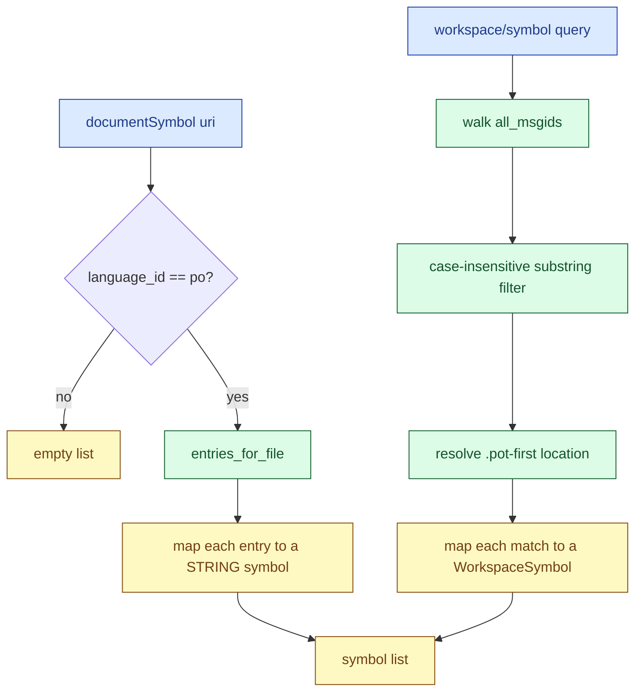

# F09 — Symbols

> **Status:** Draft
>
> **Version:** 0.2   ·   **Last updated:** 2026-06-15
>
> **Purpose:** Catalog entries as document symbols, and any msgid searchable across the whole workspace.
>
> **Depends on:** [F01-catalog-index](F01-catalog-index.md), [E07-data-model](../foundations/E07-data-model.md)   ·   **Related:** [F05-hover](F05-hover.md), [F06-navigation](F06-navigation.md)

> Requirement tag: **SYM**

---

## 1. Purpose & Scope

This spec turns the catalog index into two editor surfaces: an outline of the catalog you're looking at, and a search box over every msgid in the workspace.

You open `de.po` and your editor's outline lists every translation in it — `Checkout`, `Save`, and the rest. You hit your workspace-symbol key, type `chec`, and the picker finds `Checkout` no matter which file you're in. Both surfaces are pure reads over the index [F01](F01-catalog-index.md) already built.

This spec covers:

- Document symbols (`textDocument/documentSymbol`) for `.po`/`.pot` files.
- Workspace symbols (`workspace/symbol`) over every msgid in the index.

## 2. Non-Goals / Out of Scope

- Symbols for Python or Jinja source — the primary language server owns those; we add only what catalogs know.
- Loading or keying catalogs — owned by [F01](F01-catalog-index.md); this spec only reads the index.
- Jumping to a symbol's definition — that's goto, owned by [F06](F06-navigation.md).

## 3. Detailed Specification

### 3.1 Document symbols

You ask for the outline of an open catalog. The server returns one symbol per entry in that file, in file order.

**REQ-SYM-01 — Each catalog entry is one document symbol.**

For a `.po`/`.pot` file, the server reads its entries via [`entries_for_file`](../foundations/E07-data-model.md) and maps each to a symbol. The symbol's `name` is the msgid; its `kind` is `STRING`; its `range` and `selection_range` anchor to the entry's `line`. The list reflects the unsaved overlay, so an entry you just typed appears before you save ([F01](F01-catalog-index.md) REQ-CAT-07).

**REQ-SYM-02 — The detail field shows status or a translation snippet.**

The `detail` summarizes the entry at a glance. A fuzzy entry reads `fuzzy`; an untranslated one reads `untranslated`; a translated one shows its `msgstr`, truncated to ~60 characters with an ellipsis. So the German `"Save"` entry shows `fuzzy`, the French `"Checkout"` shows `untranslated`, and the German `"Checkout"` shows `Kasse`.

**REQ-SYM-03 — Only catalog files produce document symbols.**

The server returns symbols only when the document's `language_id` is `po` ([E07](../foundations/E07-data-model.md)). A Python or Jinja buffer returns an empty list, so we never compete with the source language server's outline.

### 3.2 Workspace symbols

This surface is new versus the legacy server, which only had document symbols. You search across the whole catalog index, not just one file.

**REQ-SYM-04 — A query matches msgids across the whole index.**

For a `workspace/symbol` query, the server walks [`all_msgids`](../foundations/E07-data-model.md) and keeps every [CatalogKey](../foundations/E07-data-model.md) whose msgid matches. Matching is case-insensitive substring: the query `chec` matches `Checkout`, and an empty query returns every msgid. This catches partial recall — you remember "chec", not the exact casing or the full word.

**REQ-SYM-05 — Each match resolves to one location in a catalog.**

A workspace symbol needs a place to jump to. The server points each match at its `.pot` template entry when one exists, else the first defining catalog entry, using that entry's `file_path` and `line`. So searching `Checkout` lands you in `messages.pot` where the msgid is declared, the natural home of the string.

**REQ-SYM-06 — Context rides in the symbol name.**

A msgid with a `msgctxt` shows as `msgctxt|msgid` in the symbol name — `button|Save` — so the two `Save` keys read as distinct entries and a search for `button` finds the contextual one. Pickers re-filter fuzzily on the name alone, so the context must live in the name to be searchable, not in a side field the picker ignores.

### 3.3 Code map

Two pure reads over the shared state, no errors and no held state — an empty index yields an empty list.

```rust
// src/features/symbols.rs
pub fn document_symbols(state: &WorkspaceState, uri: &Uri) -> Vec<DocumentSymbol>;
pub fn workspace_symbols(state: &WorkspaceState, query: &str) -> Vec<WorkspaceSymbol>;

fn symbol_name(entry: &CatalogEntry) -> String;   // "Checkout" / "button|Save"
fn detail(entry: &CatalogEntry) -> String;        // "fuzzy" | "untranslated" | "Kasse" (REQ-SYM-02)
fn matches(key: &CatalogKey, query: &str) -> bool; // case-insensitive substring (REQ-SYM-04)
```

## 6. UI Mockups

Symbols produces two editor surfaces: the document outline the editor draws from `documentSymbol`, and the workspace-symbol quick-pick it draws from a `workspace/symbol` query. babel-lsp returns the symbol list; the editor owns the panel chrome and the picker. The mockups below are the layout contract for the content of each — what each row names and shows, not the editor's framing.

### 6.1 Document outline — `de.po` open

What the editor's outline panel shows when you open a catalog. One `STRING` symbol per entry, named by its msgid, with the §3.1 status-or-snippet detail trailing it.

```
┌─ Outline — de.po ──────────────────────────────┐
│  ⓢ Checkout              Kasse                  │
│  ⓢ button|Save           fuzzy                  │
│  ⓢ Your cart             untranslated           │
│  ⓢ %(num)d item          <count> Artikel…       │
└─────────────────────────────────────────────────┘
```

States: populated (rows above) · empty (a non-catalog buffer yields no symbols — see §6.2) · large (one row per entry; the editor paginates, not us).

### 6.2 Empty outline — a `.py` buffer

What the outline shows for a non-catalog file. babel-lsp returns no symbols, so its rows are absent — the source language server fills the panel, never us.

```
┌─ Outline — views.py ───────────────────────────┐
│  <no babel-lsp symbols — owned by the source    │
│   language server>                              │
└─────────────────────────────────────────────────┘
```

States: empty (the only babel-lsp state — REQ-SYM-03).

### 6.3 Workspace symbol picker — typing "chec"

What the editor's quick-pick shows after you hit the workspace-symbol key and type a query. babel-lsp returns each matching msgid with its resolved catalog location; the editor lays them out and owns the focus.

```
  ╭─ Go to Symbol in Workspace ────────────────────╮
  │ [ chec________________________________ ]       │
  ├────────────────────────────────────────────────┤
  │ ⓢ Checkout                                     │
  │      locale/messages.pot : 12                  │
  ╰────────────────────────────────────────────────╯
```

States: matches (rows above) · empty query (every msgid listed — REQ-SYM-04) · no match (the editor shows its own "no results").

## 7. Visualizations

How a request flows from either capability to the same shared index, and where each diverges. The document path filters by file and language; the workspace path scans every msgid.



## 8. Data Shapes

The two payloads each capability returns. A document symbol carries the name, the `STRING` kind, the detail, and the range; a workspace symbol carries the name and a resolved location.

```json
{
  "documentSymbol": {
    "name": "button|Save",
    "kind": 15,
    "detail": "fuzzy",
    "range": { "start": { "line": 8, "character": 0 }, "end": { "line": 8, "character": 0 } },
    "selectionRange": { "start": { "line": 8, "character": 0 }, "end": { "line": 8, "character": 0 } }
  },
  "workspaceSymbol": {
    "name": "Checkout",
    "kind": 15,
    "location": { "uri": "file:///shopfront/locale/messages.pot", "range": { "start": { "line": 12, "character": 0 }, "end": { "line": 12, "character": 0 } } }
  }
}
```

`kind` is `15` — the LSP `String` symbol kind. The `name` carries the `msgctxt|msgid` form when an entry has a context (REQ-SYM-06).

## 9. Examples & Use Cases

You open the shopfront's `de.po`. Your editor's outline lists `Checkout` with detail `Kasse`, and `button|Save` with detail `fuzzy` — the whole German catalog at a glance, in file order (REQ-SYM-01, REQ-SYM-02). The rendered panel is §6.1.

Later you're editing `views.py` and can't recall the exact msgid for the checkout button. You hit your workspace-symbol key and type `chec`. The picker shows `Checkout`; you select it and land in `messages.pot` where the template declares it (REQ-SYM-04, REQ-SYM-05). No catalog file was open, and no editor-specific UI was involved. The rendered picker is §6.3.

## 10. Edge Cases & Failure Modes

- The empty-msgid header entry → already dropped at load ([F01](F01-catalog-index.md) REQ-CAT-03), so it never reaches either surface.
- A huge catalog (tens of thousands of entries) → document symbols return one per entry; the count tracks the file, and a very large outline is the editor's to paginate, not ours to trim.
- A workspace query against a large index → the substring walk over `all_msgids` is linear; per P6 the index is in memory, so the scan stays fast without a separate symbol cache.
- The same msgid in many locales → workspace search returns it once, resolved to the `.pot` (or first) entry, not once per locale (REQ-SYM-05).
- A non-catalog buffer asking for document symbols → empty list (REQ-SYM-03).

## 11. Testing

Symbols is tested by reading the shopfront index and asserting the document-symbol list per file and the workspace-symbol matches and their resolved locations.

### 11.1 Scope & coverage

Target: **100% of this feature's behavior is covered.** Every `REQ-SYM-NN` below maps to at least one test; every outline/picker state (§6) and edge case (§10) has a test. See the policy in [E17 §2](../foundations/E17-testing.md#2-coverage-policy).

### 11.2 Test plan

Each row is a behavior under test. Shared fixtures link to the [E17 registry](../foundations/E17-testing.md#5-fixtures-registry); the requirement column names what it verifies.

| Behavior / scenario | Type | Fixtures | Verifies |
|---|---|---|---|
| Document symbols — one `STRING` symbol per catalog entry, in file order | integration | [clean-shopfront](../foundations/E17-testing.md#clean-shopfront) | REQ-SYM-01 |
| Detail field — `fuzzy`, `untranslated`, and a truncated `msgstr` snippet | unit | [clean-shopfront](../foundations/E17-testing.md#clean-shopfront) | REQ-SYM-02 |
| Header entry skipped — the empty-msgid header never appears as a symbol | unit | [clean-shopfront](../foundations/E17-testing.md#clean-shopfront) | REQ-SYM-01 |
| Non-catalog buffer — a `.py`/`.jinja` document yields an empty list | unit | [clean-shopfront](../foundations/E17-testing.md#clean-shopfront) | REQ-SYM-03 |
| Workspace query — case-insensitive substring over `all_msgids` (`chec` → `Checkout`) | integration | [clean-shopfront](../foundations/E17-testing.md#clean-shopfront) | REQ-SYM-04 |
| Empty query — every msgid is returned | unit | [clean-shopfront](../foundations/E17-testing.md#clean-shopfront) | REQ-SYM-04 |
| Location resolution — a match lands at its `.pot` entry, once, not per locale | integration | [clean-shopfront](../foundations/E17-testing.md#clean-shopfront) | REQ-SYM-05 |
| Context in the name — a `msgctxt` entry reads `button|Save`, searchable by `button` | unit | [clean-shopfront](../foundations/E17-testing.md#clean-shopfront) | REQ-SYM-06 |

### 11.3 Fixtures

Reusable fixtures live in the [E17 registry](../foundations/E17-testing.md#5-fixtures-registry) — linked above. This feature defines no fixtures of its own; it reuses [clean-shopfront](../foundations/E17-testing.md#clean-shopfront), whose `de.po` supplies the translated, fuzzy, and untranslated entries, the `button|Save` context key, and the `messages.pot` template for `.pot`-first location resolution.

### 11.4 Requirement coverage

Every load-bearing requirement maps to a test — this table is the proof.

| Requirement | Covered by |
|---|---|
| REQ-SYM-01 | `req_sym_01_one_symbol_per_entry_in_file_order`, `req_sym_01_header_entry_skipped` |
| REQ-SYM-02 | `req_sym_02_detail_is_status_or_snippet` |
| REQ-SYM-03 | `req_sym_03_non_catalog_buffer_is_empty` |
| REQ-SYM-04 | `req_sym_04_query_matches_substring`, `req_sym_04_empty_query_returns_all` |
| REQ-SYM-05 | `req_sym_05_resolves_pot_first_once` |
| REQ-SYM-06 | `req_sym_06_context_rides_in_name` |

## 12. End-to-End Test Plan

Driving the built binary as an editor would, request the outline of a catalog and search the workspace, asserting the symbol payloads over the wire.

### 12.1 Coverage target

**100% of the feature's scope, end to end** — the happy path plus the reasonably possible error paths (a non-catalog buffer, a context-qualified key). See the policy in [E29 §2](../foundations/E29-e2e-testing.md#2-coverage-policy).

### 12.2 Scenarios

Each scenario opens a fixture workspace, sends a `documentSymbol` or `workspace/symbol` request, and asserts the response.

| # | Journey | Path | Expected outcome |
|---|---|---|---|
| E2E-01 | `documentSymbol` of `de.po` | happy | The list includes `Checkout` (detail `Kasse`) and `button|Save` (detail `fuzzy`), in file order |
| E2E-02 | `workspace/symbol` query `chec` | happy | Returns `Checkout` resolved to `messages.pot` at its declaring line |
| E2E-03 | `documentSymbol` of a `.py` file | error | Returns an empty list — the source language server owns that outline |
| E2E-04 | `documentSymbol` of a context-qualified key | happy | The `Save` entry's symbol name reads `button|Save` |

### 12.3 Acceptance criteria & Definition of Done

The §12.2 scenarios, written Given/When/Then, are this feature's acceptance criteria:

| # | Given | When | Then |
|---|---|---|---|
| AC-01 | the clean-shopfront workspace is open | you request the outline of `de.po` | `Checkout` (detail `Kasse`) and `button|Save` (detail `fuzzy`) appear in file order |
| AC-02 | `views.py` references `_("Checkout")` | you run a workspace-symbol search for `chec` | `Checkout` is returned, resolved to `messages.pot` at its declaring line |
| AC-03 | `views.py` is open | you request its document symbols | an empty list is returned |
| AC-04 | `Save` carries `msgctxt "button"` | you request the outline holding it | its symbol name reads `button|Save` |

**Definition of Done:** every `REQ-SYM-NN` has a passing test (§11.4), every acceptance scenario above passes, and every enabled non-functional concern (§13) is verified.

## 13. Non-Functional Requirements

### 13.1 Security & Privacy

- **Access & validation** — both capabilities are read-only listings over the local index already built by [F01](F01-catalog-index.md); they never execute user code, open a network connection, or shell out (P1).
- **Data sensitivity** — the symbols carry only msgids, contexts, and translation snippets from the user's own workspace; no PII, secrets, or telemetry leave the process.
- **Baseline** — the only untrusted input is catalog text, parsed defensively upstream; symbols read the resulting facts and add no new trust boundary.

## 15. Open Questions & Decisions

- None open.

## 16. Cross-References

- **Depends on:** [F01-catalog-index](F01-catalog-index.md) — supplies `entries_for_file`, `all_msgids`, and `is_in_pot`; [E07-data-model](../foundations/E07-data-model.md) — `CatalogEntry`, `CatalogKey`, and the `language_id` dispatch.
- **Related:** [F05-hover](F05-hover.md) — renders the same status/snippet on a source call; [F06-navigation](F06-navigation.md) — the goto that a symbol's location feeds.
- **Testing:** [E17-testing](../foundations/E17-testing.md) — the coverage policy and the shared fixtures §11 reuses; [E29-e2e-testing](../foundations/E29-e2e-testing.md) — the harness and patterns §12 reuses.

## 17. Changelog

- **2026-06-15** — v0.2: restructured to the updated spec-writer template. Added §6 UI Mockups (6.1 document outline, 6.2 empty `.py` outline, 6.3 workspace symbol picker), §7 a request-flow diagram, §8 data shapes for both payloads, §11 Testing (coverage, plan, fixtures, and a per-requirement coverage table mapping REQ-SYM-01..06), §12 End-to-End Test Plan with Given/When/Then acceptance and a DoD, §13.1 Security & Privacy, and §13.2 Accessibility (content-level). Renumbered to canonical section order; preserved REQ-SYM-01..06 unchanged.
- **2026-06-15** — Initial draft: document symbols per catalog entry with status/snippet detail (REQ-SYM-01/02/03); new workspace-symbol search over `all_msgids` with `.pot`-first location resolution and `msgctxt` in the name (REQ-SYM-04/05/06). Translated and extended from the legacy `document_symbol.rs`.
