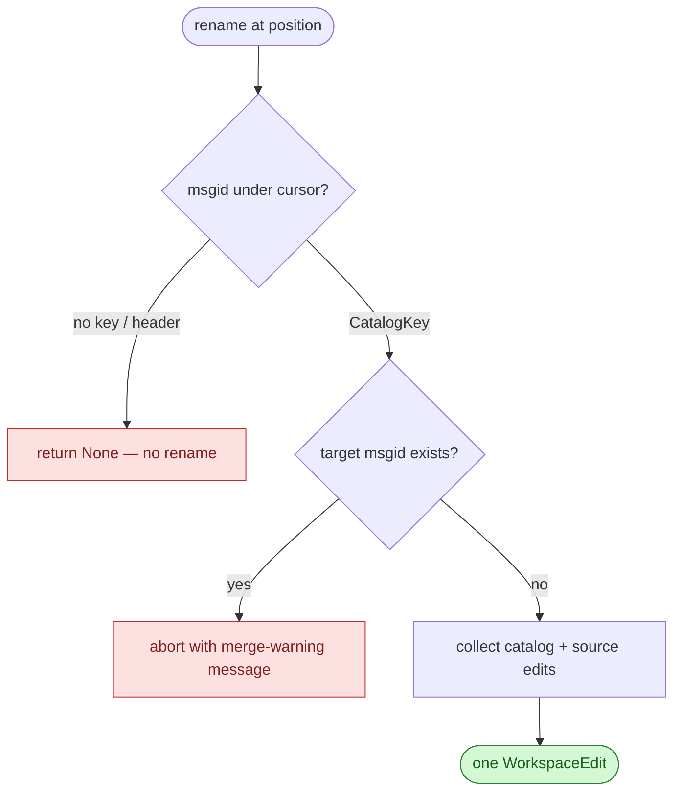

# F10 — Rename

> **Status:** Draft
>
> **Version:** 0.2   ·   **Last updated:** 2026-06-15
>
> **Purpose:** Rename a msgid once and update every catalog entry and call site across the workspace in a single edit.
>
> **Depends on:** [F01-catalog-index](F01-catalog-index.md), [F06-navigation](F06-navigation.md), [E07-data-model](../foundations/E07-data-model.md)   ·   **Related:** [F03-diagnostics](F03-diagnostics.md)

> Requirement tag: **RNM**

---

## 1. Purpose & Scope

You put the cursor on `"Checkout"`, ask your editor to rename it to `"Checkout page"`, and every place that names that msgid changes at once — the source call, the template, and all three catalogs. That single coordinated edit is what this spec delivers.

This spec covers:

- `textDocument/prepareRename`: confirm the cursor sits on a renameable msgid and return its range.
- `textDocument/rename`: build one `WorkspaceEdit` that rewrites the msgid everywhere it appears.
- The gettext nuance of re-keying a message, and the collision case.

## 2. Non-Goals / Out of Scope

- Finding the entries and calls a rename edits — the edge set is owned by [F06](F06-navigation.md); rename reuses its reference-finding and only adds the edits.
- Loading and keying catalog entries — owned by [F01](F01-catalog-index.md).
- Renaming a msgctxt, a locale, or a domain — only the msgid string is renameable here.
- Running `pybabel update` or migrating translations — the catalog stays the translator's tool (constitution P5).

## 3. Detailed Specification

Rename works on a [CatalogKey](../foundations/E07-data-model.md). The cursor identifies one key; the edit rewrites that key's msgid in every catalog entry and every source call that shares it. The msgctxt never changes, so the key's context half is preserved.

### 3.1 Prepare rename

`prepareRename` is the gate. It answers "is there a msgid here I can rename?" and hands back the exact range the editor should highlight.

**REQ-RNM-01 — Prepare returns the msgid range under the cursor.**

The server accepts the position in one of two places. In a source document, the cursor must sit inside a translation call's `msgid_range` ([E07 REQ-IDX-06](../foundations/E07-data-model.md)); the returned range is that literal alone. In a catalog, the cursor must sit on a `msgid` line of a real entry; the returned range covers the quoted msgid text. Anywhere else, prepare returns nothing and the editor refuses the rename.

```rust
// src/features/rename.rs
pub fn prepare_rename(
    state: &WorkspaceState,
    uri: &Uri,
    position: Position,
) -> Option<PrepareRenameResponse>;
```

**REQ-RNM-02 — Non-renameable positions are rejected.**

A non-literal msgid — `_(f"Hi {user}")` — has `msgid: None` ([E07 REQ-IDX-06](../foundations/E07-data-model.md)), so it forms no key and prepare rejects it (constitution P4). A catalog header entry (empty msgid) is rejected too; renaming the header is meaningless. Rejection is silent — `None`, never an error. The rejected shape is sketched in §6.1.

### 3.2 Rename

Rename resolves the key under the cursor, then collects every edit that rewrites it, across catalogs and source alike.

**REQ-RNM-03 — Rename builds one WorkspaceEdit covering every catalog entry.**

From the resolved [CatalogKey](../foundations/E07-data-model.md), the server looks up every entry the key defines across all locales and the `.pot` template ([E07 REQ-IDX-04](../foundations/E07-data-model.md)). For each, it emits a `TextEdit` replacing the `msgid` line's quoted text with the new name, escaped for the `.po` format and preserving the obsolete (`#~`) prefix where present. The msgstr and msgctxt lines are untouched. The set of touched files is sketched in §6.2.

**REQ-RNM-04 — Rename also rewrites every source call site.**

This is the improvement over the legacy server, which renamed catalogs and open source buffers but left on-disk source unsearched — a rename could miss a call in a file you hadn't opened. Here the source side is workspace-wide. The server rewrites the `msgid_range` of every matching call in open documents *and* in the on-disk source scan, reusing [F06](F06-navigation.md)'s reference-finding (REQ-NAV-04/06) and its pruning rules. Results are deduplicated by `(uri, range)` so an open file's buffer hit shadows its disk hit (REQ-NAV-05).

```rust
// src/features/rename.rs
pub fn rename(
    state: &WorkspaceState,
    uri: &Uri,
    position: Position,
    new_name: &str,
) -> Option<WorkspaceEdit>;
```

**REQ-RNM-05 — The edit respects the unsaved overlay.**

Every catalog entry rewritten reads from the buffer when one is open, not the disk copy ([E07 REQ-IDX-07](../foundations/E07-data-model.md), [F01](F01-catalog-index.md) REQ-CAT-07). So a rename lands correctly on lines you are still editing, and the `WorkspaceEdit` the editor applies is consistent with what you see on screen.

### 3.3 The gettext nuance

Renaming a msgid is not a cosmetic edit — it re-keys the message. You should understand what that does to your catalogs before you reach for it.

**REQ-RNM-06 — Rename re-keys in place and keeps catalogs in sync.**

The edit changes the `msgid` line text in every catalog and the literal in every source call together, so source and catalog stay linked under the new key. But this diverges from a `pybabel update`. Normally a changed msgid becomes a fresh, untranslated key, and the old translation drops to obsolete or fuzzy. This rename instead edits the entries in place, so the German `"Kasse"` stays attached to the new msgid rather than being orphaned. That is usually what you want from an editor refactor — but it is your edit, not gettext's migration, and the spec is explicit about the difference (constitution P5).

### 3.4 Collisions

Renaming onto a msgid that already exists would merge two distinct messages — the server will not do that silently.

**REQ-RNM-07 — A collision aborts the rename with a message.**

Before building the edit, the server checks whether the target — `(new_name, msgctxt)` — already resolves to an entry in the index. If it does, rename aborts and returns an error the editor surfaces: the two messages would merge, and the server cannot know that is intended. Renaming `"Checkout"` to an existing `"Cart"` is refused; pick a free name, or merge the catalogs by hand first. Abort, never merge. The aborted shape is sketched in §6.2.

## 6. UI Mockups

Rename produces two editor surfaces: the editor's inline rename input over the msgid, and the multi-file preview the editor builds from the returned `WorkspaceEdit`. babel-lsp owns the content of both — the renameable range it hands `prepareRename`, the files and edits it packs into the `WorkspaceEdit`, and the rejection/collision messages it surfaces. The editor owns the box itself: its focus, its keystrokes, and how it lists the changes. The mockups below are the layout contract for what babel-lsp's content makes the editor show.

### 6.1 Inline rename input — over the msgid

What you see the moment you invoke rename on a renameable msgid: the editor opens a small input over the literal, seeded with the current text, and you type the new name. babel-lsp's `prepareRename` decides whether the box opens at all and which characters it selects.

```
  app/views.py
  ┄┄┄┄┄┄┄┄┄┄┄┄┄┄┄┄┄┄┄┄┄┄┄┄┄┄┄┄┄┄┄┄┄┄┄┄┄┄┄┄┄┄┄┄┄┄┄┄┄┄┄
  _("Checkout")
    ╭───────────────────────╮
    │ Checkout page▏        │  ◀ type the new msgid; Enter applies
    ╰───────────────────────╯
     ╰──────╯
     renameable range (the literal alone)
```

States: renameable (box opens, seeded with `Checkout`) · rejected (no box — `prepareRename` returned `None` for a non-literal `_(f"Hi {user}")` or a catalog header entry; the editor shows *"You cannot rename this element"*).

### 6.2 Rename preview — files that will change

What you see after you type the new name and the editor renders the returned `WorkspaceEdit` as a preview: one row per touched file with its edit count, so you can review the whole coordinated change before accepting. babel-lsp owns this file list and counts; the editor owns the preview pane.

```
  ╭─ Rename "Checkout" → "Checkout page" ── 5 files · 5 edits ─╮
  │  app/views.py                                       1 edit │
  │  app/templates/checkout.html                        1 edit │
  │  locale/messages.pot                                1 edit │
  │  locale/de/LC_MESSAGES/messages.po   (Kasse kept)   1 edit │
  │  locale/fr/LC_MESSAGES/messages.po   (still empty)  1 edit │
  │                                                            │
  │                                    [ Cancel ]  [ Apply ]   │
  ╰────────────────────────────────────────────────────────────╯
```

States: renameable (the rows above — every catalog and call site listed) · collision (no preview — the target `"Cart"` already exists, so rename aborts; the editor shows the returned message *"Cannot rename: a message 'Cart' already exists — renaming would merge two messages"*).

## 7. Visualizations

How a rename request resolves — from the cursor to either a `WorkspaceEdit` or an abort.



## 8. Data Shapes

The `WorkspaceEdit` a rename returns is a `changes` map keyed by document URI, each value a list of `TextEdit`s. This is the contract the editor applies.

```json
{
  "changes": {
    "file:///app/views.py": [
      { "range": { "start": {"line": 12, "character": 7}, "end": {"line": 12, "character": 15} },
        "newText": "Checkout page" }
    ],
    "file:///locale/de/LC_MESSAGES/messages.po": [
      { "range": { "start": {"line": 42, "character": 7}, "end": {"line": 42, "character": 15} },
        "newText": "Checkout page" }
    ]
  }
}
```

## 9. Examples & Use Cases

You decide `"Checkout"` should read `"Checkout page"`. You put the cursor on the literal in `app/views.py` and invoke rename.

Prepare confirms the cursor is inside the call's `msgid_range` and highlights `Checkout` (REQ-RNM-01). You type the new name. The server resolves the key `Checkout`, checks that `"Checkout page"` is free (REQ-RNM-07), and builds one `WorkspaceEdit`:

```rust
// the changes map, one entry per touched file
views.py            // _("Checkout")              → _("Checkout page")
templates/checkout.html  // the matching call, found by the scan
messages.pot        // msgid "Checkout"           → msgid "Checkout page"
de/…/messages.po    // msgid "Checkout"  (Kasse kept)   → msgid "Checkout page"
fr/…/messages.po    // msgid "Checkout"  (still empty)  → msgid "Checkout page"
```

You accept. All five files change at once. The German `"Kasse"` rides along, still attached to the renamed key (REQ-RNM-06). Goto and hover on the new msgid resolve exactly as before, because every edge moved together. The preview the editor shows you for this change is sketched in §6.2.

## 10. Edge Cases & Failure Modes

- Cursor not on a msgid → prepare returns `None`; the editor refuses the rename, no error.
- Non-literal msgid (`_(f"Hi {user}")`) → no key, prepare rejects it (REQ-RNM-02, P4).
- Cursor on a catalog header entry → rejected; the header is not a renameable msgid.
- Target msgid already exists → rename aborts with a merge-warning message (REQ-RNM-07).
- Renaming inside a `fuzzy` entry → the msgid still changes; the `#, fuzzy` flag is left as-is, because rename judges no translation. Whether the now-renamed entry is still fuzzy is the translator's call, surfaced by [F03](F03-diagnostics.md), not rewritten here.
- An obsolete (`#~`) entry sharing the key → its msgid line is rewritten too, with the `#~` prefix preserved.
- The on-disk scan is the costly path, exactly as in [F06](F06-navigation.md) (REQ-NAV-06): rename reads and parses every source file once to find call sites. Bounded by the same directory pruning.

## 11. Testing

Rename is tested by resolving the cursor to a key over the shopfront fixtures and asserting the `prepareRename` range and the `WorkspaceEdit` it builds — every catalog and every call site, against both negotiated encodings.

### 11.1 Scope & coverage

Target: **100% of this feature's behavior is covered.** Every `REQ-RNM-NN` below maps to at least one test; every surface state (§6) and edge case (§10) has a test. See the policy in [E17 §2](../foundations/E17-testing.md#2-coverage-policy).

### 11.2 Test plan

Each row is a behavior under test. Shared fixtures link to the [E17 registry](../foundations/E17-testing.md#5-fixtures-registry); the requirement column names what it verifies.

| Behavior / scenario | Type | Fixtures | Verifies |
|---|---|---|---|
| `prepareRename` returns the msgid range — source call and catalog `msgid` line | unit | [clean-shopfront](../foundations/E17-testing.md#clean-shopfront) | REQ-RNM-01 |
| `prepareRename` rejects a non-literal msgid and a catalog header entry (returns `None`) | unit | [clean-shopfront](../foundations/E17-testing.md#clean-shopfront) | REQ-RNM-02 |
| Rename builds one `WorkspaceEdit` rewriting `Checkout` in `.pot`, `de`, and `fr` entries | integration | [clean-shopfront](../foundations/E17-testing.md#clean-shopfront) | REQ-RNM-03 |
| Rename also rewrites every source call site via the workspace scan, deduped by `(uri, range)` | integration | [clean-shopfront](../foundations/E17-testing.md#clean-shopfront) | REQ-RNM-04 |
| The edit reads the unsaved overlay — an open, edited `.po` buffer shadows its disk copy | integration | [clean-shopfront](../foundations/E17-testing.md#clean-shopfront) | REQ-RNM-05 |
| Re-key-in-place — the German `Kasse` stays attached to the new msgid, not orphaned | integration | [clean-shopfront](../foundations/E17-testing.md#clean-shopfront) | REQ-RNM-06 |
| Collision — renaming onto an existing `Cart` aborts with a merge-warning message, no edit | integration | [clean-shopfront](../foundations/E17-testing.md#clean-shopfront) | REQ-RNM-07 |
| Range correctness — the prepare range and edit ranges land on the literal under UTF-8 and UTF-16 | integration | [non-ascii-catalog](../foundations/E17-testing.md#non-ascii-catalog) | REQ-RNM-01, REQ-RNM-03 |

### 11.3 Fixtures

Reusable fixtures live in the [E17 registry](../foundations/E17-testing.md#5-fixtures-registry) — linked above. This feature defines no fixtures of its own; it reuses [clean-shopfront](../foundations/E17-testing.md#clean-shopfront) for the prepare/build/collision/re-key behaviors and [non-ascii-catalog](../foundations/E17-testing.md#non-ascii-catalog) for range correctness across encodings.

### 11.4 Requirement coverage

Every load-bearing requirement maps to a test — this table is the proof.

| Requirement | Covered by |
|---|---|
| REQ-RNM-01 | `req_rnm_01_prepare_returns_msgid_range_source_and_catalog`, `req_rnm_01_prepare_range_both_encodings` |
| REQ-RNM-02 | `req_rnm_02_prepare_rejects_non_literal_and_header` |
| REQ-RNM-03 | `req_rnm_03_builds_one_workspace_edit_over_all_catalogs` |
| REQ-RNM-04 | `req_rnm_04_rewrites_every_source_call_site_via_scan` |
| REQ-RNM-05 | `req_rnm_05_respects_unsaved_overlay` |
| REQ-RNM-06 | `req_rnm_06_rekeys_in_place_keeps_translation_attached` |
| REQ-RNM-07 | `req_rnm_07_collision_aborts_with_message` |

## 12. End-to-End Test Plan

Driving the built binary as an editor would, invoke `prepareRename`/`rename` over the shopfront and assert the returned range and the `WorkspaceEdit` over the wire.

### 12.1 Coverage target

**100% of the feature's scope, end to end** — the happy path plus every reasonably possible error path (a non-literal msgid, a collision, the fuzzy-preservation case, the encoding edge). See the policy in [E29 §2](../foundations/E29-e2e-testing.md#2-coverage-policy).

### 12.2 Scenarios

Each scenario opens a fixture workspace, sends a `textDocument/prepareRename` and/or `textDocument/rename`, and asserts the response.

| # | Journey | Path | Expected outcome |
|---|---|---|---|
| E2E-01 | Rename `Checkout` → `Checkout page` | happy | One `WorkspaceEdit` edits `views.py`, `messages.pot`, `de` and `fr` `.po` together; counts and ranges match |
| E2E-02 | `prepareRename` on a non-literal msgid (`_(f"Hi {user}")`) | error | `prepareRename` returns `None`; the editor refuses the rename |
| E2E-03 | Rename onto an existing msgid (`Checkout` → `Cart`) | error | Rename aborts and returns the merge-warning message; no edit is produced |
| E2E-04 | Rename inside a `fuzzy` entry (`Save`) | error | The msgid changes across files; the `#, fuzzy` flag is left in place |
| E2E-05 | Rename in a non-ASCII catalog | error | The prepare range and every edit range land on the literal under both UTF-8 and UTF-16 |

### 12.3 Acceptance criteria & Definition of Done

The §12.2 scenarios, written Given/When/Then, are this feature's acceptance criteria:

| # | Given | When | Then |
|---|---|---|---|
| AC-01 | the clean-shopfront workspace is open | you rename `_("Checkout")` to `Checkout page` | one `WorkspaceEdit` rewrites `views.py`, `checkout.html`, the `.pot`, and the `de`/`fr` catalogs together |
| AC-02 | `views.py` has `_(f"Hi {user}")` | you invoke `prepareRename` on the f-string | `None` is returned and no rename box opens |
| AC-03 | a `Cart` msgid already exists | you rename `Checkout` to `Cart` | the rename aborts with a merge-warning message and no edit is applied |
| AC-04 | German's `Save` entry is `#, fuzzy` | you rename `Save` | the msgid changes everywhere and the `#, fuzzy` flag is preserved |
| AC-05 | a non-ASCII catalog is loaded | you rename one of its msgids | every prepare and edit range covers exactly the literal under either negotiated encoding |

**Definition of Done:** every `REQ-RNM-NN` has a passing test (§11.4), every acceptance scenario above passes, and every enabled non-functional concern (§13) is verified.

## 13. Non-Functional Requirements

### 13.1 Security & Privacy

- **Access & validation** — rename never writes to disk itself; it returns a `WorkspaceEdit` the editor applies, so the user's editor stays the only thing that touches files. The workspace scan that finds call sites reads only in-workspace files, bounded by the same directory pruning as [F06](F06-navigation.md).
- **Data sensitivity** — the edit moves only msgids and the calls that name them, all from the user's own workspace; it never executes user code, opens a network connection, or shells out (P1), and no PII, secrets, or telemetry leave the process.
- **Baseline** — the only untrusted input is catalog/source text, parsed defensively upstream ([F01](F01-catalog-index.md)/[F02](F02-message-extraction.md)). The collision abort (REQ-RNM-07) is a safety property as much as a usability one: it prevents silently merging two distinct messages into one key.

## 16. Cross-References

- **Depends on:** [F01-catalog-index](F01-catalog-index.md) — supplies the index, the line map, and the unsaved overlay the edits read; [F06-navigation](F06-navigation.md) — supplies the reference-finding (open docs + workspace scan + dedup) rename reuses; [E07-data-model](../foundations/E07-data-model.md) — `CatalogKey`, `CatalogEntry.line`, `TranslationCall.msgid_range`.
- **Related:** [F03-diagnostics](F03-diagnostics.md) — judges fuzzy/missing status after a rename; rename never sets those flags itself.
- **Testing:** [E17-testing](../foundations/E17-testing.md) — the coverage policy and the shared fixtures §11 reuses; [E29-e2e-testing](../foundations/E29-e2e-testing.md) — the harness and patterns §12 reuses.

## 17. Changelog

- **2026-06-15** — v0.2: restructured to the updated spec-writer template. Added §6 UI Mockups (6.1 the inline rename input over the msgid with the renameable/rejected states, 6.2 the multi-file rename preview with per-file edit counts and the collision state), §7 a rename-resolution flow diagram, §8 the `WorkspaceEdit` data shape, §11 Testing (coverage, plan, fixtures, and a per-requirement coverage table mapping REQ-RNM-01..07), §12 End-to-End Test Plan with Given/When/Then acceptance and a DoD, §13.1 Security & Privacy (editor applies the edit, scan reads only in-workspace, collision-abort as a safety property), and §13.2 Accessibility (content-level). Renumbered to canonical section order; all REQ-RNM-01..07, the re-key nuance, and the collision abort preserved.
- **2026-06-15** — Initial draft: `prepareRename` gate for source and catalog msgids with non-literal/header rejection (REQ-RNM-01/02); workspace-wide `rename` over all catalogs and all source call sites, reusing F06 reference-finding and the unsaved overlay (REQ-RNM-03/04/05); the re-key-in-place nuance versus `pybabel update` (REQ-RNM-06); collision abort (REQ-RNM-07). Translated from the legacy `features/rename.rs`, extending its source-side reach from open buffers to the full workspace scan.
</content>
</invoke>
