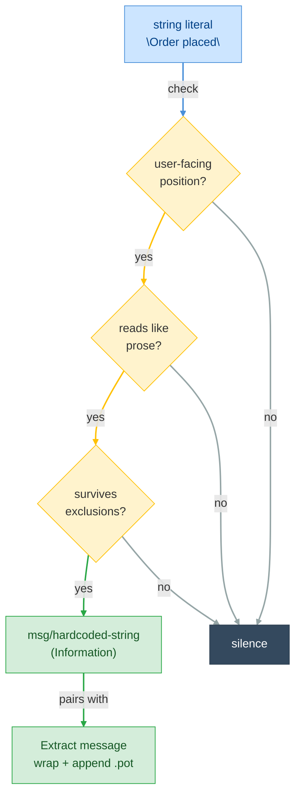

# F11 — Hardcoded Strings

> **Status:** Draft
>
> **Version:** 0.2   ·   **Last updated:** 2026-06-15
>
> **Purpose:** Find user-facing string literals that aren't wrapped in a translation call, and offer a one-click action to wrap them and add the message to the catalog.
>
> **Depends on:** [F02-message-extraction](F02-message-extraction.md), [F03-diagnostics](F03-diagnostics.md), [E15-app-config](../foundations/E15-app-config.md)   ·   **Related:** [F07-code-actions](F07-code-actions.md), [F13-catalog-commands](F13-catalog-commands.md)

> Requirement tag: **HARD**

---

## 1. Purpose & Scope

You write `return "Order placed"` in a view and forget to wrap it in `_()`. The string never reaches a catalog, so it never gets translated, and nothing tells you. This spec is the check that notices, plus the one-click fix that wraps the literal and adds it to your template.

This is the suite's headline feature — the reason a translation engineer reaches for babel-lsp over a plain `.po` editor. It is also the riskiest, because a string literal is not *proof* of a translation bug. So it ships off by default and leans hard on heuristics that keep it quiet.

This spec covers:

- The `msg/hardcoded-string` diagnostic — when it fires, gated behind `detect_hardcoded_strings`
- The heuristics that decide a literal is user-facing prose, not a key or a URL
- The exclusion list that keeps the check conservative (constitution P4)
- The "Extract message" quick fix for Python and Jinja, reusing existing msgids when they match

## 2. Non-Goals / Out of Scope

- The PO-edit mechanics — span parsing, escaping, replace ranges — owned by [F07 §3.7](F07-code-actions.md); this spec reuses them to insert the new msgid.
- The diagnostic publishing pipeline — push/pull, config resolution — owned by [F03](F03-diagnostics.md); this spec registers one code into that catalog and owns its firing detail.
- `pybabel extract`/`update` to regenerate catalogs from scratch — owned by [F13-catalog-commands](F13-catalog-commands.md). This fix appends one entry; it does not re-run extraction.
- Translating the extracted string — the server never writes a `msgstr`; that is the translator's work (P5).

## 3. Background & Rationale

Every i18n bug the rest of the suite catches assumes the string already passed through `_()`. A msgid typo, a missing translation, a dropped placeholder — all of them are about strings the developer *remembered* to wrap. The string the developer *forgot* to wrap is invisible to all of it, and it's the most common i18n mistake there is.

The legacy babel-lsp knew this mattered. It shipped a `detect_hardcoded_strings` config flag — and never implemented the detector behind it. The flag was a stub: a promise of a feature that the legacy server only toggled, never delivered. This spec is that delivery. The flag survives ([E15 REQ-CFG-04](../foundations/E15-app-config.md)), now wired to a real check.

The idea is borrowed and proven elsewhere. The i18n-ally VS Code extension flags hardcoded strings inline and offers an extract action; pylint-i18n and Django's own `makemessages` ecosystem push the same discipline from the lint side. What none of them solve cleanly is noise: a naive "flag every string literal" check screams on dict keys, log messages, and HTTP headers, and developers turn it off within the hour. The whole design problem here is *which* strings, not *whether*.

## 4. Concepts & Definitions

Translation call, msgid, msgctxt, and POT template are canonical in the [glossary](../glossary.md). Two terms are local to this spec:

- **User-facing position** — a syntactic slot where a string is shown to a person: a return value from a view, an argument to a UI-rendering function, a Jinja text node, a translatable HTML attribute. The opposite of an internal slot like a dict key or a log call.
- **Prose string** — a literal that reads like a sentence or label rather than a token: it contains a space, or it is a capitalized word. The cheap signal that a string was written for humans.

## 5. Detailed Specification

### 5.1 The check and its gate

The detector is one source-side diagnostic. It reuses the [F02](F02-message-extraction.md) extraction pass — the same tree-sitter walk that finds `_()` calls also sees the string literals that *aren't* inside one.

**REQ-HARD-01 — The check is off unless `detect_hardcoded_strings` is true.**

The diagnostic `msg/hardcoded-string` never fires under the default config. It is enabled only when `detect_hardcoded_strings = true` ([E15 REQ-CFG-04](../foundations/E15-app-config.md)). When enabled, it still passes through the normal `select`/`ignore`/`severity` resolution ([F03 REQ-DIAG-03](F03-diagnostics.md)), so a project can enable detection and then silence it per-file or re-level it. The two switches compose: the flag arms the check, the diagnostic config aims it.

**REQ-HARD-02 — Severity is Information, never louder.**

`msg/hardcoded-string` registers in the [F03](F03-diagnostics.md) catalog at **Information** (the suite may surface it as Hint where the client distinguishes). A hardcoded string is a *suggestion to look*, not a proof of error — the literal might be a deliberate non-translatable, and the server can't know. Constitution P4 forbids asserting a defect we can't prove, so this check states the strongest honest claim: "this looks translatable; did you mean to wrap it?" The squiggle covers the string literal alone.

### 5.2 What gets flagged

A literal fires the check only when it sits in a user-facing position *and* reads like prose *and* survives every exclusion. All three gates, in that order. Any one failing means silence.

**REQ-HARD-03 — Flag prose literals in user-facing positions only.**

The user-facing positions, by language:

| Language | Position | Example |
|---|---|---|
| Python | `return` value of a function | `return "Order placed"` |
| Python | argument to a known UI-rendering call | `messages.success(request, "Saved")` |
| Python | a `raise SomeError("…")` user-message argument | `raise ValidationError("Email is required")` |
| Jinja | a template **text node** between tags | `<p>Buy now</p>` |
| Jinja | a translatable HTML attribute value | `` |

The translatable HTML attributes are a fixed set: `alt`, `title`, `placeholder`, `label`, `aria-label`. These are the attributes a screen reader or tooltip shows a person; other attributes (`class`, `href`, `id`, `name`) are never flagged.

The set of "UI-rendering calls" is small and conservative by default, and tunable (OQ-HARD-1) — a wrong entry here is a false positive on every call site, so the built-in set stays minimal.

**REQ-HARD-04 — A flagged literal must read like prose.**

Within a user-facing position, the literal fires only if it looks written for humans: it contains at least one space, **or** it is a single capitalized word (`"Checkout"`, `"Save"`). A lowercase single token (`"submit"`, `"btn-primary"`) does not read like prose and is skipped — it's far more likely a key, a CSS class, or an enum value than a sentence.

### 5.3 The exclusion list

Even in a user-facing position, many prose-shaped strings are not messages. The exclusions below are the heart of the feature's conservatism — each one is a class of false positive that would otherwise drive a developer to disable the check.

**REQ-HARD-05 — These literals are never flagged.**

| Excluded | Why it's not a message | Example |
|---|---|---|
| Already inside a translation call | It's already extracted | `_("Checkout")` |
| Dict / set keys | An internal lookup key, not display text | `data["status"]` |
| Format specifiers alone | A fragment, not a sentence | `"%s"`, `"{}"` |
| URLs, paths, emails | Identifiers, not prose | `"https://…"`, `"/api/v1"`, `"a@b.com"` |
| Single non-capitalized token | A key or symbol (REQ-HARD-04) | `"submit"` |
| Log-call arguments | Operational text, not user-facing | `logger.info("cache miss")` |
| Dunder / constant assignments | `__author__`, `UPPER = "…"` are metadata | `__version__ = "1.0"` |
| Very short strings | Below the length floor, too ambiguous | `"OK"`, `"Hi"` |

The length floor and the URL/path/email patterns are the same recognizers the catalog checks already use where they overlap ([F03](F03-diagnostics.md) `po/url-changed`). The whole list is intended to be tunable rather than hard-coded — which entries, and whether a project can add its own, is [OQ-HARD-1](#15-open-questions--decisions).

Log calls deserve a note: a string passed to `logger.info`, `logger.debug`, `log.warning`, and friends is operational, read by an engineer in a log file, not a user in a UI. Translating it is almost always wrong, so log-call arguments are excluded even though they're prose-shaped and sit in a call.

### 5.4 The Extract message quick fix

When the check fires, it pairs with a quick fix that does the wrapping *and* the catalog bookkeeping in one edit. This is the action that makes the diagnostic worth having.

**REQ-HARD-06 — "Extract message" wraps the literal and appends the msgid.**

The action, kind `CodeActionKind::QUICKFIX`, attaches to the diagnostic's range. It produces a single `WorkspaceEdit` with two parts:

1. **Wrap the literal in the source file** — replace `"Order placed"` with `_("Order placed")`, using the configured translation keyword (the first `extra_keywords` gettext alias if set, else `_`).
2. **Append the msgid to the `.pot` template** — insert `msgid "Order placed"` / `msgstr ""` into `locale/messages.pot`, using the [F07 §3.7](F07-code-actions.md) PO-edit mechanics for span placement and gettext-escaping.

Both edits land in the same `WorkspaceEdit.changes` map — the source URI and the `.pot` URI — so accepting the fix is atomic. The string is escaped once before it enters both the call and the `.pot` quotes.

**REQ-HARD-07 — Optionally seed each locale `.po` with an untranslated entry.**

A secondary action variant, **"Extract message and add to all locales"**, additionally inserts `msgid "Order placed"` / `msgstr ""` into every locale `.po` for the domain — the new message appears immediately as `po/missing-translation` in each, ready for a translator. This mirrors what `pybabel update` would do, but as a single targeted edit rather than a full catalog regeneration ([F13](F13-catalog-commands.md) owns the full path). The primary action touches only the `.pot`; this variant is the "prepare for translation now" shortcut.

**REQ-HARD-08 — A matching existing msgid is reused, not duplicated.**

Before appending, the fix asks the catalog index whether the literal already exists as a msgid ([E07 REQ-IDX-04](../foundations/E07-data-model.md) `lookup`/`is_in_pot`). If `"Order placed"` is already a key, the fix wraps the source literal but **skips** the `.pot` insertion — the message exists, the call just needed to reference it. The action title says so: **"Wrap in `_()` (message already in catalog)"**. This is i18n-ally's reuse behavior: an extract should converge messages, not fork a second identical entry that becomes a `po/duplicate-id` later.

### 5.5 The Jinja variant

Templates wrap text two ways, and the fix offers the idiomatic one for the position.

**REQ-HARD-09 — A flagged template text node wraps in `` or `{{ _() }}`.**

For a text node — `<button>Buy now</button>` — the fix wraps the body in a trans block, `<button>Buy now</button>`, the form [F02 REQ-EXT-09](F02-message-extraction.md) extracts. For a translatable attribute — `alt="Product photo"` — the fix rewrites the value as an output expression, `alt="{{ _('Product photo') }}"`, since an attribute can't host a block tag. The `.pot` append (REQ-HARD-06) and reuse (REQ-HARD-08) rules apply identically; only the source-side wrapping shape differs.

### 5.6 The correctness gate

**REQ-HARD-10 — The fix is offered only when its edit is provably correct.**

Per constitution P4 and [F07 REQ-ACT-02](F07-code-actions.md), a wrong extract corrupts both the source and the catalog. The fix withholds when it can't be sure: no `.pot` template exists in the workspace (nowhere to append — offer the wrap-only variant instead, or withhold), the literal spans an f-string or concatenation the wrap can't safely enclose, or the configured keyword isn't importable in scope (the server can't add the import safely — it offers the wrap and notes the missing import is the user's to add). When the gate fails, the action simply doesn't appear; the diagnostic still does.

## 6. UI Mockups

This feature shows up in the editor as two surfaces: the squiggle the diagnostic draws under a flagged literal, and the lightbulb menu the quick fix hangs off. Both carry their meaning in words, never color alone (constitution §4.6) — the diagnostic message names the string and the severity reads as "Information."

### 6.1 The `msg/hardcoded-string` squiggle

What you see in the source file when `detect_hardcoded_strings` is on and a `return "Order placed"` literal trips all three gates. The squiggle covers the literal alone (REQ-HARD-02); hovering it shows the Information message.

```
  app/views.py
  ──────────────────────────────────────────────────────────────
  4 │  def place_order(request):
  5 │      return "Order placed"
    │             ~~~~~~~~~~~~~~
    │             └─ ⓘ Information
    │             ╭──────────────────────────────────────────────╮
    │             │ msg/hardcoded-string                         │
    │             │ Hardcoded string 'Order placed' — looks      │
    │             │ translatable. Did you mean to wrap it in _()?│
    │             │                                  [ 💡 Quick Fix ] │
    │             ╰──────────────────────────────────────────────╯
  ──────────────────────────────────────────────────────────────
```

States: off (no flag — the default, `detect_hardcoded_strings = false`) · flagged (Information squiggle, as above) · silenced (`diagnostics.ignore` — no squiggle, no action).

### 6.2 The lightbulb "Extract message" menu

What the lightbulb (`💡`) offers when you invoke code actions on the flagged literal. The primary action wraps and appends the `.pot`; the locale-seeding variant and the reuse variant appear by context.

```
  5 │      return "Order placed"
    │      💡
    │      ╭──────────────────────────────────────────────────────╮
    │      │  Extract message                                     │
    │      │  Extract message and add to all locales              │
    │      ╰──────────────────────────────────────────────────────╯
```

When the literal already exists as a msgid (REQ-HARD-08), the menu collapses to the wrap-only variant — no `.pot` append, and the title says so:

```
  5 │      return "Checkout"
    │      💡
    │      ╭──────────────────────────────────────────────────────╮
    │      │  Wrap in _() (message already in catalog)            │
    │      ╰──────────────────────────────────────────────────────╯
```

States: full menu (extract + seed-all-locales) · reuse-only (existing msgid → wrap-only) · withheld (correctness gate fails per REQ-HARD-10 — the diagnostic still shows, no action appears).

## 7. Visualizations

A literal runs the three gates; only a survivor becomes a diagnostic, and only then is the extract fix offered.



## 8. Data Shapes

The fix's output is a single `WorkspaceEdit` — the contract the editor applies. Both edits ride in one `changes` map keyed by URI, so accepting the fix is atomic (REQ-HARD-06). The shape below is what an extract on `return "Order placed"` emits when the msgid is new:

```json
{
  "changes": {
    "file:///app/views.py": [
      { "range": { "start": { "line": 4, "character": 11 },
                   "end":   { "line": 4, "character": 25 } },
        "newText": "_(\"Order placed\")" }
    ],
    "file:///locale/messages.pot": [
      { "range": { "start": { "line": 42, "character": 0 },
                   "end":   { "line": 42, "character": 0 } },
        "newText": "\nmsgid \"Order placed\"\nmsgstr \"\"\n" }
    ]
  }
}
```

When the literal already exists as a msgid (REQ-HARD-08), the `.pot` URI is absent — only the source edit ships.

## 9. Examples & Use Cases

You turn the feature on in the shopfront's `pyproject.toml`:

```toml
# pyproject.toml
[tool.babel-lsp]
detect_hardcoded_strings = true
```

In `app/views.py`, a view returns an un-wrapped string:

```python
# app/views.py — was
def place_order(request):
    return "Order placed"
#          ~~~~~~~~~~~~~~  hardcoded string 'Order placed' — wrap in _() to translate it?
```

The literal is in a `return` position, reads like prose, and survives the exclusions, so `msg/hardcoded-string` fires. You hit the lightbulb and pick **Extract message**. Two edits apply at once:

```python
# app/views.py — becomes
def place_order(request):
    return _("Order placed")
```

```po
# locale/messages.pot — becomes (appended)
msgid "Order placed"
msgstr ""
```

In `app/templates/checkout.html`, a button holds raw text:

```jinja
{# app/templates/checkout.html — was #}
<button>Buy now</button>
{#       ~~~~~~~  hardcoded string 'Buy now' — wrap in ? #}
```

You accept **Extract message**, and the text node becomes a trans block (REQ-HARD-09):

```jinja
{# app/templates/checkout.html — becomes #}
<button>Buy now</button>
```

Meanwhile, the literals the check *doesn't* touch are the proof it's tuned right: `data["status"]` (a dict key), `logger.info("cache miss")` (a log call), `return "/orders"` (a path), and the already-wrapped `_("Checkout")` all stay silent.

## 10. Edge Cases & Failure Modes

- **f-string in a user-facing position** (`return f"Hello {user}"`) → not wrappable as a plain msgid. The check may still note it, but the offered fix is the **convert to `_("Hello %(user)s") % {"user": user}`** rewrite, not a naive wrap — interpolating before lookup defeats gettext (cf. [F03](F03-diagnostics.md) `msg/fstring-in-call`). v1 may withhold the auto-rewrite and only suggest, since the placeholder mapping is a guess.
- **String already carrying printf/brace placeholders** (`"Welcome %(name)s"`) → wrapped as-is; the placeholders are preserved verbatim into the call and the `.pot` msgid, since gettext passes them through.
- **The literal already exists as a msgid** → wrap only, no `.pot` append (REQ-HARD-08); never a duplicate entry.
- **Two identical hardcoded strings in one file** → both fire; accepting the first adds the `.pot` entry, and the second's fix then sees an existing msgid and becomes wrap-only — no second append.
- **No `.pot` template in the workspace** → the append target is gone; the wrap-only variant is offered or the action withholds (REQ-HARD-10), and the diagnostic still appears.
- **The noise tradeoff itself** → if the heuristics still over-fire for a project, `detect_hardcoded_strings = false` (the default) or a `diagnostics.ignore = ["msg/hardcoded-string"]` turns it off without touching the rest of the suite. Off is always one line away — that's the safety valve for a check that can't be P4-perfect.
- **A capitalized proper noun** (`"PostgreSQL"`, `"GitHub"`) → may fire as a single capitalized word; a deliberate non-translatable. The Information severity and easy ignore are the mitigation, pending a tunable allowlist (OQ-HARD-1).

## 11. Testing

The check is pure tree-sitter logic, so the three gates and the exclusion list test as fast unit cases over fixture source; the quick fix tests as the `WorkspaceEdit` it emits.

### 11.1 Scope & coverage

Target: **100% of this feature's behavior is covered.** Every `REQ-HARD-NN` below maps to at least one test; every UI surface state (§6) and edge case (§10) has a test. See the policy in [E17 §2](../foundations/E17-testing.md#2-coverage-policy).

### 11.2 Test plan

Each row is a behavior under test. The detection rows reuse the [clean-shopfront](../foundations/E17-testing.md#clean-shopfront) baseline, extended with the hardcoded-strings source (§11.3).

| Behavior / scenario | Type | Fixtures | Verifies |
|---|---|---|---|
| With `detect_hardcoded_strings = false` (default), no literal fires; with `true`, a flagged literal fires at Information | unit | [hardcoded-strings](#113-fixtures) | REQ-HARD-01, REQ-HARD-02 |
| Gate 1 — only literals in a user-facing position fire (`return`, UI-call, `raise`, Jinja text node, translatable attr); a dict key or `class` attr stays silent | unit | [hardcoded-strings](#113-fixtures) | REQ-HARD-03 |
| Gate 2 — only prose-shaped literals fire (has a space, or a single capitalized word); a lowercase single token is skipped | unit | [hardcoded-strings](#113-fixtures) | REQ-HARD-04 |
| Gate 3 — the exclusion list silences each class (already-wrapped, dict key, format spec, URL/path/email, log-call arg, dunder/const, too-short) | unit | [hardcoded-strings](#113-fixtures) | REQ-HARD-05 |
| Extract fix wraps the source literal in `_()` and appends `msgid`/`msgstr ""` to `messages.pot`, atomically in one `WorkspaceEdit` | unit | [hardcoded-strings](#113-fixtures) | REQ-HARD-06 |
| Seed-all-locales variant additionally inserts the empty entry into each locale `.po` | unit | [clean-shopfront](../foundations/E17-testing.md#clean-shopfront) | REQ-HARD-07 |
| Existing-msgid reuse — when the literal already exists as a msgid, the fix wraps only and skips the `.pot`, titled "already in catalog" | unit | [clean-shopfront](../foundations/E17-testing.md#clean-shopfront) (`Checkout` exists) | REQ-HARD-08 |
| Jinja variant — a text node wraps in `…`; a translatable attribute rewrites to `{{ _('…') }}` | unit | [hardcoded-strings](#113-fixtures) | REQ-HARD-09 |
| Correctness gate — no `.pot`, an f-string/concatenation, or a non-importable keyword withholds the action while the diagnostic still shows | unit | [hardcoded-strings](#113-fixtures) (no `.pot`) | REQ-HARD-10 |
| Two identical literals — first append succeeds, the second becomes wrap-only (§10) | unit | [hardcoded-strings](#113-fixtures) | REQ-HARD-06, REQ-HARD-08 |

### 11.3 Fixtures

The shared baseline lives in the [E17 fixtures registry](../foundations/E17-testing.md#5-fixtures-registry); this feature adds one local fixture for the detector's inputs.

- **hardcoded-strings** — the [clean-shopfront](../foundations/E17-testing.md#clean-shopfront) workspace with `detect_hardcoded_strings = true` and an `app/views.py` carrying a `return "Order placed"` un-wrapped literal, plus the silent controls (`data["status"]` dict key, `logger.info("cache miss")` log call, `return "/orders"` path, the already-wrapped `_("Checkout")`) and a `checkout.html` `<button>Buy now</button>` text node. The single source of truth for the three-gate and exclusion tests.

### 11.4 Requirement coverage

Every load-bearing requirement maps to a test — this table is the proof.

| Requirement | Covered by |
|---|---|
| REQ-HARD-01 | flag is off by default, armed by `detect_hardcoded_strings` |
| REQ-HARD-02 | fires at Information, squiggle covers the literal only |
| REQ-HARD-03 | gate 1 — user-facing position only |
| REQ-HARD-04 | gate 2 — prose shape only |
| REQ-HARD-05 | gate 3 — each exclusion class stays silent |
| REQ-HARD-06 | extract wraps + appends `.pot` in one atomic `WorkspaceEdit` |
| REQ-HARD-07 | seed-all-locales variant inserts the empty entry per `.po` |
| REQ-HARD-08 | existing-msgid reuse → wrap-only, no duplicate |
| REQ-HARD-09 | Jinja text-node and attribute wrapping shapes |
| REQ-HARD-10 | correctness gate withholds the action, keeps the diagnostic |

## 12. End-to-End Test Plan

The journeys that matter run a real client over stdio: enable the flag, see the squiggle, invoke the action, and assert the source and `.pot` both changed.

### 12.1 Coverage target

**100% of the feature's scope, end to end** — the happy path plus all reasonably possible error paths (off by default, existing msgid, excluded literal, withheld action). See the policy in [E29 §2](../foundations/E29-e2e-testing.md#2-coverage-policy).

### 12.2 Scenarios

Each row is a journey a real client drives end to end; the outcome is asserted over the protocol.

| # | Journey | Path | Expected outcome |
|---|---|---|---|
| E2E-01 | With `detect_hardcoded_strings = true`, open `views.py` holding `return "Order placed"` | happy | `msg/hardcoded-string` published at Information over the literal's range |
| E2E-02 | Invoke the **Extract message** action on the flagged literal | happy | one `WorkspaceEdit` wraps the literal in `_()` and appends `msgid "Order placed"` / `msgstr ""` to `messages.pot` |
| E2E-03 | Extract a literal that already exists as a msgid (`Checkout`) | happy | wrap-only edit; no duplicate `.pot` entry, title reads "already in catalog" |
| E2E-04 | Open the same file with the flag at its default `false` | error | no `msg/hardcoded-string` diagnostic is published |
| E2E-05 | Open a file whose only literals are excluded (a URL, a `logger.info` arg) | error | no diagnostic fires for any excluded literal |

### 12.3 Acceptance criteria & Definition of Done

The §12.2 scenarios, written Given/When/Then, are this feature's acceptance criteria:

| # | Given | When | Then |
|---|---|---|---|
| AC-01 | `detect_hardcoded_strings = true` and a `return "Order placed"` literal | the file is opened | `msg/hardcoded-string` is published at Information over that literal |
| AC-02 | the flagged literal above | the user accepts **Extract message** | the source becomes `return _("Order placed")` and `messages.pot` gains the new entry, in one edit |
| AC-03 | a literal already present as a msgid | the user accepts the action | the source is wrapped and no second `.pot` entry is written |
| AC-04 | the default config (`detect_hardcoded_strings = false`) | the file is opened | no hardcoded-string diagnostic appears |
| AC-05 | a literal on the exclusion list (a URL or a log-call arg) | the file is opened | no diagnostic fires for it |

**Definition of Done:** every `REQ-HARD-NN` has a passing test (§11.4), every acceptance scenario above passes, and the §13.1 security concern is verified.

## 13. Non-Functional Requirements

### 13.1 Security & Privacy

- **Access & analysis boundary** — detection is static analysis of source the editor already has open; the server reads parse trees and the catalog, and crosses no new trust boundary.
- **No direct writes** — the extract fix returns a `WorkspaceEdit` for the editor to apply; the server never writes the source file or the `.pot` to disk itself, so the user reviews and consents to every change.
- **Scoped edits only** — an applied edit touches only the flagged literal and the `.pot` (and, for the seed variant, the locale `.po` files); it never runs a process, opens a network connection, or shells out.
- **No sensitive data** — the feature handles only the literal text under the cursor and msgids; it logs no PII or secrets and sends nothing off the machine.

## 15. Open Questions & Decisions

- **OQ-HARD-1** — The exact heuristic set: the minimum string length floor, the precise URL/path/email patterns, the built-in "UI-rendering call" names, and whether a project can extend or override the exclusion list (a `hardcoded.ignore` / `hardcoded.functions` config block). Leaning toward making the list tunable once the built-in defaults prove either too noisy or too quiet on real projects.
- **OQ-HARD-2** — Per-position config: should a project disable text-node detection but keep attribute detection (or vice-versa) independently, rather than the single on/off flag? Deferred until the single flag's noise profile is understood.
- **OQ-HARD-3** — Whether the f-string case (§8) ships an auto-rewrite to `_("…") % {...}` or only a suggestion in v1. Leaning suggestion-only first, because the placeholder-name mapping is a guess P4 is uneasy with.
- **Decision** — Detection ships off by default and at Information severity. The feature is too noise-prone to assert errors or to opt users in silently; it earns its keep by being trivial to enable and trivial to silence.

## 16. Cross-References

- **Depends on:** [F02-message-extraction](F02-message-extraction.md) — the tree-sitter walk that surfaces the un-wrapped literals alongside the wrapped calls; [F03-diagnostics](F03-diagnostics.md) — registers `msg/hardcoded-string` and runs its publishing/config resolution; [E15-app-config](../foundations/E15-app-config.md) — the `detect_hardcoded_strings` flag that arms the check.
- **Related:** [F07-code-actions](F07-code-actions.md) — the PO-edit mechanics (§3.7) this fix reuses to append the msgid, and the host for the extract edit; [F13-catalog-commands](F13-catalog-commands.md) — the full `pybabel extract`/`update` path this fix is a targeted alternative to; [E07-data-model](../foundations/E07-data-model.md) — the `lookup`/`is_in_pot` queries the reuse check reads.
- **Testing:** [E17 §2.5](../foundations/E17-testing.md) — this feature's row in the e2e coverage matrix.

## 17. Changelog

- **2026-06-15** — v0.2: restructured to the updated spec-writer template — added §6 UI Mockups (the `msg/hardcoded-string` squiggle with its Information message, the "Extract message" lightbulb menu, and its reuse "already in catalog" variant), §8 Data Shapes (the atomic `WorkspaceEdit` the fix emits), §11 Testing (the three-gate and exclusion unit plan, the local hardcoded-strings fixture, and the REQ-HARD-01..10 coverage table), §12 End-to-End Test Plan (flag-on→squiggle→extract journeys with Given/When/Then acceptance and a DoD), and §13.1 Security & Privacy (static-analysis-only, edits via `WorkspaceEdit`, no direct writes, no exec/network/PII). Renumbered the existing sections to the canonical order; all prior content (REQ-HARD-01..10, the three-gate detection, OQ-HARD-1..3 still open) is preserved unchanged. No §13.2 Accessibility — under constitution §4.6 that duty is the editor's, and the status-in-words content rule lives in §6.
- **2026-06-15** — Initial draft: the `msg/hardcoded-string` check gated behind the legacy `detect_hardcoded_strings` stub, at Information severity (REQ-HARD-01…02); the three-gate detection — user-facing position, prose shape, exclusion list (REQ-HARD-03…05); the "Extract message" quick fix wrapping the literal and appending the `.pot`, with locale-seeding and existing-msgid reuse variants (REQ-HARD-06…08); the Jinja ``/`{{ _() }}` wrapping (REQ-HARD-09); the P4 correctness gate (REQ-HARD-10); shopfront examples; and the heuristic/config open questions.
