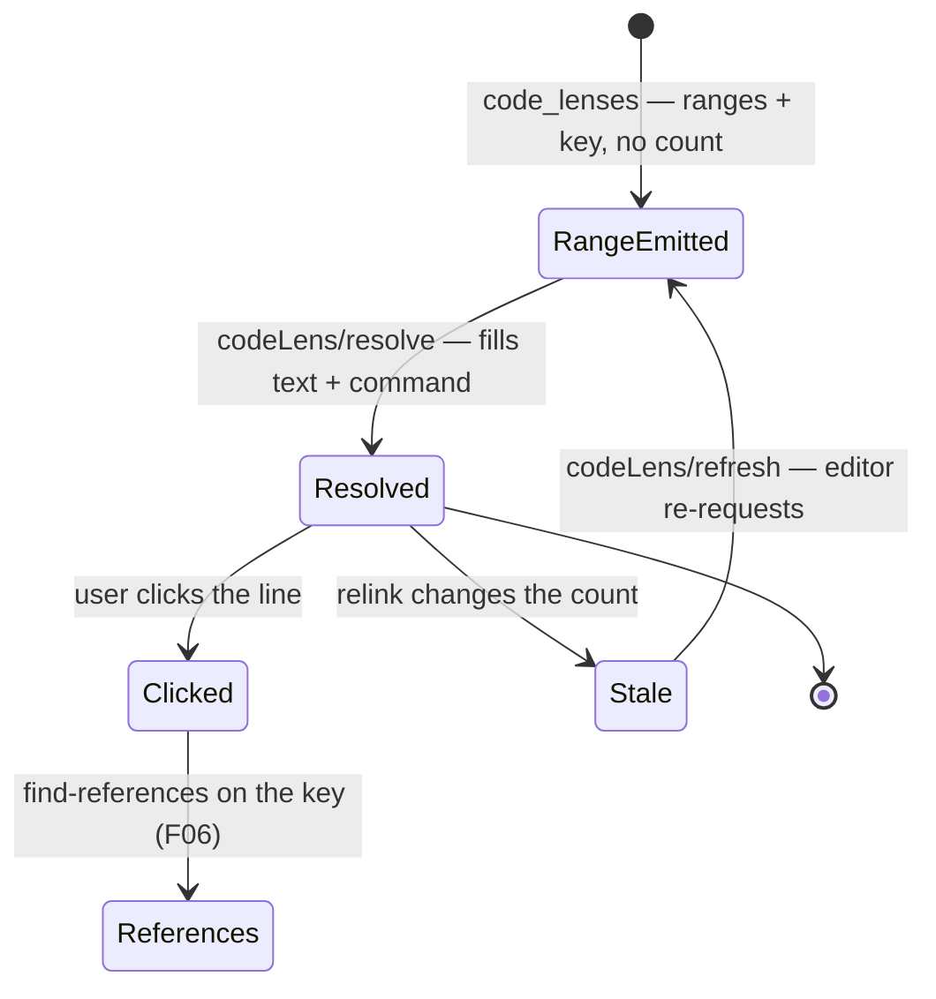

# F12 — Code Lens

> **Status:** Draft
>
> **Version:** 0.2   ·   **Last updated:** 2026-06-15
>
> **Purpose:** Inline counts above your messages — how many times a msgid is used, and how many locales translate it.
>
> **Depends on:** [F01-catalog-index](F01-catalog-index.md), [F06-navigation](F06-navigation.md), [E07-data-model](../foundations/E07-data-model.md)   ·   **Related:** [F08-inlay-hints](F08-inlay-hints.md)

> Requirement tag: **LENS**

---

## 1. Purpose & Scope

A code lens is a small clickable line the editor floats above a line of code. This spec puts two of them to work for translations.

Above each catalog entry, you see how many locales translate it. Above each translation call, you see how many times that msgid is used. Click either, and you jump to the things it counts.

This spec covers:

- The catalog lens: `k of m locales translated` above each catalog entry, fuzzy marked.
- The source lens: `used N times` above each translation call.
- The click action for each, routed through [F06](F06-navigation.md) navigation.
- Refreshing lenses after a relink changes the counts.

## 2. Non-Goals / Out of Scope

- Building the index the lenses read — owned by [F01](F01-catalog-index.md).
- The goto and find-references targets a click resolves to — owned by [F06](F06-navigation.md).
- Judging an entry missing or fuzzy as a diagnostic — owned by [F03-diagnostics](F03-diagnostics.md); the lens only reports coverage, it never warns.
- Inline per-call translation previews — owned by [F08-inlay-hints](F08-inlay-hints.md).

## 3. Background & Rationale

Coverage is the question a translation team asks all day: is this string done everywhere, or only in German? The answer already lives in the [catalog index](F01-catalog-index.md) — `all_locales` and `missing_locales` ([E07 REQ-IDX-04](../foundations/E07-data-model.md)) compute it in one lookup. A lens is just that lookup, rendered above the line. It adds no new state and runs no new scan; it is a pure read, cheap by construction (per P6).

## 4. Detailed Specification

### 4.1 The catalog lens

Above each catalog entry, the lens shows how many locales translate that key out of how many exist.

**REQ-LENS-01 — A catalog entry shows its locale coverage.**

For each non-header entry in an open `.po`/`.pot` document, the server emits a lens above the entry's `msgid` line. It builds the entry's [CatalogKey](../foundations/E07-data-model.md), reads `all_locales` for the denominator and `missing_locales` for the gap, and renders `k of m locales translated` where `k = m − missing`. In the shopfront, the `"Checkout"` entry shows `1 of 2 locales translated` — German has `"Kasse"`, French is still empty.

**REQ-LENS-02 — Fuzzy translations are marked, not counted as done.**

A `#, fuzzy` entry exists but is unverified, and gettext ignores it at runtime. So a fuzzy `msgstr` does not count toward `k`. When the entry under the lens is itself fuzzy, the lens appends a marker — `1 of 2 locales translated · fuzzy` — so the translator sees the string needs a second look.

**REQ-LENS-03 — Clicking the catalog lens finds every reference.**

The catalog lens command runs find-references ([F06 REQ-NAV-04](F06-navigation.md)) on the entry's key. The result lists every other catalog entry and every source call that shares the msgid, so one click answers "where else does this live?".

### 4.2 The source lens

Above each translation call, the lens counts how many source uses share its msgid.

**REQ-LENS-04 — A translation call shows its use count.**

For each resolved [TranslationCall](../foundations/E07-data-model.md) in an open source document, the server emits a lens above the call, reading `used N times`. `N` is the number of source references — translation calls across the workspace — that resolve to the same [CatalogKey](../foundations/E07-data-model.md). Above `_("Checkout")` in `views.py`, the lens reads `used 1 time` when that is the only call using it. A call with an unresolved msgid (`msgid: None`, per P4) forms no key and gets no lens.

**REQ-LENS-05 — Clicking the source lens lists the references.**

The source lens command runs find-references ([F06](F06-navigation.md)) on the call's key, listing every source call and catalog entry that uses the msgid — the same edge the catalog lens offers, from the source side.

### 4.3 Resolve and refresh

Lenses return ranges first and fill their text lazily, then refresh when a relink moves the numbers.

**REQ-LENS-06 — Lenses resolve lazily.**

The lens pass returns ranges and a key payload immediately; the count, the coverage text, and the command fill in via `codeLens/resolve`. A large file with hundreds of entries therefore pays only for the lenses the editor actually shows. Each lens carries its [CatalogKey](../foundations/E07-data-model.md) in its `data` field so the resolve round-trip needs no second lookup of position.

**REQ-LENS-07 — The server refreshes lenses after a relink.**

A translator saves a `.po` you are not editing, and the coverage counts change in a file the editor has cached. After a relink ([E01 REQ-ARCH-04](../foundations/E01-architecture.md)) that changed counts, the server sends `workspace/codeLens/refresh` when the client advertises `workspace.codeLens.refreshSupport`. Clients without that capability re-request lenses on local edits only; the stale count clears next time the file is touched.

```rust
// src/features/codelens.rs
pub fn code_lenses(state: &WorkspaceState, uri: &Uri) -> Vec<CodeLens>;   // ranges + key, no counts
pub fn resolve(state: &WorkspaceState, lens: CodeLens) -> CodeLens;       // fills text + command

#[derive(Serialize, Deserialize)]
struct LensData { key: CatalogKey }                                       // survives the resolve round-trip
```

## 6. UI Mockups

The editor floats each lens as one clickable line directly above the code it counts. Both surfaces render the same way — a single line above the line — so this section sketches each, and §9 walks the data behind them.

### 6.1 Catalog coverage lens — above a `.po`/`.pot` entry

What you see above each catalog entry in an open `.po`/`.pot` document. The lens line carries the coverage text and is itself the clickable command; clicking it runs find-references (REQ-LENS-03).

```
  ╭─ 1 of 2 locales translated ─╮  ◀ click → references
  msgid "Checkout"
  msgstr "Kasse"
```

States: covered (`k of m locales translated`) · fuzzy (the entry under the lens is `#, fuzzy`, so the line appends ` · fuzzy` — see below) · zero (`0 of m locales translated`, no locale translates it yet).

```
  ╭─ 0 of 2 locales translated · fuzzy ─╮  ◀ Save is #, fuzzy
  msgid "Save"
  msgstr "Speichern"
```

### 6.2 Source use-count lens — above a translation call

What you see above each resolved translation call in an open source document. The lens line reads the use count and clicks through to the same references (REQ-LENS-05).

```
  ╭─ used 1 time ─╮  ◀ click → references
  _("Checkout")
```

States: counted (`used N times`, with `used 1 time` singular) · none (an unresolved call — `_(f"Hi {user}")` — forms no key, so no lens line renders at all).

## 7. Visualizations

The lens pass returns ranges immediately and fills each line's text on demand, then the server nudges the editor to re-ask after a relink. This is the lifecycle of a single lens.



## 8. Data Shapes

A lens crosses the wire twice: once as a bare range with its key in `data`, then resolved with the count text and the click command. The key in `data` is what survives the round-trip (REQ-LENS-06).

```json
{
  "range": { "start": { "line": 11, "character": 0 }, "end": { "line": 11, "character": 17 } },
  "data": { "key": { "msgid": "Checkout", "msgctxt": null } }
}
```

Resolved, the same lens carries its title and command:

```json
{
  "range": { "start": { "line": 11, "character": 0 }, "end": { "line": 11, "character": 17 } },
  "command": {
    "title": "1 of 2 locales translated",
    "command": "babel-lsp.findReferences",
    "arguments": [{ "msgid": "Checkout", "msgctxt": null }]
  }
}
```

## 9. Examples & Use Cases

You open `locale/messages.pot` and put your cursor near `msgid "Checkout"`. Above it floats `1 of 2 locales translated`: the index reports two locales, and `missing_locales` names French (REQ-LENS-01, rendered in §6.1). You open the German catalog and the `"Save"` entry reads `0 of 2 locales translated · fuzzy` — both locales lack a verified translation, and this one is flagged (REQ-LENS-02). You click the lens and find-references lists every place `"Save"` appears (REQ-LENS-03).

You switch to `app/views.py`. Above `_("Checkout")` sits `used 1 time` — the only call using that msgid (REQ-LENS-04, rendered in §6.2). You add a second `_("Checkout")` in `checkout.html`; after the next pass the count becomes `used 2 times`. Meanwhile a translator saves the French `"Checkout"` translation; the relink fires `codeLens/refresh`, and the `.pot` lens flips to `2 of 2 locales translated` without you touching the file (REQ-LENS-07).

## 10. Edge Cases & Failure Modes

- A call with a non-literal msgid (`_(f"Hi {user}")`) → no key, no lens (P4).
- An entry whose key resolves in no other catalog → coverage still renders against `all_locales`; the count is honest, even at zero.
- A client with no code-lens support → no lenses appear, and that is fine. **Zed's code-lens support is limited and Helix renders none; Neovim shows lenses only after opt-in setup.** The same coverage and use-count facts are available on hover ([F05-hover](F05-hover.md)); the lens is a progressive enhancement layered over that surface, never the only way to read the number.
- A huge catalog file → lenses obey a per-file budget; past the cap the server stops emitting and lets the lazy resolve carry the visible ones, so a 5,000-entry catalog never floods the editor with lenses it will not render.
- The cursor sits in a closed file → lenses are computed only for open documents; closed files contribute to counts but show no lens of their own.

## 11. Testing

Code lens is tested by emitting lenses over the shopfront fixtures, resolving a lens from its `CatalogKey` payload, and asserting the rendered count and its click command.

### 11.1 Scope & coverage

Target: **100% of this feature's behavior is covered.** Every `REQ-LENS-NN` below maps to at least one test; every lens state (§6) and edge case (§10) has a test. See the policy in [E17 §2](../foundations/E17-testing.md#2-coverage-policy).

### 11.2 Test plan

Each row is a behavior under test. Shared fixtures link to the [E17 registry](../foundations/E17-testing.md#5-fixtures-registry); the requirement column names what it verifies.

| Behavior / scenario | Type | Fixtures | Verifies |
|---|---|---|---|
| Catalog coverage lens — `all_locales`/`missing_locales` render `k of m locales translated` above the entry | integration | [clean-shopfront](../foundations/E17-testing.md#clean-shopfront) | REQ-LENS-01 |
| Fuzzy entry — a `#, fuzzy` `msgstr` is excluded from `k` and the line appends ` · fuzzy` | unit | [clean-shopfront](../foundations/E17-testing.md#clean-shopfront) | REQ-LENS-02 |
| Source use-count lens — a resolved call renders `used N times`, singular for one | integration | [clean-shopfront](../foundations/E17-testing.md#clean-shopfront) | REQ-LENS-04 |
| Click routing — both lens commands run find-references on the lens's key | integration | [clean-shopfront](../foundations/E17-testing.md#clean-shopfront) | REQ-LENS-03, REQ-LENS-05 |
| Lazy resolve — `code_lenses` returns ranges + a `CatalogKey` payload; `codeLens/resolve` fills the text and command | unit | [clean-shopfront](../foundations/E17-testing.md#clean-shopfront) | REQ-LENS-06 |
| Refresh after relink — a count-changing relink sends `codeLens/refresh` when the client advertises `refreshSupport` | integration | [clean-shopfront](../foundations/E17-testing.md#clean-shopfront) | REQ-LENS-07 |

### 11.3 Fixtures

Reusable fixtures live in the [E17 registry](../foundations/E17-testing.md#5-fixtures-registry) — linked above. This feature defines no fixtures of its own; it reuses [clean-shopfront](../foundations/E17-testing.md#clean-shopfront) for the coverage counts (German translates `Checkout`, French leaves it missing, German's `Save` is `#, fuzzy`), the use counts, the click-routing edge, the lazy resolve round-trip, and the refresh-after-relink path.

### 11.4 Requirement coverage

Every load-bearing requirement maps to a test — this table is the proof.

| Requirement | Covered by |
|---|---|
| REQ-LENS-01 | `req_lens_01_catalog_entry_shows_locale_coverage` |
| REQ-LENS-02 | `req_lens_02_fuzzy_excluded_and_marked` |
| REQ-LENS-03 | `req_lens_03_catalog_click_finds_references` |
| REQ-LENS-04 | `req_lens_04_call_shows_use_count` |
| REQ-LENS-05 | `req_lens_05_source_click_lists_references` |
| REQ-LENS-06 | `req_lens_06_resolves_lazily_from_key_payload` |
| REQ-LENS-07 | `req_lens_07_refreshes_after_relink` |

## 12. End-to-End Test Plan

Driving the built binary as an editor would, request lenses over the shopfront, resolve them, click through to references, and watch the count refresh after a catalog edit.

### 12.1 Coverage target

**100% of the feature's scope, end to end** — the happy path plus the reasonably possible error paths (a client without code-lens support, a relink that moves the count). See the policy in [E29 §2](../foundations/E29-e2e-testing.md#2-coverage-policy).

### 12.2 Scenarios

Each scenario opens a fixture workspace, sends `textDocument/codeLens` (and `codeLens/resolve`), and asserts the response.

| # | Journey | Path | Expected outcome |
|---|---|---|---|
| E2E-01 | Lens on `msgid "Checkout"` in the `.pot` | happy | Resolved title reads `1 of 2 locales translated` |
| E2E-02 | Lens on `_("Checkout")` in `views.py` | happy | Resolved title reads `used 1 time` |
| E2E-03 | Click a resolved lens | happy | The command runs find-references and returns every call and entry sharing the msgid |
| E2E-04 | Edit a catalog, then re-request | happy | After the relink the resolved count refreshes (e.g. `2 of 2 locales translated`) |
| E2E-05 | Client without code-lens support | error | No lenses are returned; hover ([F05](F05-hover.md)) still serves the same facts |

### 12.3 Acceptance criteria & Definition of Done

The §12.2 scenarios, written Given/When/Then, are this feature's acceptance criteria:

| # | Given | When | Then |
|---|---|---|---|
| AC-01 | the clean-shopfront workspace is open | you resolve the lens on `msgid "Checkout"` | its title reads `1 of 2 locales translated` |
| AC-02 | `views.py` has a single `_("Checkout")` | you resolve the lens above it | its title reads `used 1 time` |
| AC-03 | a lens is resolved with its `CatalogKey` | you click it | find-references lists every call and entry sharing the msgid |
| AC-04 | the French `Checkout` translation is saved | the relink completes and you re-request lenses | the `.pot` lens now reads `2 of 2 locales translated` |
| AC-05 | the client advertises no code-lens support | you open a source or catalog file | no lenses appear, and the same facts remain available on hover |

**Definition of Done:** every `REQ-LENS-NN` has a passing test (§11.4), every acceptance scenario above passes, and every enabled non-functional concern (§13) is verified.

## 13. Non-Functional Requirements

### 13.1 Security & Privacy

- **Access & validation** — a lens is a read-only render of counts already computed in the in-memory index; it never executes user code, opens a network connection, or shells out (P1).
- **Data sensitivity** — the lens shows only locale counts and use counts derived from the user's own workspace; no msgids, PII, secrets, or telemetry leave the process.
- **Baseline** — the only untrusted input is catalog/source text, parsed defensively upstream ([F01](F01-catalog-index.md)/[F02](F02-message-extraction.md)); the lens renders the resulting counts and adds no new trust boundary.

## 15. Open Questions & Decisions

- No open questions at this time.

## 16. Cross-References

- **Depends on:** [F01-catalog-index](F01-catalog-index.md) — the index whose `all_locales`/`missing_locales` the coverage lens reads; [F06-navigation](F06-navigation.md) — the find-references edge both lens clicks route to; [E07-data-model](../foundations/E07-data-model.md) — `CatalogKey`, `CatalogEntry`, `TranslationCall`, and the index read API.
- **Related:** [F08-inlay-hints](F08-inlay-hints.md) — the other inline surface, per-call rather than per-count; [F05-hover](F05-hover.md) — carries the same facts where lenses do not render; [E01-architecture](../foundations/E01-architecture.md) — the relink that triggers refresh.
- **Testing:** [E17-testing](../foundations/E17-testing.md) — the coverage policy and the shared fixtures §11 reuses; [E29-e2e-testing](../foundations/E29-e2e-testing.md) — the harness and patterns §12 reuses.

## 17. Changelog

- **2026-06-15** — v0.2: restructured to the updated spec-writer template. Added §6 UI Mockups rendering the catalog coverage lens (6.1) and the source use-count lens (6.2) above their code lines with states; §7 a lens-lifecycle state diagram; §8 the resolve-round-trip data shapes; §11 Testing (coverage, plan, fixtures, and a per-requirement table mapping REQ-LENS-01..07); §12 End-to-End Test Plan with Given/When/Then acceptance and a DoD; and §13.1 Security & Privacy. Preserved REQ-LENS-01..07 unchanged; renumbered to canonical section order. Per constitution §4.6, accessibility is the editor's, so no §13.2.
- **2026-06-15** — Initial draft: the catalog coverage lens over `all_locales`/`missing_locales` with fuzzy marking (REQ-LENS-01/02), the source use-count lens (REQ-LENS-04), both clicks routed to F06 find-references (REQ-LENS-03/05), lazy resolve on a `CatalogKey` payload (REQ-LENS-06), and `codeLens/refresh` after a relink (REQ-LENS-07). Honest editor-support note (Zed limited, Helix none, Neovim opt-in) with hover as the fallback surface.
</content>
</invoke>
