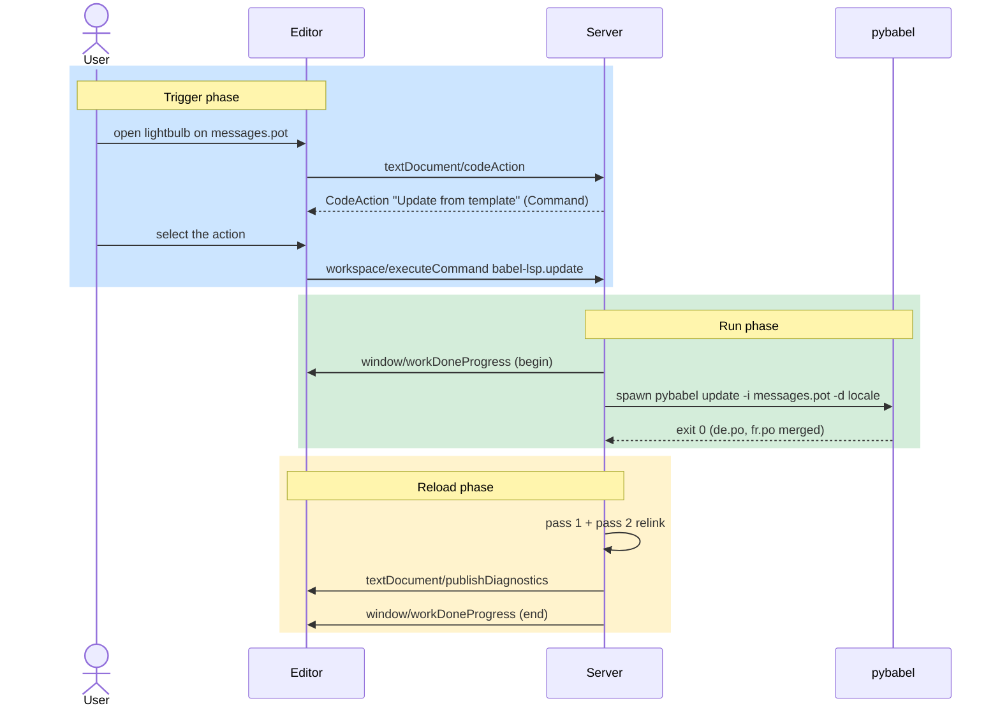

# F13 — Catalog Commands

> **Status:** Draft
>
> **Version:** 0.2   ·   **Last updated:** 2026-06-15
>
> **Purpose:** Run pybabel-style extract, update, and compile from the editor — wired as LSP commands and surfaced where you'd reach for them.
>
> **Depends on:** [E03-tech-stack](../foundations/E03-tech-stack.md), [F07-code-actions](F07-code-actions.md)   ·   **Related:** [F14-editor-integration](F14-editor-integration.md), [F15-cli](F15-cli.md)

> Requirement tag: **CMD**

---

## 1. Purpose & Scope

The quick fixes in [F07](F07-code-actions.md) edit one catalog entry. This spec is the other axis: the whole-catalog operations that keep the catalogs in sync with your source — extract, update, compile.

You trigger these from the editor, but the server never re-implements them. It shells out to your `pybabel`, watches the result, and reloads the catalogs. The catalog stays the source of truth (constitution P5); babel-lsp just drives the tool you already use.

This spec covers:

- The three commands — extract, update, compile — declared at `initialize`
- How an editor with no command palette (Zed) triggers them, through code actions
- Running `pybabel`, reporting progress, and relinking on success
- The CLI fallback when an editor can't trigger commands at all

## 2. Non-Goals / Out of Scope

- **Re-implementing extraction, merge, or compile in Rust.** Per constitution P5 and [E03 REQ-TECH-03](../foundations/E03-tech-stack.md), `pybabel` (and `msgfmt`) do the work. babel-lsp reads and validates; it never becomes a second Babel.
- Per-entry quick fixes — copy msgid, toggle fuzzy, add plural forms — owned by [F07](F07-code-actions.md). Those are local `WorkspaceEdit`s, not catalog-wide runs.
- Config resolution — where `pybabel_path`, the locale dir, and `babel.cfg` come from — owned by [E15-app-config](../foundations/E15-app-config.md). This spec consumes that config.
- The headless CLI surface itself — owned by [F15-cli](F15-cli.md). This spec describes the same three operations as editor commands.

## 3. Background & Rationale

A translation workflow has three whole-catalog steps. You **extract** msgids from source into a `.pot` template. You **update** each locale's `.po` by merging the new template in. You **compile** the `.po` files to binary `.mo` for the runtime. These are exactly what `pybabel extract`, `pybabel update`, and `pybabel compile` do.

The server already knows your catalogs and your config, so it can offer these as one-click commands — no remembering flags. The hard part is not running `pybabel`; it's *triggering* the command in an editor that has no generic way to invoke an arbitrary LSP command. That triggering model is the heart of this spec.

## 4. Concepts & Definitions

- **Server command** — a string id the server registers at `initialize`; the client invokes it via `workspace/executeCommand`, and the server's `execute_command` handler runs it. Distinct from a code action's inline `WorkspaceEdit` ([F07](F07-code-actions.md)), which the client applies with no round-trip.
- **Trigger surface** — the UI an editor renders that can carry a command. For babel-lsp the surface is the code-action lightbulb (canonical in [F07](F07-code-actions.md)).
- **Catalog**, **POT template**, **domain**, **locale** — canonical in the [glossary](../glossary.md).

## 5. Detailed Specification

### 5.1 The three commands

Each command is one whole-catalog `pybabel` operation. Read them as verbs on the catalog set.

**REQ-CMD-01 — Three commands, declared at initialize.**

The server advertises exactly three command ids in `ServerCapabilities.execute_command_provider`:

```rust
// src/server/commands.rs — registered in the initialize result
ExecuteCommandOptions {
    commands: vec![
        "babel-lsp.extract".into(),  // pybabel extract → write/update the .pot
        "babel-lsp.update".into(),   // pybabel update  → merge .pot into each .po
        "babel-lsp.compile".into(),  // pybabel compile → .po → .mo
    ],
    ..Default::default()
}
```

A client that reads this list knows the server will honour those three `workspace/executeCommand` calls. Each maps to one subprocess invocation (§5.4).

| Command id | pybabel call | Effect |
|---|---|---|
| `babel-lsp.extract` | `pybabel extract -F babel.cfg -o messages.pot .` | Re-scan source, rewrite the `.pot` template |
| `babel-lsp.update` | `pybabel update -i messages.pot -d locale` | Merge the template into every locale's `.po` |
| `babel-lsp.compile` | `pybabel compile -d locale` | Compile each `.po` to its `.mo` |

The exact flags derive from resolved config ([E15](../foundations/E15-app-config.md)) — the locale dir, the domain, the `babel.cfg` path. Each command optionally takes a locale argument, so "update just `fr`" is a narrower `workspace/executeCommand` with `arguments: ["fr"]`.

### 5.2 The trigger model

This is the part the question "how do I trigger it in Zed?" turns on. The short answer: through code actions, because Zed renders no command palette for arbitrary LSP commands.

**REQ-CMD-02 — Commands are triggered through code actions, not a command palette.**

VS Code lets an extension contribute a command to its palette, so a user can type "Babel: Extract" and fire `workspace/executeCommand` directly. Zed, Neovim, and Helix have no such generic contribution point — there is no menu listing the server's registered command ids.

So the server reaches `workspace/executeCommand` through the one trigger surface every editor already renders: the **code-action lightbulb**. The flow:

1. The server returns a `CodeAction` whose `command` field references a registered command id (e.g. `babel-lsp.compile`). The action carries no `edit`.
2. The user picks it from the lightbulb menu. The client sends `workspace/executeCommand` with that id and its arguments.
3. The server's `execute_command` handler runs the `pybabel` op (§5.4) and, for source-buffer changes, calls `client.apply_edit(WorkspaceEdit)` — otherwise it shells out and republishes diagnostics on completion.

A command action and a quick-fix action look the same to the user; the difference is that a command action defers the work to the server, where a quick fix ([F07 REQ-ACT-01](F07-code-actions.md)) carries its edit inline.

**REQ-CMD-03 — Command actions anchor at natural source locations.**

A whole-catalog op has no cursor of its own, so the server attaches the command action where you'd reach for it:

- Cursor in a `.po` or `.pot` file → **"Compile catalog"** and **"Update from template"**.
- Cursor in `pyproject.toml` or `babel.cfg` → **"Extract messages"**.

These ride the same `code_action` handler as [F07](F07-code-actions.md), but produce `CodeActionKind::SOURCE` actions carrying a `Command`, not a `WorkspaceEdit`. The handler offers them whenever the file type matches and the resolved config names a locale dir — no diagnostic precondition, since these are operations, not fixes.

**REQ-CMD-04 — The CLI is the reliable cross-editor trigger.**

When an editor can't surface a command at all — or in CI, where there is no editor — the `babel-lsp` CLI ([F15](F15-cli.md)) runs the same three operations headless: `babel-lsp extract`, `babel-lsp update`, `babel-lsp compile`. This is the recommended path whenever editor triggering is awkward; it reuses the same config resolution and the same `pybabel` invocation, so the result is identical to the command. The editor commands are a convenience over a CLI that always works.

**REQ-CMD-05 — Code lens is a secondary surface where supported.**

For clients that render `textDocument/codeLens`, the server may attach a command lens at the top of a `.pot` ("Update all catalogs") or a `.po` ("Compile"). The lens carries the same `Command` as the code action. It is additive — the code-action path (§5.2) is the baseline that every first-class editor supports.

### 5.3 The executeCommand handler

**REQ-CMD-06 — One handler dispatches the three ids; an unknown id is rejected.**

`execute_command` matches `params.command` against the three registered ids and dispatches to the matching runner (§5.4). Any other id returns an error response — the server only honours what it advertised in REQ-CMD-01. Arguments (an optional locale) are validated before the subprocess spawns.

```rust
// src/server/commands.rs
pub async fn execute_command(
    &self,
    params: ExecuteCommandParams,
) -> Result<Option<Value>> {
    match params.command.as_str() {
        "babel-lsp.extract" => self.run_extract(args).await,
        "babel-lsp.update"  => self.run_update(args).await,
        "babel-lsp.compile" => self.run_compile(args).await,
        other => Err(unknown_command(other)),
    }
}
```

### 5.4 Running pybabel

**REQ-CMD-07 — pybabel is spawned; its path comes from config or PATH.**

The runner spawns `pybabel` (and `msgfmt` for compile, when configured to use it) as a child process under `tokio`. The binary path is the resolved `pybabel_path` from [E15](../foundations/E15-app-config.md), falling back to the first `pybabel` on `PATH`. The server passes the config-derived flags (§5.1) and the workspace root as the working directory. Nothing about the user's program is imported or executed — only the Babel tool runs (constitution P1 is about *user code*; invoking the user's chosen toolchain is the explicit P5 exception in [E03 REQ-TECH-03](../foundations/E03-tech-stack.md)).

**REQ-CMD-08 — Progress streams over workDoneProgress; failures surface a message.**

When the client advertises `window.workDoneProgress`, the runner creates a progress token and reports the operation's phases — "Extracting messages…", "Updating fr…", "Compiling…". A long extract is therefore visible and cancellable (§7). On a non-zero exit, the runner surfaces the subprocess `stderr` via `window/showMessage` at error severity; it does not invent diagnostics from the tool's output.

**REQ-CMD-09 — On success the server reloads catalogs and relinks.**

When `pybabel` exits zero and has touched catalog files, the server re-runs pass 1 on the changed `.po`/`.pot` files and triggers a debounced pass 2 ([E01 REQ-ARCH-04](../foundations/E01-architecture.md)), then republishes diagnostics ([E01 REQ-ARCH-10](../foundations/E01-architecture.md)). An `extract` that rewrote the `.pot` clears `msg/unknown-id` squiggles on newly templated msgids; a `compile` touches no `.po` text, so it relinks nothing and only reports done. The file watcher ([E01 REQ-ARCH-12](../foundations/E01-architecture.md)) would catch the disk change anyway; the explicit reload just makes the command feel synchronous.

## 6. Visualizations

The path from lightbulb to relink, end to end. The phases are coloured: the editor round-trip, the server's command handling, and the subprocess + reload.



## 7. Examples & Use Cases

You add `_("Wishlist")` to `app/views.py`, and `msgid "Wishlist"` exists in no catalog yet — `msg/unknown-id` squiggles it. You open `locale/messages.pot` and hit the lightbulb. The server offers **"Extract messages"** is anchored on `babel.cfg`, but right here on the `.pot` it offers **"Update from template"** and **"Compile catalog"**.

You run extract first from `babel.cfg`: `pybabel extract` re-scans source and rewrites `messages.pot` with `Wishlist` in it. Back in the `.pot`, you pick **"Update from template"**. The server runs `pybabel update` across `de.po` and `fr.po`, merging the new msgid into both as empty entries. Progress shows "Updating de…", "Updating fr…". On success it relinks, and `_("Wishlist")` loses its squiggle — now the catalogs know it, they just lack a translation (`po/missing-translation`, which [F07](F07-code-actions.md)'s copy-msgid fix scaffolds). Finally **"Compile catalog"** writes `de.mo` and `fr.mo`.

In CI, the same three steps are `babel-lsp extract && babel-lsp update && babel-lsp compile` — no editor, identical result.

## 8. Edge Cases & Failure Modes

- **`pybabel` not installed** → the spawn fails with `ENOENT`; the server surfaces "pybabel not found — install Babel or set `pybabel_path`" via `window/showMessage`, and the catalogs are untouched. No crash (constitution P3).
- **No virtualenv / wrong interpreter** → `pybabel_path` is unset and `PATH` has no `pybabel`; treated as not-installed, same graceful message. The fix is config, surfaced in the message.
- **Long-running extract on a big tree** → progress reports keep it visible; the work runs under `spawn_blocking`-adjacent async so the runtime never blocks ([E01 REQ-ARCH-08](../foundations/E01-architecture.md)). If the client sends `window/workDoneProgress/cancel`, the runner kills the child process and reports cancellation.
- **`pybabel` exits non-zero** (a malformed `babel.cfg`, an unreadable source file) → its `stderr` is shown verbatim; no partial reload, since the catalogs may be half-written. The next watcher event reconciles whatever did land.
- **Command id the server didn't register** → `execute_command` rejects it (REQ-CMD-06); a client can't invoke an operation babel-lsp never advertised.
- **A catalog open and unsaved in the editor** during update → `pybabel` edits the file on disk; the editor's buffer is now stale. The server's reload reads the unsaved overlay ([E07 REQ-IDX-07](../foundations/E07-data-model.md)) for indexing, but the user must reconcile the buffer with disk themselves — the server does not force-reload an editor buffer.

## 9. Open Questions & Decisions

- **Decision (resolves OQ-CMD-1)** — v1 ships the standard `workspace/executeCommand` path only, triggered through code actions. It covers Zed, Neovim, and Helix — every first-class editor. A custom `babel-lsp/runCommand` method would enable a command palette and structured results, but it's a non-standard method to version and maintain for a consumer that doesn't exist yet; revisit only if a richer client (e.g. a future VS Code extension, [F14](F14-editor-integration.md)) needs it.
- **Decision (resolves OQ-CMD-2)** — `compile` prefers `pybabel compile` for one consistent Babel toolchain across all three commands (and per P5), and falls back to `msgfmt` only when Babel's compile isn't available. So a project needs just `pybabel` in the common case, and the editor button behaves the same as `extract`/`update`.
- **Decision** — Editor commands and the CLI ([F15](F15-cli.md)) share one runner module, so the three operations behave identically whether triggered from a lightbulb or a shell. The editor path only adds progress reporting and the relink.

## 10. Cross-References

- **Depends on:** [E03-tech-stack](../foundations/E03-tech-stack.md) — REQ-TECH-03, `pybabel` invoked not reimplemented, and `pybabel_path` discovery; [F07-code-actions](F07-code-actions.md) — the code-action trigger surface these commands ride.
- **Related:** [F14-editor-integration](F14-editor-integration.md) — how Zed/Neovim/Helix surface the lightbulb and progress; [F15-cli](F15-cli.md) — the headless path running the same three operations; [E01-architecture](../foundations/E01-architecture.md) — pass 1/pass 2 reload, progress, and watcher reconciliation; [E15-app-config](../foundations/E15-app-config.md) — `pybabel_path`, locale dir, and `babel.cfg` resolution.
- **Testing:** [E17 §2.5](../foundations/E17-testing.md) — this feature's row in the e2e coverage matrix (faked `pybabel` per REQ-TST-08).

## 11. Changelog

- **2026-06-15** — v0.2: resolved the command open questions — standard `workspace/executeCommand` only, no custom `babel-lsp/runCommand` method (OQ-CMD-1); `compile` prefers `pybabel compile`, falling back to `msgfmt` (OQ-CMD-2). Added the E17 coverage-matrix testing note.
- **2026-06-15** — Initial draft: the three `babel-lsp.{extract,update,compile}` commands declared at initialize; the code-action trigger model for palette-less editors (Zed), with natural-location anchoring and the CLI as the reliable cross-editor fallback; the `execute_command` dispatch, `pybabel` subprocess runner, workDoneProgress, and success-relink; not-installed/cancel/non-zero edge cases; the `babel-lsp/runCommand` extension open question.
