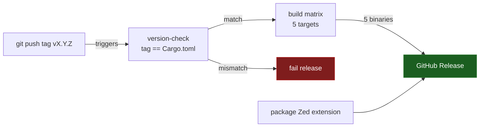

# F16 — Release & CI

> **Status:** Draft
>
> **Version:** 0.3   ·   **Last updated:** 2026-06-15
>
> **Purpose:** The GitHub Actions pipeline — quality gates on every push, and cross-compiled binaries attached to a GitHub Release on every version tag.
>
> **Depends on:** [E03-tech-stack](../foundations/E03-tech-stack.md), [E17-testing](../foundations/E17-testing.md)   ·   **Related:** [F14-editor-integration](F14-editor-integration.md), [F15-cli](F15-cli.md)

> Requirement tag: **REL**

---

## 1. Purpose & Scope

This spec defines how babel-lsp is checked and shipped. Two GitHub Actions workflows do the work: one gates every change, the other builds and publishes binaries.

The first, `qa.yml`, runs on every push and pull request. It formats, lints, tests, and runs the e2e suite. Nothing merges until it is green.

The second, `release.yml`, runs when you push a version tag. It cross-compiles the binary for five targets, packages the Zed extension, attaches everything to a GitHub Release, then publishes a PyPI wheel and refreshes the AUR and Homebrew packages.

This spec covers:

- The QA workflow — its steps, its pinned toolchains, and what blocks merge.
- The release workflow — the build matrix, the version check, and the published assets.
- The versioning rule that ties a `vX.Y.Z` tag to `Cargo.toml`.

## 2. Non-Goals / Out of Scope

- The contents of the tests themselves — owned by [E17-testing](../foundations/E17-testing.md).
- The Zed extension's structure and the editor config snippets — owned by [F14-editor-integration](F14-editor-integration.md).
- The `babel-lsp check` command's behavior — owned by [F15-cli](F15-cli.md); this spec only invokes it.
- **crates.io publishing** — deferred (OQ-REL-1); the PyPI wheel, AUR, and Homebrew channels *are* in scope (REQ-REL-07).

## 3. Background & Rationale

CI exists so the constitution's principles stay true under change. P3 (never panic) and P6 (fast enough) are easy to regress; a gate that runs the e2e suite on every push catches that before it lands. The toolchain pins in [E03 REQ-TECH-01](../foundations/E03-tech-stack.md) — Rust 2024, MSRV 1.85 — are only real if CI enforces them, so `qa.yml` builds on both 1.85 and stable.

Release automation exists because the binary targets five platforms. Cross-compiling and uploading five assets by hand is error-prone; a tag-triggered workflow makes a release a single `git push`.

## 4. Concepts & Definitions

- **QA gate** — a required status check on `qa.yml`. A pull request cannot merge while it is red.
- **Version tag** — an annotated git tag of the form `vX.Y.Z` that triggers `release.yml`. The tag is the source of truth for the released version.
- **Build matrix** — the set of `(target, runner)` pairs the release job fans out across, one binary per pair.

## 5. Detailed Specification

### 5.1 The QA workflow

`qa.yml` runs on push and pull request. It lands at M0, before any feature work, so every later commit is gated from the first day.

**REQ-REL-01 — QA runs fmt, clippy, test, and e2e on every push and PR.**

The workflow runs four checks in order: `cargo fmt --check`, `cargo clippy --all-targets -- -D warnings`, `cargo test`, and the `pytest-lsp` e2e suite ([E17 REQ-TST-02](../foundations/E17-testing.md)). Any failing step fails the job. Clippy warnings are errors, per [E03 REQ-TECH-01](../foundations/E03-tech-stack.md).

**REQ-REL-02 — QA builds on MSRV and stable.**

The job matrixes over two toolchains, `1.85` and `stable`. Building on 1.85 proves the MSRV claim; building on stable catches forward-looking breakage early. Both must pass.

**REQ-REL-03 — A self-lint step runs `babel-lsp check`.**

After the build, the workflow optionally runs `babel-lsp check` over a fixture workspace ([F15-cli](F15-cli.md)). This dogfoods the CLI and asserts it exits zero on clean input. It is advisory at M0 and promoted to required once the CLI stabilizes.

Here is the QA workflow. It pins toolchains with `dtolnay/rust-toolchain` and caches the Cargo build:

```yaml
# .github/workflows/qa.yml
name: QA
on: [push, pull_request]

jobs:
  rust:
    strategy:
      matrix:
        toolchain: ["1.85", "stable"]
    runs-on: ubuntu-latest
    steps:
      - uses: actions/checkout@v4
      - uses: dtolnay/rust-toolchain@master
        with:
          toolchain: ${{ matrix.toolchain }}
          components: rustfmt, clippy
      - uses: Swatinem/rust-cache@v2
      - run: cargo fmt --check
      - run: cargo clippy --all-targets -- -D warnings
      - run: cargo test

  e2e:
    runs-on: ubuntu-latest
    steps:
      - uses: actions/checkout@v4
      - uses: dtolnay/rust-toolchain@stable
      - uses: Swatinem/rust-cache@v2
      - run: cargo build
      - uses: actions/setup-python@v5
        with: { python-version: "3.12" }
      - run: pip install pytest pytest-lsp
      - run: pytest tests/e2e
```

### 5.2 The release workflow

`release.yml` runs on a `v*` tag push. It checks the version, fans out across the build matrix, then collects the binaries into one GitHub Release.

**REQ-REL-04 — The tag is the source of truth; `Cargo.toml` must match.**

The release uses semver tags `vX.Y.Z`. A first job strips the leading `v` and asserts the result equals the `version` in `Cargo.toml`. A mismatch fails the whole release before any build starts — you never ship a binary whose self-reported version disagrees with its tag.

**REQ-REL-05 — The binary is cross-compiled for five targets.**

A matrix builds one stripped binary per target. The targets and their runners:

| Target | Runner | Artifact name |
|---|---|---|
| `x86_64-unknown-linux-gnu` | `ubuntu-latest` | `babel-lsp-linux-x86_64` |
| `aarch64-unknown-linux-gnu` | `ubuntu-latest` | `babel-lsp-linux-aarch64` |
| `x86_64-apple-darwin` | `macos-13` | `babel-lsp-macos-x86_64` |
| `aarch64-apple-darwin` | `macos-latest` | `babel-lsp-macos-aarch64` |
| `x86_64-pc-windows-msvc` | `windows-latest` | `babel-lsp-windows-x86_64.exe` |

Linux aarch64 cross-compiles via `cross`; the Apple and Windows targets build natively on their runners. Each binary is stripped before upload.

**REQ-REL-06 — A GitHub Release collects the binaries and the Zed extension.**

A final job creates the GitHub Release for the tag and attaches every matrix artifact. It also packages the Zed extension ([F14-editor-integration](F14-editor-integration.md)) and attaches it. The release body is generated from the commit log between tags.

**REQ-REL-07 — The release also publishes a PyPI wheel and refreshes the OS packages.**

Beyond the GitHub Release, the same tag fans out to the channels babel-lsp's audience actually installs from:

- **PyPI wheel (`maturin`).** Per-platform wheels are built with `maturin` and published to PyPI on tag, so `pip install babel-lsp` and `uv tool install babel-lsp` work. This is the primary channel — the users are Python developers who already have pip and `pybabel`.
- **AUR + Homebrew.** A job bumps the AUR `PKGBUILD` and the Homebrew formula to the new version and checksums, so `yay -S babel-lsp` and `brew install babel-lsp` are first-class and updated on every release.
- **macOS binaries ship unsigned.** No Apple Developer certificate is used in v1; the README documents the one-time Gatekeeper override (`xattr -d com.apple.quarantine babel-lsp`). Signing and notarization are deferred (OQ-REL-3).

Here is the release workflow, abbreviated to the load-bearing steps:

```yaml
# .github/workflows/release.yml
name: Release
on:
  push:
    tags: ["v*"]

jobs:
  version-check:
    runs-on: ubuntu-latest
    steps:
      - uses: actions/checkout@v4
      - name: Tag matches Cargo.toml
        run: |
          tag="${GITHUB_REF_NAME#v}"
          crate=$(cargo metadata --no-deps --format-version 1 \
            | jq -r '.packages[0].version')
          test "$tag" = "$crate" || {
            echo "tag $tag != Cargo.toml $crate"; exit 1; }

  build:
    needs: version-check
    strategy:
      matrix:
        include:
          - { target: x86_64-unknown-linux-gnu,  os: ubuntu-latest,  name: linux-x86_64 }
          - { target: aarch64-unknown-linux-gnu, os: ubuntu-latest,  name: linux-aarch64, cross: true }
          - { target: x86_64-apple-darwin,        os: macos-13,       name: macos-x86_64 }
          - { target: aarch64-apple-darwin,       os: macos-latest,   name: macos-aarch64 }
          - { target: x86_64-pc-windows-msvc,     os: windows-latest, name: windows-x86_64 }
    runs-on: ${{ matrix.os }}
    steps:
      - uses: actions/checkout@v4
      - uses: dtolnay/rust-toolchain@stable
        with: { targets: ${{ matrix.target }} }
      - name: Build
        run: cargo build --release --target ${{ matrix.target }}
      - uses: actions/upload-artifact@v4
        with:
          name: babel-lsp-${{ matrix.name }}
          path: target/${{ matrix.target }}/release/babel-lsp*

  release:
    needs: build
    runs-on: ubuntu-latest
    steps:
      - uses: actions/checkout@v4
      - uses: actions/download-artifact@v4
        with: { path: dist }
      - name: Package Zed extension
        run: ./scripts/package-zed-extension.sh dist/
      - uses: softprops/action-gh-release@v2
        with:
          files: dist/**
          generate_release_notes: true
```

## 6. Visualizations

The release flow: a tag fans out into the matrix, and the matrix collects into one release.



## 7. Examples & Use Cases

You cut release `0.4.0`. First you bump `version = "0.4.0"` in `Cargo.toml` and merge that — `qa.yml` gates the bump like any change. Then you tag and push:

```bash
git tag -a v0.4.0 -m "babel-lsp 0.4.0"
git push origin v0.4.0
```

`release.yml` wakes up. The version-check job confirms `0.4.0` matches `Cargo.toml`, so the matrix runs. Five jobs each cross-compile and upload one binary; a sixth packages the Zed extension. The final job creates the `v0.4.0` Release with all six assets and notes generated from the commits since `v0.3.0`, then the wheel is published to PyPI and the AUR/Homebrew packages are bumped. A Python user runs `pip install babel-lsp`, an Arch user `yay -S babel-lsp`, and anyone else downloads `babel-lsp-linux-x86_64` directly.

## 8. Edge Cases & Failure Modes

- **Tag/`Cargo.toml` mismatch** → the version-check job fails before any build runs, and no Release is created. You delete the bad tag, fix the version, and re-tag.
- **A QA gate fails** → the PR's required check is red and the branch cannot merge. The author fixes the failing step and pushes again.
- **Release re-run idempotency** → re-running `release.yml` for an existing tag re-uploads assets to the same Release rather than creating a duplicate; `action-gh-release` overwrites by filename. Deleting and re-pushing a tag is the clean way to redo a botched release.
- **A single matrix leg fails** → that platform's binary is missing from the Release; the job fails loudly rather than publishing a partial release silently. Fix and re-run.

## 11. Testing

F16's "tests" are the gates themselves — the two workflows are validated by running them, on every push and on every tag. A green `qa.yml` *is* the proof that fmt, clippy, the Rust suites, and the e2e suite pass; a failing version-check *is* the proof that the tag/`Cargo.toml` rule holds. So this section maps each release requirement to the workflow job or check that exercises it, rather than to a separate test file.

### 11.1 Scope & coverage

Target: **100% of this feature's behavior is covered.** Every `REQ-REL-NN` below maps to the workflow job or check that exercises it. See the policy in [E17-testing](../foundations/E17-testing.md#2-coverage-policy).

### 11.2 Test plan

Each row is a workflow behavior under test. The workflows run the same unit and integration suites defined in [E17-testing](../foundations/E17-testing.md) and the end-to-end suite in [E29-e2e-testing](../foundations/E29-e2e-testing.md); the release-specific behaviors are gated by their own jobs.

| Behavior / scenario | Type | How it runs | Verifies |
|---|---|---|---|
| `qa.yml` runs fmt, clippy, `cargo test`, and the e2e suite on every push and PR | integration | the `rust` + `e2e` jobs, on both toolchains | REQ-REL-01 |
| The Rust matrix builds and tests on MSRV `1.85` and `stable` | integration | the `rust` job's `toolchain` matrix | REQ-REL-02 |
| The self-lint `babel-lsp check` step exits zero on a clean fixture workspace | integration | the `check` step over a [clean-shopfront](../foundations/E17-testing.md#clean-shopfront) fixture | REQ-REL-03 |
| A tag whose number disagrees with `Cargo.toml` fails the release | unit | the `version-check` job (deliberate mismatch fails it) | REQ-REL-04 |
| The build matrix produces one stripped binary per target | integration | the `build` job's `target` matrix, five legs | REQ-REL-05 |
| The release collects every binary plus the packaged Zed extension | integration | the `release` job (download-artifact → gh-release) | REQ-REL-06 |
| The tag publishes a PyPI wheel and refreshes AUR + Homebrew | integration | the publish jobs (`maturin`, AUR/Homebrew bump) | REQ-REL-07 |

### 11.3 Fixtures

The QA and self-lint steps reuse the shared workspaces from the [E17 fixtures registry](../foundations/E17-testing.md#5-fixtures-registry) rather than defining their own.

- **[clean-shopfront](../foundations/E17-testing.md#clean-shopfront)** — the workspace the `babel-lsp check` self-lint step runs over; the step asserts a clean exit.
- **version-mismatch tag** — a feature-local check: a tag like `v9.9.9` pushed against an unbumped `Cargo.toml` must fail the `version-check` job (REQ-REL-04). Exercised by deliberately mismatching the two.

### 11.4 Requirement coverage

Every load-bearing requirement maps to the workflow job or check that proves it — this table is that index.

| Requirement | Covered by |
|---|---|
| REQ-REL-01 | `qa.yml` `rust` job (fmt/clippy/test) + `e2e` job, every push/PR |
| REQ-REL-02 | `qa.yml` `rust` job, `toolchain: ["1.85", "stable"]` matrix |
| REQ-REL-03 | `qa.yml` self-lint `babel-lsp check` step over [clean-shopfront](../foundations/E17-testing.md#clean-shopfront) |
| REQ-REL-04 | `release.yml` `version-check` job; mismatch case from §11.3 |
| REQ-REL-05 | `release.yml` `build` job, five-target matrix |
| REQ-REL-06 | `release.yml` `release` job (artifacts + Zed extension) |
| REQ-REL-07 | `release.yml` publish jobs (PyPI wheel, AUR + Homebrew bump) |

## 13. Non-Functional Requirements

### 13.1 Security & Privacy

Release is where babel-lsp's supply chain lives, so this is the section that matters most for F16. The trust boundary is the one every user crosses: they download and run a prebuilt binary they did not compile, so everything below exists to make that binary trustworthy.

- **Provenance & build integrity** — every release artifact is built in CI from the exact tagged commit, never from a developer's laptop. The `version-check` job (REQ-REL-04) asserts the tag equals `Cargo.toml`, so a binary's self-reported version always matches the source it was built from. Dependency provenance is pinned by the committed `Cargo.lock`, so a release builds the same dependency graph every time.
- **Secrets handling** — the PyPI token and any future signing keys live only in GitHub Actions encrypted secrets, never in the repo or in workflow output. The PyPI, AUR, and Homebrew publish steps use narrowly **scoped tokens** so a leak of one channel's credential can't reach the others.
- **Unsigned macOS binaries (v1)** — macOS artifacts ship **unsigned** in v1 (REQ-REL-07, OQ-REL-3): no Apple Developer cert is used, so Gatekeeper will quarantine them and the README documents the one-time `xattr -d com.apple.quarantine babel-lsp` override. This is a deliberate, documented trust gap — users override Gatekeeper manually — pending the macOS user base that would justify a paid signing cert.
- **Privacy** — the workflows handle no user data; they operate only on the repo's source, the CI secrets above, and the published artifacts. There is nothing personal to classify or retain.
- **Trust boundary of prebuilt binaries** — shipping binaries the user can't easily verify is the central risk here. v1 mitigates it with CI-only builds from tagged commits, a locked dependency graph, scoped publish tokens, and release notes generated from the commit log; signing and notarization (OQ-REL-3) are the remaining hardening step, deferred but tracked.

## 14. Open Questions & Decisions

- **Decision (resolves OQ-REL-1)** — v1 does **not** publish to crates.io. Distribution is the prebuilt binaries on the GitHub Release plus the editor packaging ([F14](F14-editor-integration.md)); a `cargo install babel-lsp` source path isn't a v1 goal and can be added later if demand appears.
- **Decision (resolves OQ-REL-2)** — The project maintains an **AUR package and a Homebrew formula**, bumped on every release (REQ-REL-07), so Arch and macOS users get a first-class `yay -S` / `brew install`.
- **Decision (resolves OQ-REL-3)** — macOS binaries ship **unsigned** in v1, with a documented Gatekeeper override (REQ-REL-07). Signing and notarization need a paid Apple Developer cert and CI secrets; deferred until a macOS user base warrants the cost.
- **Decision (resolves OQ-REL-4)** — The release **publishes a PyPI wheel via `maturin`** (REQ-REL-07), so `pip install babel-lsp` works — the natural channel for a Python-ecosystem tool. This is the one v1 *source/package* channel; crates.io stays deferred (OQ-REL-1).

## 15. Cross-References

- **Depends on:** [E03-tech-stack](../foundations/E03-tech-stack.md) — the toolchain and MSRV the gates enforce; [E17-testing](../foundations/E17-testing.md) — the unit/integration suites and `pytest-lsp` e2e suite the QA workflow runs; [E29-e2e-testing](../foundations/E29-e2e-testing.md) — the end-to-end suite `qa.yml` runs.
- **Related:** [F14-editor-integration](F14-editor-integration.md) — the Zed extension artifact the release attaches; [F15-cli](F15-cli.md) — the `babel-lsp check` self-lint step.

## 16. Changelog

- **2026-06-15** — v0.3: restructured to the spec-writer template — added §11 Testing (the workflows *are* the gates; every REQ-REL maps to the job or check that exercises it) and §13.1 Security & Privacy (the supply-chain trust boundary of shipping prebuilt binaries: CI-only builds from tagged commits, locked dependencies, scoped publish tokens, unsigned-macOS gap). Renumbered Open Questions → §14, Cross-References → §15, Changelog → §16.
- **2026-06-15** — Resolved the release open questions: no crates.io (OQ-REL-1); ship a **PyPI wheel** via maturin (OQ-REL-4); maintain **AUR + Homebrew** packages (OQ-REL-2); macOS binaries **unsigned** with a documented Gatekeeper override (OQ-REL-3) — all gathered into REQ-REL-07.
- **2026-06-15** — Initial draft: the `qa.yml` gate (fmt/clippy/test/e2e on MSRV + stable), the `release.yml` tag-triggered build matrix over five targets, the tag/`Cargo.toml` version check, and the GitHub Release packaging the binaries plus the Zed extension.
