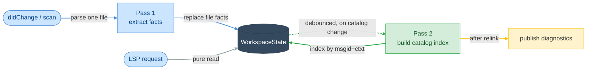

# E01 — Architecture

> **Status:** Draft
>
> **Version:** 0.2   ·   **Last updated:** 2026-06-15
>
> **Purpose:** The system shape: one Rust binary, a two-pass index over source and catalogs, and pure-function features. Read this before any feature spec.
>
> **Depends on:** [constitution](../constitution.md)   ·   **Related:** [E07-data-model](E07-data-model.md), [E03-tech-stack](E03-tech-stack.md), [E17-testing](E17-testing.md)

> Requirement tag: **ARCH**

---

## 1. Purpose & Scope

This spec defines how the server is put together: its process model, the two-pass indexing pipeline, how files are detected and parsed, how catalogs stay in sync with disk, and how LSP features read the result. Feature specs assume everything here.

## 2. Non-Goals / Out of Scope

- The concrete index types — owned by [E07-data-model](E07-data-model.md).
- What each feature does with the index — owned by the `F##` specs.
- Config resolution and locale discovery — owned by [E15-app-config](E15-app-config.md).
- Test harness details — owned by [E17-testing](E17-testing.md).

## 3. Background & Rationale

The shape — an LSP framework crate, tree-sitter parsing, concurrent-map state — is the one production Rust language servers converge on. What's specific to babel-lsp is that a message's meaning is split across files: a `_("Checkout")` call in `app/views.py` is only half the story; the other half lives in `locale/de/LC_MESSAGES/messages.po` and `locale/fr/...`. Per-file extraction alone can't answer "is this msgid translated, and in which locales?" — so a workspace-level linking step that joins source calls to catalog entries becomes the heart of the design.

## 4. Concepts & Definitions

Fact, linking, catalog index, and workspace state are canonical in the [glossary](../glossary.md). One term is specific to this spec:

- **Debounce window** — the short delay after a change before pass 2 re-runs, so a burst of keystrokes triggers one re-link, not twenty.

## 5. Detailed Specification

### 5.1 Process model

The server is one binary speaking LSP over stdio; that's the whole deployment story.

**REQ-ARCH-01 — Single static binary, stdio only.**

The server ships as one Rust binary with no runtime dependencies. The `lsp` subcommand speaks JSON-RPC over stdio — the one transport v1 ships. The `check`, `extract`, `update`, `compile`, and `stats` subcommands reuse the same pipeline headless — the full CLI surface is [F15](../features/F15-cli.md). `tower-lsp-server` handles the framing ([E03](E03-tech-stack.md)); all request handlers live in one `impl LanguageServer for Backend`.

> **Note:** Remote transports are deferred (OQ-ARCH-2). `tower-lsp-server` could serve over a TCP socket, and a real HTTP transport would need a custom wrapper, but neither is built in v1 — stdio reaches every first-class editor.

**REQ-ARCH-02 — Static analysis only.**

The server never executes user code, imports user modules, or runs the app to discover messages (constitution P1). tree-sitter parses source; `polib` parses catalogs; nothing else reads program meaning.

### 5.2 The two-pass pipeline

Everything the server knows flows through two passes: extract per file, then link across files.

**REQ-ARCH-03 — Pass 1 runs per file, on every change.**

On `didOpen`, `didChange`, `didSave`, and during the initial workspace scan, the changed file is parsed and its facts extracted. For a source file (`.py`, Jinja templates) that means its translation calls ([F02](../features/F02-message-extraction.md)); for a catalog file (`.po`/`.pot`) that means its entries ([F01](../features/F01-catalog-index.md)). The file's old facts are replaced atomically. Pass 1 touches only that one file.

Text sync is `TextDocumentSyncKind::INCREMENTAL`. Incoming edits are applied to the stored source through the single offset/encoding module (REQ-ARCH-09), then the file is fully re-parsed — a single-file parse fits the budget. Feeding edits to `Tree::edit` for an incremental reparse is recorded as a later optimization, not built now.

**REQ-ARCH-04 — Pass 2 builds the catalog index, debounced.**

After any pass-1 change to a catalog file, a debounced pass 2 rebuilds the catalog index from the catalog facts: it groups every entry under its `(msgid, msgctxt)` key across all locales and domains, records which locales translate each key, and overlays any unsaved catalog buffers ([E07](E07-data-model.md)). Pass 2 is a pure in-memory walk over facts — it re-parses nothing.

A **generation counter** keeps the passes from racing. Every pass-1 change bumps the workspace generation; pass 2 records the generation it started from and discards its result if the counter moved before it published, then reschedules. A published snapshot therefore always links one consistent set of facts.

Source-file edits don't rebuild the index — they only change that file's calls — so after a source `didChange` the server re-runs the cheap source-side checks against the existing index without a full pass 2.

### 5.3 File detection

A workspace scan must not parse every Python file in a large monorepo, so cheap indicators gate the parse.

**REQ-ARCH-05 — Indicator-gated scanning, force-parse on open.**

During the workspace scan, a source file is parsed only if it contains a translation-related indicator substring: `gettext`, `_(`, `ngettext`, `pgettext`, `{% trans`, or any name in the configured `extra_keywords` ([E15](E15-app-config.md)). Catalog files (`.po`/`.pot`) are always parsed — there are few of them and each is wholly relevant. On `didOpen`/`didChange`/`didSave` a file is parsed unconditionally, so features work in files that use an aliased or unusual translation function.

`pyproject.toml`, `babel-lsp.toml`, and `babel.cfg` are watched too; a change re-runs config resolution ([E15](E15-app-config.md)) and triggers pass 2.

### 5.4 Feature dispatch

**REQ-ARCH-06 — Features are pure functions.**

Every LSP capability is a function in `src/features/` taking the shared state plus the request's URI/position, returning the LSP response type. A feature reads one consistent index snapshot and answers from it. Features hold no state and take no locks beyond `DashMap`'s per-entry reads, so concurrent requests just work.

### 5.5 Resilience

**REQ-ARCH-07 — Partial input degrades, never breaks.**

Source extractors walk whatever tree tree-sitter produced — including `ERROR` nodes — and return the facts they can find (constitution P3). A catalog that fails to parse cleanly yields the entries `polib` could read, not an empty file. A translation call whose msgid isn't a literal is stored as an unresolved msgid and excluded from lookups (P4). A request handler that hits a bug returns an empty/null LSP response, never crashes the process.

### 5.6 Protocol conduct

Rules from the LSP spec and hard-won ecosystem experience the implementation honors from day one — each cheap to build in, expensive to retrofit.

**REQ-ARCH-08 — Document notifications apply in order; parsing never blocks the runtime.**

`tower-lsp-server` runs handlers concurrently, which can apply two `didChange` events out of order and corrupt the stored source. Document mutations (`didOpen`/`didChange`/`didClose`) are serialized **per URI**: each document's notifications apply in arrival order, while unrelated documents and read requests proceed concurrently. CPU-bound work (parsing, index rebuild) runs under `tokio::task::spawn_blocking`, never directly in an async handler.

**REQ-ARCH-09 — Position encoding is negotiated, preferring UTF-8.**

The server advertises `positionEncoding: "utf-8"` when the client offers it (LSP 3.17) and falls back to the mandatory UTF-16 — surrogate pairs included — otherwise. This matters acutely here: translated strings are full of multi-byte characters, so an off-by-encoding range lands a squiggle mid-character. All offset conversion goes through one utility module; [E17](E17-testing.md) pins the edge cases with non-ASCII catalogs.

**REQ-ARCH-10 — Both push and pull diagnostics; publish every change, including to empty.**

The server publishes diagnostics after each relink (`textDocument/publishDiagnostics`) *and* advertises the pull model (`textDocument/diagnostic`) for clients that prefer it. Diagnostics are workspace-scoped: closing a file clears nothing; a finding disappears only when a relink removes it or the file is deleted. A file whose findings vanished gets an explicit empty publish, or stale squiggles linger. A newly opened file always receives a (possibly empty) publish — the e2e harness's "the server looked at this file" signal ([E17](E17-testing.md)).

**REQ-ARCH-11 — The workspace scan never blocks `initialize`.**

`initialize` returns immediately; scanning and the first catalog load run in the background after `initialized`. When the client advertises `window.workDoneProgress`, the server reports scan progress on a created token; otherwise it scans silently. Requests arriving mid-scan answer from whatever is indexed so far.

**REQ-ARCH-12 — The index follows the disk: catalog watching is mandatory.**

Translators and `pybabel` edit `.po` files outside the editor, so the index must track disk. The server registers `workspace/didChangeWatchedFiles` dynamically when the client supports it, and falls back to native watching (the `notify` crate) over the same glob set otherwise. The watched set: every source glob, `**/*.po`, `**/*.pot`, and the config files. The handler keeps the index honest:

- **Created** → pass 1 on the new catalog or source file; relink.
- **Changed** (a file *not* open in the editor) → re-extract from disk; relink. For *open* files the editor's `didChange` buffer is the truth (the unsaved overlay), and watcher events for them are ignored.
- **Deleted** → drop the file's facts; relink. Its entries vanish from every index and their diagnostics clear per REQ-ARCH-10.

Renames arrive as delete+create and need no special handling. Config-file changes trigger config re-resolution before the relink.

## 6. Examples & Use Cases

You add `_("Wishlist")` to `app/views.py`. Pass 1 re-extracts that file's calls on each keystroke — cheap, single-file. The source-side check runs against the existing index and, finding no catalog entry for `"Wishlist"`, raises `msg/unknown-id`. Meanwhile a translator saves `locale/de/LC_MESSAGES/messages.po` with the German translation; the file watcher fires, pass 1 re-reads the catalog, the debounced pass 2 rebuilds the index, and the squiggle on `_("Wishlist")` clears on the next relink — a file you never opened.

## 7. Edge Cases & Failure Modes

- A `.po` file is deleted → its entries are removed and pass 2 re-runs; that locale's translations vanish from the index.
- A catalog fails to parse → `polib` returns the readable entries; the unreadable region is skipped, not fatal.
- Source edit with no catalog change → only the cheap source-side checks re-run; no full index rebuild.
- Huge workspace, no i18n → the scan finds no indicators and no catalogs, parses almost nothing, idles at near-zero cost.

## 8. Open Questions & Decisions

- **Decision (resolves OQ-ARCH-1)** — The debounce window is a fixed **300 ms**, not configurable in v1. It's the conventional LSP debounce; the [E17](E17-testing.md) performance fixture validates it, and the constant is tuned there if a real workspace needs it.
- **Decision (resolves OQ-ARCH-2)** — v1 ships **stdio only**. No `--tcp` and no `--http`: stdio reaches every first-class editor (Zed, Neovim, Helix), so a remote transport is surface to build and secure for no current need. `tower-lsp-server` could serve over a TCP socket and HTTP would need a custom wrapper — both are deferred, not built.
- **Decision** — Pass 2 rebuilds the index wholesale rather than incrementally. Simplicity wins until a real workspace proves it too slow; catalogs are small relative to source.
- **Decision** — Performance budgets (P6 made measurable, tested in [E17](E17-testing.md)): initial scan + catalog load ≤ 2 s per 1,000 indicator-matched files; relink ≤ 100 ms on the large fixture; hover/completion p95 ≤ 50 ms.

## 9. Cross-References

- **Depends on:** [constitution](../constitution.md) — principles P1, P3, P4, P6 cited above.
- **Related:** [E07-data-model](E07-data-model.md) — the index pass 2 builds; [E03-tech-stack](E03-tech-stack.md) — the framing crate and parsers; [E15-app-config](E15-app-config.md) — config files watched; [E17-testing](E17-testing.md) — how the pipeline is tested.

## 10. Changelog

- **2026-06-15** — v0.2: resolved the architecture open questions — transport is **stdio only** (REQ-ARCH-01; `--tcp`/`--http` dropped, OQ-ARCH-2) and the debounce window is a fixed 300 ms (OQ-ARCH-1); added `stats` to the headless subcommands.
- **2026-06-15** — Initial draft: two-pass pipeline (source facts + catalog facts → catalog index), indicator-gated scanning, pure-function features, protocol conduct (ordering, UTF-8 negotiation, push+pull diagnostics, catalog watching), and the performance budgets.
